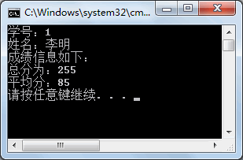
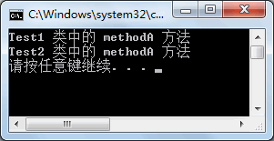

# C# 接口（Interface）

接口定义了所有类继承接口时应遵循的语法合同。接口定义了语法合同 **"是什么"** 部分，派生类定义了语法合同 **"怎么做"** 部分。

接口定义了属性、方法和事件，这些都是接口的成员。接口只包含了成员的声明。成员的定义是派生类的责任。接口提供了派生类应遵循的标准结构。

接口使得实现接口的类或结构在形式上保持一致。

抽象类在某种程度上与接口类似，但是，它们大多只是用在当只有少数方法由基类声明由派生类实现时。

------

## 1.定义接口

  在 [C#](http://c.biancheng.net/csharp/) 语言中，类之间的继承关系仅支持单重继承，而接口是为了实现多重继承关系设计的。

一个类能同时实现多个接口，还能在实现接口的同时再继承其他类，并且接口之间也可以继承。

无论是表示类之间的继承还是类实现接口、接口之间的继承，都使用`“:”`来表示。

接口定义的语法形式如下。  

```c#
interface  接口名称
{
    接口成员；
}
```

其中：

#### 1) 接口名称

通常是以 I 开头，再加上其他的单词构成。例如创建一个计算的接口，可以命名为 ICompute。

#### 2) 接口成员

接口中定义的成员与类中定义的成员类似。

接口中定义的成员必须满足以下要求。

* 接口中的成员不允许使用 public、private、protected、internal 访问修饰符。
* 接口中的成员不允许使用 static、virtual、abstract、sealed 修饰符。
* 在接口中不能定义字段。
* 在接口中定义的方法不能包含方法体。

【实例】创建一个接口计算学生成绩的接口 ICompute,并在接口中分别定义计算总成绩、平均成绩的方法。

根据题目要求，在该接口中定义学生的学号、姓名的属性，并定义计算成绩的总分和 平均分的方法。

定义接口的代码如下。

```c#
interface ICompute
{
    int Id { get; set; }
    string Name { get; set; }
    void Total();
    void Avg();
}
```

通过上面的代码即可完成一个接口的定义，但是由于接口中的方法并没有具体的内容，直接调用接口中的方法没有任何意义。

>  在 C# 语言中规定不能直接创建接口的实例，只能通过类实现接口中的方法。

## 2.接口的实现

接口的实现实际上和类之间的继承是一样的，也是重写了接口中的方法，让其有了具体的实现内容。

但需要注意的是，在类中实现一个接口时必须将接口中的所有成员都实现，否则该类必须声明为抽象类，并将接口中未实现的成员以抽象方式实现。

在 C# 语言中实现接口的具体语法形式如下。

```c#
class  类名 : 接口名
{
    //类中的成员以及实现接口中的成员
}
```

以抽象方式实现接口中的成员是指将接口中未实现的成员定义为抽象成员，示例代码如下。

```c#
interface ITest
{
    string name { get; set}
    void Print();
}
abstract class Test : ITest
{
    public abstract string name { get; set; }
    public abstract void Print();
}
```

从上面的代码可以看出，在实现类 Test 中将未实现的属性和方法分别定义为抽象属性和抽象方法，并将实现类定义为抽象类。

这是一种特殊的实现方式，在实际应用中通常是将接口中的所有成员全部实现。

在实现接口的成员时有两种方式，一种是**隐式实现接口成员**，一种是**显式实现接口成员**。

在实际应用中隐式实现接口的方式比较常用，由于在接口中定义的成员默认是 public 类型的，隐式实现接口成员是将接口的所有成员以 public 访问修饰符修饰。

显式实现接口是指在实现接口时所实现的成员名称前含有接口名称作为前缀。

需要注意的是使用显式实现接口的成员不能再使用修饰符修饰，即 public、abstract、virtual、 override 等。

接下来将通过实例来演示在编程中隐式实现接口与显式实现接口有什么区别。

【实例】将上一节《C#接口定义》中定义的接口分别使用隐式和显式方式实现。

### 1) 隐式方式实现

根据题目要求，首先使用隐式方式来实现接口 ICompute 的成员，以计算机专业的学生类 (ComputerMajor) 实现 ICompute 接口，为其添加英语 (English)、编程 (Programming)、数据库 (Database) 学科成绩属性，代码如下。

```c#
class ComputerMajor : ICompute
{
    public int Id { get; set; }     //隐式的实现接口中的属性
    public string Name { get; set; }    //隐式实现接口中的属性
    public double English { get; set; }
    public double Programming { get; set; }
    public double Database { get; set; }
    public void Avg()       //隐式实现接口中的方法
    {
        double avg = (English + Programming + Database) / 3;
        Console.WriteLine("平均分：" + avg);
    }
    public void Total()
    {
        double sum = English + Programming + Database;
        Console.WriteLine("总分为：" + sum);
    }
}
```

从上面的代码可以看出，所有接口中的成员在实现类 ComputerMajor 中都被 public 修饰符修饰。

在 Main 方法中调用该实现类的成员，代码如下。

```c#
class Program
{
    static void Main(string[] args)
    {
        ComputerMajor computerMajor = new ComputerMajor();
        computerMajor.Id = 1;
        computerMajor.Name = "李明";
        computerMajor.English = 80;
        computerMajor.Programming = 90;
        computerMajor.Database = 85;
        Console.WriteLine("学号：" + computerMajor.Id);
        Console.WriteLine("姓名：" + computerMajor.Name);
        Console.WriteLine("成绩信息如下：");
        computerMajor.Total();
        computerMajor.Avg();
    }
}
```

执行上面的代码，效果如下图所示。



### 2) 显式方式实现

使用显式方式来实现接口成员的代码如下。

```c#
class ComputerMajor : ICompute
{
    public double English { get; set; }
    public double Programming { get; set; }
    public double Database { get; set; }
    int ICompute.Id { get; set; }           //显示实现接口中的属性
    string ICompute.Name { get; set; }      //显示实现接口中的属性
    void ICompute.Total()                   //显示实现接口中的方法
    {
        double sum = English + Programming + Database;
        Console.WriteLine("总分数：" + sum);
    }
    void ICompute.Avg()
    {
        double avg = (English + Programming + Database) / 3;
        Console.WriteLine("平均分为：" + avg);
    }
}
```

从上面的代码可以看出，在使用显式方式实现接口中的成员时，所有成员都会加上接口名称 ICompute 作为前缀，并且不加任何修饰符。

在Main方法中调用实现类中的成员,代码如下

```c#
class Program
{
    static void Main(string[] args)
    {
        ComputerMajor computerMajor = new ComputerMajor();
        ICompute compute = computerMajor;       //创建接口的实例
        compute.Id = 1;
        compute.Name = "李明";
        computerMajor.English = 80;
        computerMajor.Programming = 90;
        computerMajor.Database = 85;
        Console.WriteLine("学号：" + compute.Id);
        Console.WriteLine("姓名：" + compute.Name);
        Console.WriteLine("成绩信息如下：");
        compute.Total();
        compute.Avg();
    }
}
```

执行上面的代码，效果与上图一致。从调用的代码可以看出，在调用显式方式实现接口的成员时，必须使用接口的实例来调用，而不能使用实现类的实例来调用。

与类之间的继承类似，实现类的实例也可以隐式转换为其所实现接口的接口类型。

接口与抽象类的区别入下表所示。

| 接口                                                         | 抽象类                                                       |
| ------------------------------------------------------------ | ------------------------------------------------------------ |
| 在接口中仅能定义成员，但不能有具体的实现。                   | 抽象类除了抽象成员以外，其他成员允许有具体的实现。           |
| 在接口中不能声明字段，并且不能声明任何私有成员，成员不能包含任何修饰符。 | 在抽象类中能声明任意成员，并能使用任何修饰符来修饰。         |
| 接口能使用类或者结构体来继承。                               | 抽象类仅能使用类继承。                                       |
| 在使用类来实现接口时，必须隐式或显式地实现接口中的所有成员，否则需要将实现类定义为抽象类，并将接口中未实现的成员以抽象的方式实现。 | 在使用类来继承抽象 类时允许实现全部或部分成员，但仅实现其中的部分成员，其实现类必须也定义为抽象类。 |
| 一个接口允许继承多个接口。                                   | 一个类只能有一个父类。                                       |

## 3.接口中实现多态

在前面学过多态能使用类之间的继承关系来实现，通过多个类继承同一个接口，并实现接口中的成员也能完成多态的表示。

使用接口实现多态 需要满足以下两个条件。

* 定义接口并使用类实现了接口中的成员。
* 创建接口的实例指向不同的实现类对象。

假设接口名称为 ITest，分别定义两个实现类来实现接口的成员，示例代码如下。

```c#
interface ITest
{
    void methodA();
}
class Test1 : ITest
{
    public void methodA()
    {
        Console.WriteLine("Test1 类中的 methodA 方法");
    }
}
class Test2 : ITest
{
    public void methodA()
    {
        Console.WriteLine("Test2 类中的 methodA 方法");
    }
}
```

使用多态的方式调用实现类中的方法，Main 方法中的代码如下。

```c#
class Program
{
    static void Main(string[] args)
    {
        ITest test1 = new Test1();  //创建接口的实例test1指向实现类Test1的对象
        test1.methodA();
        ITest test2 = new Test2();  //创建接口的实例test2指向实现类Test2的对象
        test2.methodA();
    }
}
```

执行上面的代码，效果如下图所示。



从上面的执行效果可以看出，使用不同类实现同一接口的方法输出的内容各不相同，这就是使用接口的方式实现多态的方法。

【实例】创建绘制图形的接口，分别使用两个类来实现接口绘制不同的图形。

根据题目要求，在绘制图形的接口中包括图形面积、坐标、颜色属性，并编写一个方法输出图形的描述，即属性值。接口定义的代码如下。

```c#
interface IShape
{
    double Area { get; }
    double X { get; set; }
    double Y { get; set; }
    string Color { get; set; }
    void Draw();
}
```

下面分别使用矩形类 (Rectangle) 和圆类 (Circle) 实现该接口，并实现接口中的所有成员，代码如下。

```c#
class Rectangle :IShape
{
    //为矩形的长和宽赋值
    public Rectangle(double length,double width)
    {
        this.Length = length;
        this.Width = width;
    }
    public double Length { get; set; }//定义长方形的长度
    public double Width { get; set; }//定义长方形的宽度
    public double Area
    {
        get
        {
            return Length * Width;//计算长方形面积
        }
    }
    public string Color { get; set; }
    public double X { get; set; }
    public double Y { get; set; }
    public void Draw()
    {
        Console.WriteLine("绘制图形如下：");
        Console.WriteLine("在坐标 {0},{1} 的位置绘制面积为 {2} 颜色为 {3} 的矩形", X, Y, Area, Color);
    }
}
class Circle : IShape
{
    //为圆的半径赋值
    public Circle(double radius)
    {
        this.Radius = radius;
    }
    public double Radius { get; set; }
    public double Area
    {
        get
        {
            return Radius * Radius * 3.14;
        }
    }
    public string Color { get; set; }
    public double X { get; set; }
    public double Y { get; set; }
    public void Draw()
    {
        Console.WriteLine("绘制图形如下：");
        Console.WriteLine("在坐标为 {0},{1} 的位置绘制面积为 {2} 颜色为 {3} 的圆形", X, Y, Area, Color);
    }
}
```

在 Main 方法中分别调用实现类中的属性和方法，代码如下。

```c#
class Program
{
    static void Main(string[] args)
    {
        IShape shape1 = new Rectangle(10, 20);
        shape1.X = 100;
        shape1.Y = 200;
        shape1.Color = "红色";
        shape1.Draw();
        IShape shape2 = new Circle(10);
        shape2.X = 300;
        shape2.Y = 500;
        shape2.Color = "蓝色";
        shape2.Draw();
    }
}
```

执行上面的代码，效果如下图所示。


在该实例中，接口的每个实现类中都设置了带参数的构造方法为实现类中新增加的属性赋值，这样在创建实现类的实例时即可为相应的属性赋值。

如果不使用构造方法为实现类中新增加的属性赋值，则需要先创建实现类的实例，并对其新增加的属性赋值，再将实现类的实例赋给接口的实例。

与 `IShape shapel = newRectangle( 10,20);` 等效的代码如下。

```c#
Reatangle rectangle = new Rectangle();
rectangle.Length = 10;
rectangle.Width = 20;
IShape shape1 = rectangle;
```

为了简化代码，在接口的实现类中定义了新的属性，通常是通过实现类的构造方法为属性赋值的。