# C# 继承

继承是面向对象程序设计中最重要的概念之一。继承允许我们根据一个类来定义另一个类，这使得创建和维护应用程序变得更容易。同时也有利于重用代码和节省开发时间。

当创建一个类时，程序员不需要完全重新编写新的数据成员和成员函数，只需要设计一个新的类，继承了已有的类的成员即可。这个已有的类被称为的**基类**，这个新的类被称为**派生类**。

继承的思想实现了 **属于（IS-A）** 关系。例如，哺乳动物 **属于（IS-A）** 动物，狗 **属于（IS-A）** 哺乳动物，因此狗 **属于（IS-A）** 动物。

* C# 继承的特点
  * 派生类是对基类的扩展，派生类可以添加新的成员，但不能移除已经继承的成员的定义。
  * 继承是可以传递的。如果 C 从 B 中派生，B 又从 A 中派生，那么 C 不仅继承了 B 中声明的成员，同样也继承了 A 中声明的成员。
  * 构造函数和析构函数不能被继承，除此之外其他成员能被继承。基类中成员的访问方式只能决定派生类能否访问它们。
  * 派生类如果定义了与继承而来的成员同名的新成员，那么就可以覆盖已继承的成员，但这并不是删除了这些成员，只是不能再访问这些成员。
  * 类可以定义虚方法、虚属性及虚索引指示器，它的派生类能够重载这些成员，从而使类可以展示出多态性。
  * 派生类只能从一个类中继承，可以通过接口来实现多重继承。

为了将继承关系灵活运地用到程序设计中，在 C# 语言中提供了接口来解决多重继承的关系。

在编程中灵活地使用类之间的继承关系能很好地实现类中成员的重用，有利于类的使用。

## 1.基类和派生类

一个类可以派生自多个类或接口，这意味着它可以从多个基类或接口继承数据和函数。

C# 中创建派生类的语法如下：

```c#
<访问修饰符符> class <基类>
{
 ...
}
class <派生类> : <基类>
{
 ...
}
```

假设，有一个基类 Shape，它的派生类是 Rectangle：

```c#
using System;
namespace InheritanceApplication
{
   class Shape 
   {
      public void setWidth(int w)
      {
         width = w;
      }
      public void setHeight(int h)
      {
         height = h;
      }
      protected int width;
      protected int height;
   }

   // 派生类
   class Rectangle: Shape
   {
      public int getArea()
      { 
         return (width * height); 
      }
   }
   
   class RectangleTester
   {
      static void Main(string[] args)
      {
         Rectangle Rect = new Rectangle();

         Rect.setWidth(5);
         Rect.setHeight(7);

         // 打印对象的面积
         Console.WriteLine("总面积： {0}",  Rect.getArea());
         Console.ReadKey();
      }
   }
}
```

当上面的代码被编译和执行时，它会产生下列结果：

```
总面积： 35
```

## 2.基类的初始化

派生类继承了基类的成员变量和成员方法。因此父类对象应在子类对象创建之前被创建。您可以在成员初始化列表中进行父类的初始化。

下面的程序演示了这点：

```c#
using System;
namespace RectangleApplication
{
   class Rectangle
   {
      // 成员变量
      protected double length;
      protected double width;
      public Rectangle(double l, double w)
      {
         length = l;
         width = w;
      }
      public double GetArea()
      {
         return length * width;
      }
      public void Display()
      {
         Console.WriteLine("长度： {0}", length);
         Console.WriteLine("宽度： {0}", width);
         Console.WriteLine("面积： {0}", GetArea());
      }
   }//end class Rectangle  
   class Tabletop : Rectangle
   {
      private double cost;
      public Tabletop(double l, double w) : base(l, w)
      { }
      public double GetCost()
      {
         double cost;
         cost = GetArea() * 70;
         return cost;
      }
      public void Display()
      {
         base.Display();
         Console.WriteLine("成本： {0}", GetCost());
      }
   }
   class ExecuteRectangle
   {
      static void Main(string[] args)
      {
         Tabletop t = new Tabletop(4.5, 7.5);
         t.Display();
         Console.ReadLine();
      }
   }
}
```

当上面的代码被编译和执行时，它会产生下列结果：

```
长度： 4.5
宽度： 7.5
面积： 33.75
成本： 2362.5
```


## 3.多重继承(实现接口)

多重继承指的是一个类别可以同时从多于一个父类继承行为与特征的功能。与单一继承相对，单一继承指一个类别只可以继承自一个父类。

**C# 不支持多重继承**。但是，您可以使用接口来实现多重继承。下面的程序演示了这点：

```c#
using System;
namespace InheritanceApplication
{
   class Shape 
   {
      public void setWidth(int w)
      {
         width = w;
      }
      public void setHeight(int h)
      {
         height = h;
      }
      protected int width;
      protected int height;
   }

   // 基类 PaintCost
   public interface PaintCost 
   {
      int getCost(int area);

   }
   // 派生类
   class Rectangle : Shape, PaintCost
   {
      public int getArea()
      {
         return (width * height);
      }
      public int getCost(int area)
      {
         return area * 70;
      }
   }
   class RectangleTester
   {
      static void Main(string[] args)
      {
         Rectangle Rect = new Rectangle();
         int area;
         Rect.setWidth(5);
         Rect.setHeight(7);
         area = Rect.getArea();
         // 打印对象的面积
         Console.WriteLine("总面积： {0}",  Rect.getArea());
         Console.WriteLine("油漆总成本： ${0}" , Rect.getCost(area));
         Console.ReadKey();
      }
   }
}
```

当上面的代码被编译和执行时，它会产生下列结果：

```
总面积： 35
油漆总成本： $2450
```

## 4.Object类

  Object 类是 [C#](http://c.biancheng.net/csharp/) 语言中最原始、最重要的类，是所有类的“祖先”，每个 C# 类都是它的子类，它实现了每个类都必须具有的基本方法。

这里指的“所有类”，即不管是 C# 系统所提供的标准类，还是用户自行編写的类，都是从Object类直接或间接继承而来，它是类层次结构中的顶级类，即 C# 树型类层次结构的“根”。

Object 类中的属性和方法可以被用到任何类。

当編程者定义一个类时没有使用关键字 Extends 指明它的父类，则編译器认为该类从 Object 类继承而来。

但 Object 类的方法所实现的功能很有限，都是由编程者在自行设计的 class 类型的类体内编写与原型完全相同的方法来覆盖它们，以实现用户所要求的有用功能。

在 Object 类中提供了 4 个常用的方法，即 Equals、GetHashCode、GetType 以及 ToString 方法。

我们将在接下来的几节中分别为大家讲解这四种常用方法。

既然任何一个类都继承了 Object 类，这 4 个方法也可以被任何类使用或重写。  

### 4.1 Equals方法

C#

 Equals 方法主要用于比较两个对象是否相等，如果相等则返回 True,否则返回 False。

如果是引用类型的对象，则用于判断两个对象是否引用了同一个对象。

在 C# 语言中，Equals 方法提供了两个，一个是静态的，一个是非静态的，具体的定义如下。

```c#
Equals (object ol, object o2); //静态方法Equals (object o); //非静态方法
```

下面通过实例演示 Equals 方法的使用。

【实例】使用 Equals 方法判断两个对象是否引用了 Student 对象。

根据题目要求，首先创建 Student 类，由于并不需要使用该类的成员，在类中不必写 任何代码，创建 Student 类的代码如下。

```c#
class Student{};
```

创建两个 Student 类的对象，并使用 Equals 方法比较类的对象，代码如下。

```c#
class Program{    
    static void Main(string[] args)    
 	{        
        Student stu1 = new Student();        
        Student stu2 = new Student();
        bool flag = Equals(stu1, stu2);
        Console.WriteLine("stu1 和 stu2 比较的结果为，{0}", flag);    
    }
}
```

执行上面的代码，效果如下图所示。

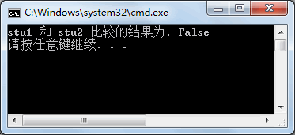

从上面的执行效果可以看出，Stu1 和 Stu2 引用的并不是同一个对象。如果将代码更改为：

```c#
Student stu2=stu1;
```

这样使用 Equals 方法判断的结果才为 True。如果使用 Equals(object o)方法比较 stul 和 stu2 的值，代码如下。

```c#
stul.Equals(stu2);
```

### 4.2 GetHashCode方法

C#

 GetHashCode 方法返回当前 System.Object 的哈希代码，每个对象的哈希值都是固定的。

该方法不含有任何参数，并且不是静态方法，因此需要使用实例来调用该方法。

由于该方法是在 Object 类中定义的，因此任何对象都可以直接调用该方法。

下面通过实例来演示该方法的使用。

【实例】创建两个 Student 类的对象，并分别计算其哈希值。

根据题目要求，代码如下。

```c#
class Program
{    
    static void Main(string[] args)    
    {        
        Student stu1 = new Student();        
        Student stu2 = new Student();        
        Console.WriteLine(stu1.GetHashCode());        
        Console.WriteLine(stu2.GetHashCode());    
    }
}
```

执行上面的代码，效果如下图所示。

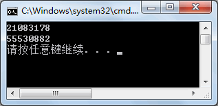

从上面的执行效果可以看出，不同实例的哈希值是不同的，因此也可以通过该方法比较对象是否相等。

### 4.3 GetType方法

C#

 GetType 方法用于获取当前实例的类型，返回值为 System.Type 类型。

C# GetType 方法不含任何参数，是非静态方法。

其调用与上一节《

C# GetHashCode方法

》介绍的 GetHashCode() 方法类似，使用任何对象都能直接调用该方法。

下面通过实例来演示该方法的使用。

【实例】创建字符串类型的变量、整数类型的变量以及 Student 类的对象，并分别使用 GetType 方法获取其类型并输出。

根据题目要求，代码如下。

```c#
class Program
{    
    static void Main(string[] args)    
    {        
        int i = 100;        
        string str = "abc";        
        Student stu = new Student();        
        Console.WriteLine(i.GetType());        
        Console.WriteLine(str.GetType());        
        Console.WriteLine(stu.GetType());    
    }
}
```

执行上面的代码，效果如下图所示。

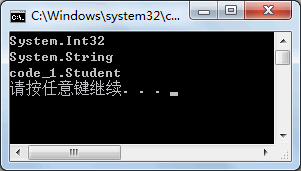

从上面的执行效果可以看出，每一个变量都通过 GetType 方法获取了其类型，通常可以使用该方法比较某些对象是否为同一类型的。

### 4.4 ToString方法

C#

 ToString 方法返回一个对象实例的字符串，在默认情况下将返回类类型的限定名。

C# 中几乎所有的类型都派生自 Object，所以如果当前类型没有重写 ToString() 方法的情况下，调用 ToString() 方法，默认返回当前类型的名称。

任何类都可以重写 ToString 方法，返回自定义的字符串。

对于其他的值类型，则为将值转换为字符串类型的值。

【实例】创建整数类型的变量以及 Object 类的对象，并分别使用 ToString 方法获取其字符串的表现形式并输出。

根据题目要求，代码如下。

```c#
class Program
{    
    static void Main(string[] args)    
    {        
        Int32 a = 1;        
        Object b = new Object();        
        Console.WriteLine("值类型(Int32类型)的字符串的表现形式:{0}", a.ToString());       
        Console.WriteLine("引用类型字符串的表现形式:{0}", b.ToString());    
    }
}
```

执行上面的代码，效果如下图所示。

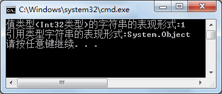

## 5.base

### base关键字：调用父类成员方法

  在 [C#](http://c.biancheng.net/csharp/) 语言中子类中定义的同名方法相当于在子类中重新定义了一个方法，在子类中的对象是调用不到父类中的同名方法的，调用的是子类中的方法。

因此也经常说成是将父类中的同名方法隐藏了。

【实例 1】在 Main 方法中分别创建前面编写过的 Person、Teacher 以及 Student 类的对 象，并调用其中的 Print 方法。

根据题目要求，代码如下。  

```c#
class Program
{    
    static void Main(string[] args)    
    {        
        Person person = new Person();        
        Console.WriteLine("Person类的Print方法打印内容");        
        person.Print();        
        Student student = new Student();        
        Console.WriteLine("Student类的Print方法打印内容");        
        student.Print();        
        Teacher teacher = new Teacher();        
        Console.WriteLine("Teacher类的Print方法打印内容");        
        teacher.Print();    
    }
}
```

执行上面的代码，效果如下图所示。

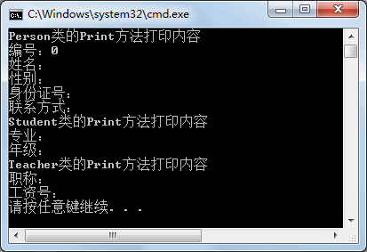

从上面的执行效果可以看出，在创建不同类的对象后，调用同名的方法 Print 效果是不同的。

创建子类的对象仅能调用子类中的 Print 方法，而与父类中的 Print 方法无关。

在继承的关系中，子类如果需要调用父类中的成员可以借助 base 关键字来完成，具体的用法如下。

base. 父类成员

如果在同名的方法中使用 base 关键字调用父类中的方法，则相当于把父类中的方法内容复制到该方法中。

【实例 2】改写实例 1 中的 Student 和 Teacher 类中同名的 Print 方法，使用 base 关键字 调用父类中的 Print 方法。

根据题目要求，更改后的代码如下。

```c#
class Teacher:Person
{    
	public string Title { get; set; }    
	public string WageNo { get; set; }    
	public void Print()    
	{        
		base.Print();        
		Console.WriteLine("职称：" + Title);        
		Console.WriteLine("工资号：" + WageNo);    
	}
}
class Student:Person
{    
	public string Major { get; set; }    
	public string Grade { get; set; }    
	public void Print()    
	{        
		base.Print();        
		Console.WriteLine("专业：" + Major);        
		Console.WriteLine("年级：" + Grade);    
	}
}
```

在实例 1 的 Main 方法中创建子类对象调用 Print 方法的代码不用修改，重新执行后效 果如下图所示。

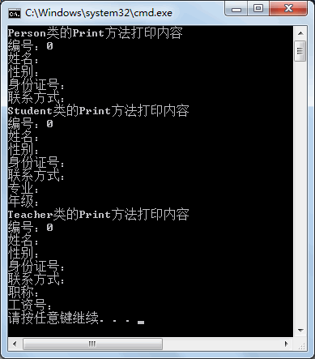

从上面的执行效果可以看出，通过 base 关键字调用 Print 方法即可调用在父类中定义的语句。

> 说明：用户在程序中会遇到 this 和 base 关键字，this 关键字代表的是当前类的对象，而 base 关键字代表的是父类中的对象。

## 6.virtual

### virtual关键字:表示这些成员将会在继承后重写其中的内容

C# `virtual` 是虚拟的含义，在 C# 语言中，默认情况下类中的成员都是非虚拟的，通常将类中的成员定义成虚拟的，表示这些成员将会在继承后重写其中的内容。

virtual 关键字能修饰方法、属性、索引器以及事件等，用到父类的成员中。

使用 virtual 关键字修饰属性和方法的语法形式如下。

```c#

//修饰属性
public  virtual  数据类型  属性名{get; set; }

//修饰方法
访问修饰符  virtual  返回值类型方法名
{
    语句块；
}

```

>  需要注意的是，virtual 关键字不能修饰使用 `static` 修饰的成员。

此外，virtual 关键字既可以添加到访问修饰符的后面，也可以添加到访问修饰符的前面，但实际应用中习惯将该关键字放到访问修饰符的后面。

子类继承父类后能重写父类中的成员，重写的关键字是 override。

所谓重写是指子类和父类的成员定义一致，仅在子类中增加了 override 关键字修饰成员。

例如在父类中有一个求长方形面积的方法，方法定义如下。

```c#
publie int Area（int x, int y）{    return x * y}
```

在子类中重写该方法的代码如下。

```c#
public override int Area（int x,int y）
{
    语句块；
    return  整数类型的值;
}
```
在子类中重写父类中的方法后能改变方法体中的内容，但是方法的定义不能改变。

【实例 1】将上一节《C# base》中定义的 Person 类中的 Print 方法更改为虚拟的方法，分别用 Student 类和 Teacher 类继承 Person 类,并重写 Print 方法，打印出学生信息和教师信息。

为了减少重复的代码，在每个类中省略了属性部分的定义内容，仅保留 Print 方法部分的内容，实现的代码如下。

```c#
class Person
{    
    public virtual void Print()    
    {        
        Console.WriteLine("编号："+ Id);        
        Console.WriteLine("姓名："+ Name);        
        Console.WriteLine("性别："+ Sex);        
        Console.WriteLine("身份证号："+ Cardid);        
        Console.WriteLine("联系方式："+ Tel);    
    }
}
class Student:Person
{    
	public override void Print()    
	{        
		Console.WriteLine("编号："+ Id);        
		Console.WriteLine("姓名："+ Name);        
		Console.WriteLine("性别："+ Sex);        
		Console.WriteLine("身份证号："+ Cardid);        
		Console.WriteLine("联系方式："+ Tel);        
		Console.WriteLine("专业："+ Major);        
		Console.WriteLine("年级："+ Grade);    
	}
}
class Teacher:Person
	{    
	public override void Print()    
	{        
		Console.WriteLine("编号："+ Id);        
		Console.WriteLine("姓名："+ Name);        
		Console.WriteLine("性别："+ Sex);        
		Console.WriteLine("身份证号："+ Cardid);        
		Console.WriteLine("联系方式："+ Tel);        
		Console.WriteLine("专业："+ Major);        
		Console.WriteLine("年级："+ Grade);    
	}
}
```

通过上面的代码即可完成对 Person 类中 Print 方法的重写，在重写后的 Print 方法中能直接调用在 Person 类中定义的成员。

但读者会发现在 Person 类的 Print 中已经对 Person 中的相关属性编写了输出操作的代码，而每一个子类中又重复地编写了代码，造成代码的冗余，也没有体现出代码重用的特点。

如果能在重写父类方法的同时直接使用父类中已经编写过的内容就会方便很多。

在重写 Print 方法后仍然需要使用 base 关键字调用父类中的 Print 方法执行相应的操作。

【实例 2】改写实例 1 中的 Student 和 Teacher 类中重写的 Print 方法，使用 base 关键字调用父类中的 Print 方法。

根据题目要求，更改后的代码如下。

```c#
class Student:Person
{
    public override void Print()
    {
        base.Print ();
        Console.WriteLine("专业："+ Major);
        Console.WriteLine("年级："+ Grade);
    }
}
class Teacher:Person
{
    public override void Print()
    {
        base.Print ();
        Console.WriteLine("专业："+ Major);
        Console.WriteLine("年级："+ Grade);
    }
}
```

从上面的代码可以看出继承给程序带来的好处，不仅减少了代码的冗余，还增强了程序的可读性。

方法隐藏和重写方法有区别吗？这是很多初学者常问的问题。观察以下代码，思考结果会是什么？

```c#
class Program
{
    static void Main(string[] args)
    {
        A a1 = new B();
        a1.Print();
        A a2 = new C();
        a2.Print();
    }
}
class A
{
    public virtual void Print()
    {
        Console.WriteLine("A");
    }
}
class B :A
{
    public new void Print()
    {
        Console.WriteLine("B");
    }
}
class C :A
{
    public override void Print()
    {
        Console.WriteLine("C");
    }
}
```

执行上面的代码，效果如下图所示。

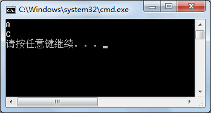

从上面的执行效果可以看出，使用方法隐藏的方法调用的结果是父类 A 中 Print 方法中的内容，而使用方法重写的方法调用的结果是子类 C 中 Print 方法中的内容。

因此方法隐藏相当于在子类中定义新方法，而方法重写则是重新定义父类中方法的内容。

从上面的代码也可以看出，在“A a1=new B()”语句中 A 类是父类、B 类是子类，相当于将子类转换成父类，即隐式转换。

如果需要将父类转换成子类，则需要强制转换，并且在强制转换前需要先将所需的子类转换成父类，示例代码如下。

```c#
A a2=new C();
C c=(C) a2;
c.Print();
```

在上面的实例中,a2 是父类对象,然后将其强制转换成 C 类对象。

Object 类中的 ToString 方法能被类重写，并返回所需的字符串，通常将其用到类中返回类中属性的值。

在 Student 类中添加重写的 ToString 方法，代码如下。

```c#
class Student
{
    public string Major{ get; set;}
    public string Grade{ get; set;}
    public void Print()
    {
        Console.WriteLine("专业："+ Major);
        Console.WriteLine("年级："+ Grade);
    }
    public override string ToString()
    {
        return Major+","+Grade;
    }
}
```

这样，在调用 Student 类中的 ToString 方法时即可获取专业和年级的值。

此外，除了 ToString 方法，在类中也可以重写 Equals 方法、GetHashCode 方法。

## 7.abstract

### abstract：声明抽象类或抽象方法

C#

 abstract 关键字代表的是抽象的，使用该关键字能修饰类和方法，修饰的方法被称为抽象方法、修饰的类被称为抽象类。

在 C# 语言中抽象方法是一种不带方法体的方法，仅包含方法的定义，语法形式如下。

访问修饰符  abstract  方法返回值类型  方法名(参数列表);

其中，当 abstract 用于修饰方法时，也可以将 abstract 放到访问修饰符的前面。

抽象方法定义后面的“;”符号是必须保留的。需要注意的是，抽象方法必须定义在抽象类中。

在定义抽象类时，若使用 abstract 修饰类，将其放到 class 关键字的前面，语法形式如下。
```c#
访问修饰符  abstract class  类名
{
    //类成员
}
```
其中“abstract”关键字也可以放到访问修饰符的前面。

在抽象类中可以定义抽象方法，也可以定义非抽象方法。

通常抽象类会被其他类继承，并重写其中的抽象方法或者虚方法。

此外，尽管在抽象类中仍然能定义构造器，但抽象类不能实例化，即不能使用如下语句。
```c#
new  抽象类的名称();
```
【实例 1】创建抽象类 ExamResult，并在类中定义数学 (Math)、英语 (English) 成绩的属性，定义抽象方法计算总成绩。

分别定义数学专业和英语专业的学生类继承抽象类 ExamResult，重写计算总成绩的方法并根据科目分数的不同权重计算总成绩。

其中，数学专业的数学分数占60%、英语分数占40%；英语专业的数学分数占40%、英语分数占60%。

根据题目要求，代码如下。

```c#
abstract class ExamResult
{
    //学号
    public int Id { get; set; }
    //数学成绩
    public double Math { get; set; }
    //英语成绩
    public double English { get; set; }
    //计算总成绩
    public abstract void Total();
}
class MathMajor : ExamResult
{
    public override void Total()
    {
        double total = Math * 0.6 + English * 0.4;
        Console.WriteLine("学号为" + Id + "数学专业学生的成绩为：" + total);
    }
}
class EnglishMajor : ExamResult
{
    public override void Total()
    {
        double total = Math * 0.4 + English * 0.6;
        Console.WriteLine("学号为" + Id + "英语专业学生的成绩为：" + total);
    }
}
```

在 Main 方法中分别创建 MathMajor 和 EnglishMajor 类的对象，并调用其中的 Total 方法，代码如下。

```c#
class Program
{
    static void Main(string[] args)
    {
        MathMajor mathMajor = new MathMajor();
        mathMajor.Id = 1;
        mathMajor.English = 80;
        mathMajor.Math = 90;
        mathMajor.Total();
        EnglishMajor englishMajor = new EnglishMajor();
        englishMajor.Id = 2;
        englishMajor.English = 80;
        englishMajor.Math = 90;
        englishMajor.Total();
    }
}
```

执行上面的语句，代码如下图所示。

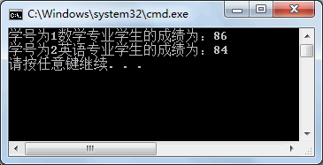

在实际应用中，子类仅能重写父类中的虚方法或者抽象方法，当不需要使用父类中方法的内容时，将其定义成抽象方法，否则将方法定义成虚方法。

## 8.sealed

### sealed：声明密封类或密封方法

> 不能被继承后重写的方法,和不能被继承的类

C# sealed 关键字的含义是密封的，使用该关键字能修饰类或者类中的方法，修饰的类被称为密封类、修饰的方法被称为密封方法。

但是密封方法必须出现在子类中，并且是子类重写的父类方法，即 sealed 关键字必须与 override 关键字一起使用。

密封类不能被继承，密封方法不能被重写。在实际应用中，在发布的软件产品里有些类或方法不希望再被继承或重写，可以将其定义为密封类或密封方法。

【实例】创建一个计算面积的抽象类 AreaAbstract ,并定义抽象方法计算面积。

定义矩形类继承该抽象类，并重写抽象方法，将其定义为密封方法；定义圆类继承该抽象类，并重写抽象方法，将该类定义为密封类。

根据题目要求，代码如下。

```c#
abstract class AreaAbstract
{
    public abstract void Area();
}
class Rectangle : AreaAbstract
{
    public double Width { get; set; }
    public double Length { get; set; }
    public sealed override void Area()
    {
        Console.WriteLine("矩形的面积是：" + Width * Length);
    }
}
sealed class Circle : AreaAbstract
{
    public double r { get; set; }
    public override void Area()
    {
        Console.WriteLine("圆的面积是：" + r * 3.14 * 3.14);
    }
}
```

在上面的实例中，Circle 类不能被继承，Rectangle 类中的 Area 方法不能被重写。

## 9.构造器的关系

在前面《C#继承》一节中已经介绍了类的继承关系，但一直没有涉及的内容是类中的构造器，在继承关系中构造器之间究竟是什么关系呢？

先看一下实例代码，然后观察运行结果。

```c#
class Program
{
    static void Main(string[] args)
    {
        B b = new B();
    }
}
class A
{
    public A()
    {
        Console.WriteLine("A类的构造器");
    }
}
class B :A
{
    public B()
    {
        Console.WriteLine("B类的构造器");
    }
}
```

执行上面的代码，效果如下图所示。

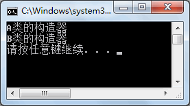

从上面的执行效果可以看出，在创建子类的实例时，先执行父类 A 中的无参构造器，再执行子类 B 中的无参构造器。

如果调用子类中带参数的构造器会发生什么呢？还会执行父类中的构造器吗？

将上面实例中子类 B 的代码以及 Main 方法的代码更改为如下代码。

```c#
class Program
{
    static void Main(string[] args)
    {
        B b = new B("ok");
    }
}
class A
{
    public A()
    {
        Console.WriteLine("A类的构造器");
    }
}
class B :A
{
    public B()
    {
        Console.WriteLine("B类的构造器");
    }
    public B(string name)
    {
        Console.WriteLine("B类中带参数的构造器，传入的值为：" + name);
    }
}
```

执行上面的代码，效果如下图所示。

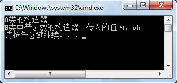

从上面的执行效果可以看出，尽管在子类中调用了带参数的构造器，也会先调用其父类中的无参构造器。

如果需要在子类中调用父类的构造器应该怎么办呢？直接在构造器后面使用“:base(参数)”的形式即可。

默认情况下，在子类的构造器中都会自动调用父类的无参构造器，如果需要调用父类中带参数的构造器才使用“:base(参数)”的形式。

在父类 A 中添加一个带参数的构造器，代码如下。

```c#
class A
{
    public A()
    {
        Console.WriteLine("A类的构造器");
    }
    public A(string name)
    {
        Console.WriteLine("A类的构造器，传入的值为：" + name);
    }
}
class B :A
{
    public B()
    {
        Console.WriteLine("B类的构造器");
    }
    public B(string name):base(name)    //调用父类中带参数的构造器
    {
        Console.WriteLine("B类中带参数的构造器，传入的值为：" + name);
    }
}
```

Main 方法中的内容不变，执行效果如下图所示。

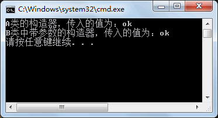

从上面的执行效果可以看出，通过在子类的构造器中使用“:base(参数)”的方式即可调用父类带参数的构造器，实际上这也是子类和父类中构造器的一种继承关系表示。

> 注意：如果在父类中没有无参构造器，必须在子类的构造器中继承父类的构造器，否则程序无法成功编译。

## 10.多态

在 

C#

 语言中多态称为运行时多态，也就是在程序运行时自动让父类的实例调用子类中重写的 方法，它并不是在程序编译阶段完成的。

使用继承实现多态，实际上是指子类在继承父类后，重写了父类的虚方法或抽象方法。

在创建父类的对象指向每一个子类的时候，根据调用的不同子类中重写的方法产生了不同的执行效果。

总而言之，使用继承实现多态必须满足以下两个条件。

* 子类在继承父类时必须有重写的父类的方法。
* 在调用重写的方法时，必须创建父类的对象指向子类(即子类转换成父类)。

【实例】根据不同层次（本科生、研究生）的学生打印出不同的专业要求。

根据题目要求，创建专业信息的抽象类 (Major)，并在其中定义学号 (Id)、姓名 (Name)，以及打印专业要求的抽象方法 (Requirenwnt)。

分别使用本科生和研究生类继承专业信息类，并重写其中的打印专业要求的方法。实现的代码如下。

```c#
class Program
{
    static void Main(string[] args)
    {
        Major major1 = new Undergraduate();
        major1.Id = 1;
        major1.Name = "张晓";
        Console.WriteLine("本科生信息：");
        Console.WriteLine("学号：" + major1.Id + "姓名：" + major1.Name);
        major1.Requirement();
        Major major2 = new Graduate();
        major2.Id = 2;
        major2.Name = "李明";
        Console.WriteLine("研究生信息：");
        Console.WriteLine("学号：" + major2.Id + "姓名：" + major2.Name);
        major2.Requirement();
    }
}
abstract class Major
{
    public int Id { get; set; }
    public string Name { get; set; }
    public abstract void Requirement();
}
class Undergraduate :Major
{
    public override void Requirement()
    {
        Console.WriteLine("本科生学制4年，必须修满48学分");
    }
}
class Graduate : Major
{
    public override void Requirement()
    {
        Console.WriteLine("研究生学制3年，必须修满32学分");
    }
}
```

执行上面的代码，效果如下图所示。

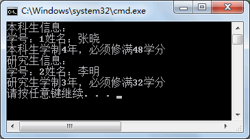

从上面的执行效果可以看出，创建父类的实例指向了不同的子类，在程序运行时会自动调用子类中重写后的方法内容，显示出本科生和研究生的要求信息。