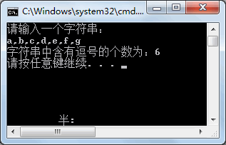
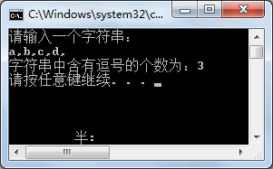

# C# 数组（Array）

数组是一个存储相同类型元素的固定大小的顺序集合。数组是用来存储数据的集合，通常认为数组是一个同一类型变量的集合。

声明数组变量并不是声明 number0、number1、...、number99 一个个单独的变量，而是声明一个就像 numbers 这样的变量，然后使用 numbers[0]、numbers[1]、...、numbers[99] 来表示一个个单独的变量。数组中某个指定的元素是通过索引来访问的。

所有的数组都是由连续的内存位置组成的。最低的地址对应第一个元素，最高的地址对应最后一个元素。


## 1.声明数组

在 C# 中声明一个数组，您可以使用下面的语法：

```c#
datatype[] arrayName;
```

其中，

* *datatype* 用于指定被存储在数组中的元素的类型。
* *[ ]* 指定数组的秩（维度）。秩指定数组的大小。
* *arrayName* 指定数组的名称。

例如：

```c#
double[] balance;
```

## 2.初始化数组

声明一个数组不会在内存中初始化数组。当初始化数组变量时，您可以赋值给数组。

数组是一个引用类型，所以您需要使用 **new** 关键字来创建数组的实例。

例如：

```c#
double[] balance = new double[10];
```

## 3.赋值给数组

您可以通过使用索引号赋值给一个单独的数组元素，比如：

```c#
double[] balance = new double[10];
balance[0] = 4500.0;
```

您可以在声明数组的同时给数组赋值，比如：

```c#
double[] balance = { 2340.0, 4523.69, 3421.0};
```

您也可以创建并初始化一个数组，比如：

```c#
int [] marks = new int[5]  { 99,  98, 92, 97, 95};
```

在上述情况下，你也可以省略数组的大小，比如：

```c#
int [] marks = new int[]  { 99,  98, 92, 97, 95};
```

您也可以赋值一个数组变量到另一个目标数组变量中。在这种情况下，目标和源会指向相同的内存位置：

```c#
int [] marks = new int[]  { 99,  98, 92, 97, 95};
int[] score = marks;
```

当您创建一个数组时，C# 编译器会根据数组类型隐式初始化每个数组元素为一个默认值。例如，int 数组的所有元素都会被初始化为 0。

## 4.访问数组元素

元素是通过带索引的数组名称来访问的。这是通过把元素的索引放置在数组名称后的方括号中来实现的。例如：

```
double salary = balance[9];
```

下面是一个实例，使用上面提到的三个概念，即声明、赋值、访问数组：

```c#
using System;
namespace ArrayApplication
{
   class MyArray
   {
      static void Main(string[] args)
      {
         int []  n = new int[10]; /* n 是一个带有 10 个整数的数组 */
         int i,j;

         /* 初始化数组 n 中的元素 */         
         for ( i = 0; i < 10; i++ )
         {
            n[ i ] = i + 100;
         }

         /* 输出每个数组元素的值 */
         for (j = 0; j < 10; j++ )
         {
            Console.WriteLine("Element[{0}] = {1}", j, n[j]);
         }
         Console.ReadKey();
      }
   }
}
```

当上面的代码被编译和执行时，它会产生下列结果：

```
Element[0] = 100
Element[1] = 101
Element[2] = 102
Element[3] = 103
Element[4] = 104
Element[5] = 105
Element[6] = 106
Element[7] = 107
Element[8] = 108
Element[9] = 109
```


## 5.其他表现形式

| 概念                                                         | 描述                                                         |
| :----------------------------------------------------------- | :----------------------------------------------------------- |
| [多维数组](https://www.runoob.com/csharp/csharp-multi-dimensional-arrays.html) | C# 支持多维数组。多维数组最简单的形式是二维数组。            |
| [交错数组](https://www.runoob.com/csharp/csharp-jagged-arrays.html) | C# 支持交错数组，即数组的数组。                              |
| [传递数组给函数](https://www.runoob.com/csharp/csharp-passing-arrays-to-functions.html) | 您可以通过指定不带索引的数组名称来给函数传递一个指向数组的指针。 |
| [参数数组](https://www.runoob.com/csharp/csharp-param-arrays.html) | 这通常用于传递未知数量的参数给函数。                         |
| [Array 类](https://www.runoob.com/csharp/csharp-array-class.html) | 在 System 命名空间中定义，是所有数组的基类，并提供了各种用于数组的属性和方法。 |

### 5.1多维数字

C# 支持多维数组。多维数组又称为矩形数组。

您可以声明一个 string 变量的二维数组，如下：

```c#
string [,] names;
```

或者，您可以声明一个 int 变量的三维数组，如下：

```c#
int [ , , ] m;
```

#### a.二维数组

多维数组最简单的形式是二维数组。一个二维数组，在本质上，是一个一维数组的列表。

一个二维数组可以被认为是一个带有 x 行和 y 列的表格。下面是一个二维数组，包含 3 行和 4 列：


因此，数组中的每个元素是使用形式为 a[ i , j ] 的元素名称来标识的，其中 a 是数组名称，i 和 j 是唯一标识 a 中每个元素的下标。

##### i.初始化二维数组

多维数组可以通过在括号内为每行指定值来进行初始化。下面是一个带有 3 行 4 列的数组。

```
int [,] a = new int [3,4] {
 {0, 1, 2, 3} ,   /*  初始化索引号为 0 的行 */
 {4, 5, 6, 7} ,   /*  初始化索引号为 1 的行 */
 {8, 9, 10, 11}   /*  初始化索引号为 2 的行 */
};
```

##### ii.访问二维数组元素

二维数组中的元素是通过使用下标（即数组的行索引和列索引）来访问的。例如：

```
int val = a[2,3];
```

上面的语句将获取数组中第 3 行第 4 个元素。您可以通过上面的示意图来进行验证。让我们来看看下面的程序，我们将使用嵌套循环来处理二维数组：

```c#
using System;

namespace ArrayApplication
{
    class MyArray
    {
        static void Main(string[] args)
        {
            /* 一个带有 5 行 2 列的数组 */
            int[,] a = new int[5, 2] {{0,0}, {1,2}, {2,4}, {3,6}, {4,8} };

            int i, j;

            /* 输出数组中每个元素的值 */
            for (i = 0; i < 5; i++)
            {
                for (j = 0; j < 2; j++)
                {
                    Console.WriteLine("a[{0},{1}] = {2}", i, j, a[i,j]);
                }
            }
           Console.ReadKey();
        }
    }
}
```

当上面的代码被编译和执行时，它会产生下列结果：

```
a[0,0]: 0
a[0,1]: 0
a[1,0]: 1
a[1,1]: 2
a[2,0]: 2
a[2,1]: 4
a[3,0]: 3
a[3,1]: 6
a[4,0]: 4
a[4,1]: 8
```

### 5.2交错数组

交错数组是数组的数组。您可以声明一个带有 **int** 值的交错数组 *scores*，如下所示：

```
int [][] scores;
```

声明一个数组不会在内存中创建数组。创建上面的数组：

```
int[][] scores = new int[5][];
for (int i = 0; i < scores.Length; i++) 
{
   scores[i] = new int[4];
}
```

您可以初始化一个交错数组，如下所示：

```
int[][] scores = new int[2][]{new int[]{92,93,94},new int[]{85,66,87,88}};
```

其中，scores 是一个由两个整型数组组成的数组 -- scores[0] 是一个带有 3 个整数的数组，scores[1] 是一个带有 4 个整数的数组。

下面的实例演示了如何使用交错数组：

```c#
using System;

namespace ArrayApplication
{
    class MyArray
    {
        static void Main(string[] args)
        {
            /* 一个由 5 个整型数组组成的交错数组 */
            int[][] a = new int[][]{new int[]{0,0},new int[]{1,2}, 
            new int[]{2,4},new int[]{ 3, 6 }, new int[]{ 4, 8 } }; 

            int i, j;

            /* 输出数组中每个元素的值 */
            for (i = 0; i < 5; i++)
            {
                for (j = 0; j < 2; j++)
                {
                    Console.WriteLine("a[{0}][{1}] = {2}", i, j, a[i][j]);
                }
            }
           Console.ReadKey();
        }
    }
}
```

当上面的代码被编译和执行时，它会产生下列结果：

```
a[0][0] = 0
a[0][1] = 0
a[1][0] = 1
a[1][1] = 2
a[2][0] = 2
a[2][1] = 4
a[3][0] = 3
a[3][1] = 6
a[4][0] = 4
a[4][1] = 8
```

### 5.3传递数组给函数

在 C# 中，您可以传递数组作为函数的参数。您可以通过指定不带索引的数组名称来给函数传递一个指向数组的指针。

```c#
using System;

namespace ArrayApplication
{
   class MyArray
   {
      double getAverage(int[] arr, int size)
      {
         int i;
         double avg;
         int sum = 0;

         for (i = 0; i < size; ++i)
         {
            sum += arr[i];
         }

         avg = (double)sum / size;
         return avg;
      }
      static void Main(string[] args)
      {
         MyArray app = new MyArray();
         /* 一个带有 5 个元素的 int 数组 */
         int [] balance = new int[]{1000, 2, 3, 17, 50};
         double avg;

         /* 传递数组的指针作为参数 */
         avg = app.getAverage(balance, 5 ) ;

         /* 输出返回值 */
         Console.WriteLine( "平均值是： {0} ", avg );
         Console.ReadKey();
      }
   }
}
```


### 5.4参数数组

有时，当声明一个方法时，您不能确定要传递给函数作为参数的参数数目。C# 参数数组解决了这个问题，参数数组通常用于传递未知数量的参数给函数。

##### **params** 关键字

在使用数组作为形参时，C# 提供了 **<u>params</u>** 关键字，使调用数组为形参的方法时，既可以传递数组实参，也可以传递一组数组元素。**<u>params</u>** 的使用格式为：

```c#
public 返回类型 方法名称( params 类型名称[] 数组名称 )
```

```c#
using System;

namespace ArrayApplication
{
   class ParamArray
   {
      public int AddElements(params int[] arr)
      {
         int sum = 0;
         foreach (int i in arr)
         {
            sum += i;
         }
         return sum;
      }
   }
      
   class TestClass
   {
      static void Main(string[] args)
      {
         ParamArray app = new ParamArray();
         int sum = app.AddElements(512, 720, 250, 567, 889);
         Console.WriteLine("总和是： {0}", sum);
         Console.ReadKey();
      }
   }
}
```

当上面的代码被编译和执行时，它会产生下列结果：

```cmd
总和是： 2938
```

### 5.5Array类

Array 类是 C# 中所有数组的基类，它是在 System 命名空间中定义。Array 类提供了各种用于数组的属性和方法。

#### a.Array 类的属性

下表列出了 Array 类中一些最常用的属性：

| 序号 | 属性 & 描述                                                  |
| :--- | :----------------------------------------------------------- |
| 1    | **IsFixedSize** 获取一个值，该值指示数组是否带有固定大小。   |
| 2    | **IsReadOnly** 获取一个值，该值指示数组是否只读。            |
| 3    | **Length** 获取一个 32 位整数，该值表示所有维度的数组中的元素总数。 |
| 4    | **LongLength** 获取一个 64 位整数，该值表示所有维度的数组中的元素总数。 |
| 5    | **Rank** 获取数组的秩（维度）。                              |

如需了解 Array 类的完整的属性列表，请参阅微软的 C# 文档。

#### b.Array 类的方法

下表列出了 Array 类中一些最常用的方法：

| 序号 | 方法 & 描述                                                  |
| :--- | :----------------------------------------------------------- |
| 1    | **Clear** 根据元素的类型，设置数组中某个范围的元素为零、为 false 或者为 null。 |
| 2    | **Copy(Array, Array, Int32)** 从数组的第一个元素开始复制某个范围的元素到另一个数组的第一个元素位置。长度由一个 32 位整数指定。 |
| 3    | **CopyTo(Array, Int32)** 从当前的一维数组中复制所有的元素到一个指定的一维数组的指定索引位置。索引由一个 32 位整数指定。 |
| 4    | **GetLength**  获取一个 32 位整数，该值表示指定维度的数组中的元素总数。 |
| 5    | **GetLongLength** 获取一个 64 位整数，该值表示指定维度的数组中的元素总数。 |
| 6    | **GetLowerBound** 获取数组中指定维度的下界。                 |
| 7    | **GetType** 获取当前实例的类型。从对象（Object）继承。       |
| 8    | **GetUpperBound** 获取数组中指定维度的上界。                 |
| 9    | **GetValue(Int32)** 获取一维数组中指定位置的值。索引由一个 32 位整数指定。 |
| 10   | **IndexOf(Array, Object)** 搜索指定的对象，返回整个一维数组中第一次出现的索引。 |
| 11   | **Reverse(Array)** 逆转整个一维数组中元素的顺序。            |
| 12   | **SetValue(Object, Int32)** 给一维数组中指定位置的元素设置值。索引由一个 32 位整数指定。 |
| 13   | **Sort(Array)** 使用数组的每个元素的 IComparable 实现来排序整个一维数组中的元素。 |
| 14   | **ToString** 返回一个表示当前对象的字符串。从对象（Object）继承。 |

如需了解 Array 类的完整的方法列表，请参阅微软的 C# 文档。


下面的程序演示了 Array 类的一些方法的用法：

```c#
using System;
namespace ArrayApplication
{
    class MyArray
    {
        
        static void Main(string[] args)
        {
            int[] list = { 34, 72, 13, 44, 25, 30, 10 };

            Console.Write("原始数组： ");
            foreach (int i in list)
            {
                Console.Write(i + " ");
            }
            Console.WriteLine();
           
            // 逆转数组
            Array.Reverse(list);
            Console.Write("逆转数组： ");
            foreach (int i in list)
            {
                Console.Write(i + " ");
            }
            Console.WriteLine();
            
            // 排序数组
            Array.Sort(list);
            Console.Write("排序数组： ");
            foreach (int i in list)
            {
                Console.Write(i + " ");
            }
            Console.WriteLine();

           Console.ReadKey();
        }
    }
}
```

当上面的代码被编译和执行时，它会产生下列结果：

```cmd
原始数组： 34 72 13 44 25 30 10
逆转数组： 10 30 25 44 13 72 34
排序数组： 10 13 25 30 34 44 72
```

> Array.Sort() 仅支持一维数组。

## 6.foreach

foreach 语句经常与数组一起使用，在 C# 语言中提供了 foreach 语句遍历数组中的元素，具体的语法形式 如下。


```c#
foreach(数据类型  变量名  in  数组名)
{
    //语句块；
}
```
【实例】在 Main 方法中创建一个 double 类型的数组，并在该数组中存入 5 名学生的考试成绩，计算总成绩和平均成绩。

根据题目要求，使用foreach语句实现该功能，代码如下。

```c#
class Program
{
    static void Main(string[] args)
    {
        double[] points = { 80, 88, 86, 90, 75.5 };
        double sum = 0;
        double avg = 0;
        foreach(double point in points)
        {
            sum = sum + point;
        }
        avg = sum / points.Length;
        Console.WriteLine("总成绩为：" + sum);
        Console.WriteLine("平均成绩为：" + avg);
    }
}
```

在计算平均成绩时，通过数组的 Length 属性即可得到数组中元素的个数，使用总成绩除以元素的个数即为结果。

执行上面的语句，效果如下图所示。


从上面的执行效果可以看出，在使用 foreach 语句时可以免去使用下标的麻烦，这也 给遍历数组中的元素带来很多方便。

## 7.Split

C#

 Split 方法用于按照指定的字符串来拆分原有字符串，并返回拆分后得到的字符串数组。

下面用两个实例来演示字符串拆分方法的应用。

【实例 1】在 Main 方法中从控制台输入一个字符串，然后计算该字符串中包含的逗号的个数。

根据题目要求，如果要查询逗号的个数，通过拆分方法 Split 将拆分结果存放到字符串数组中，数组的长度减 1 即为字符串中含有逗号的个数，代码如下。

```c#
class Program
{
    static void Main(string[] args)
    {
        Console.WriteLine("请输入一个字符串：");
        string str = Console.ReadLine();
        string[] condition = { "," };
        string[] result = str.Split(condition, StringSplitOptions.None);
        Console.WriteLine("字符串中含有逗号的个数为：" + (result.Length - 1));
    }
}
```

执行上面的代码，效果如下图所示。



在使用 Split 方法时，需要注意该方法中传递的参数 (condition, StringSplitOptions.None)。

第一个参数是拆分的条件数组，可以在该数组中存放多个字符串作为拆分的条件。

第二个 参数 StringSplitOptions.None 是拆分的选项，表示如果在拆分时遇到空字符也拆分出一个元素。

如果在拆分时不需要包含空字符串，则可以使用 StringSplitOptions.RemoveEmptyEntries 选项，例如在上例中将 StringSplitOptions.None 更改成 StringSplitOptions.RemoveEmptyEntries, 语句如下。

```c#
class Program
{
    static void Main(string[] args)
    {
        Console.WriteLine("请输入一个字符串：");
        string str = Console.ReadLine();
        string[] condition = { "," };
        string[] result = str.Split(condition, StringSplitOptions.RemoveEmptyEntries);
        Console.WriteLine("字符串中含有逗号的个数为：" + (result.Length - 1));
    }
}
```

仍然执行该实例中所输入的字符串，效果如下图所示。



从上面的执行效果可以看出，逗号的个数为 3，而前面的例子中逗号的个数为 4，这是因为当拆分“a,b,c,d,”时，最后一个逗号拆分后逗号后面的值是一个空格，因此拆分结果中数组的元素个数为 4 而不是 5。

在实际应用中，用户应根据具体情况选择拆分选项的不同值。

> 参数 `StringSplitOptions.None` 是拆分的选项，表示如果在拆分时遇到空字符也拆分出一个元素。
>
> 参数`tringSplitOptions.RemoveEmptyEntries`是拆分的选项，表示如果在拆分时遇到空字符不会拆分出一个元素。