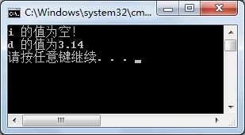
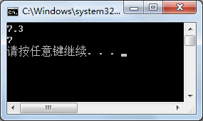
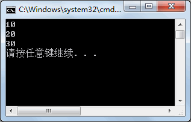
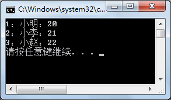
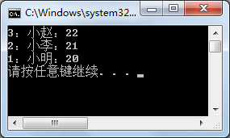

# 泛型

泛型是 C#2.0 推出的新语法，不是语法糖，而是 2.0 由框架升级提供的功能。

我们在编程程序时，经常会遇到功能非常相似的模块，只是它们处理的数据不一样。

但我们没有办法，只能分别写多个方法来处理不同的数据类型。

这个时候，那么问题来了，有没有一种办法，用同一个方法来处理传入不同种类型参数的办法呢？泛型的出现就是专门来解决这个问题的。

泛型是在 System.Collections.Generic 命名空间中的，用于约束类或方法中的参数类型。

泛型的应用非常广泛，包括方法、类以及集合等。

## 1.泛型简介

在前面已经介绍了类和方法的定义，那么泛型究竟有什么作用呢？在前面《

C#集合

》一节中介绍了集合，集合中的项允许是 object 型的值，因此可以存放任意类型的值。

例如，在 ArrayList 中以 double 类型存入学生考试成绩，但存入值时并没有做验证，存入了其他数据类型的值，代码如下。

```c#
ArrayList arrayList=new ArrayList();
arrayList.Add(100);
arrayList.Add("abc");
arrayList.Add(85.5);
```

在输出集合中的元素时，如果使用 double 类型来遍历集合中的元素，代码如下。

```c#
foreach (int d in arrayList)
{
    Console.WriteLine(d);
}
```

执行上面的代码，由于在集合中存放的并不全是 double 类型的值，因此会出现 

```c#
System.InvalidCastException
```

 异常，即指定的转换无效。

为了避免类似的情况产生，将集合中元素的类型都指定为 double 类型，不能在集合中输入其他类型的值，这种设置方式即为泛型的一种应用。

## 2.可空类型: Nullable

>  对于引用类型的变量来说，如果未对其赋值，在默认情况下是 Null 值，对于值类型的变量，如果未赋值，整型变量的默认值为 0。

> 但通过 0 判断该变量是否赋值了是不太准确的。  

定义可空类型变量的语法形式如下。
```c#
System.Nullable<T> 变量名;
```
其中，`Nullable`所在的命名空间 `System` 在 C# 类文件中默认是直接引入的，因此可以省略 `System`，直接使用 `Nullable` 即可；`T` 代表任意类型，例如定义一个存放 int 类型值的变量，代码如下。
```
Nullable<int> a;
```

这样，可以将变量 a 的值设置为 Null。即：

```
Nullable<int> a = Null;
```

除了使用上面的方法定义可空类型变量以外，还可以通过如下语句定义一个 int 类型的可空类型变量。

```
int? a
```

从上面的定义可以看出，`int?` 等同于`Nullable<int>`。

此外，在使用可空类型时也可以通过 `HasValue` 属性判断变量值是否为 Null 值。

下面通过实例来演示可空类型的应用。

### 实例
分别创建一个 int 的可空类型变量和 double 的可空类型变量，并使用 `HasValue` 属性判断其值是否为空。

根据题目要求，代码如下。

```c#
class Program
{
    static void Main(string[] args)
    {
        int? i = null;
        double? d = 3.14;
        if (i.HasValue)
        {
            Console.WriteLine("i 的值为{0}", i);
        }
        else
        {
            Console.WriteLine("i 的值为空！");
        }
        if (d.HasValue)
        {
            Console.WriteLine("d 的值为{0}", d);
        }
        else
        {
            Console.WriteLine("d 的值为空！");
        }
    }  
}
```

执行上面的代码，效果如下图所示。



从上面的执行效果可以看出，可空类型允许将值类型变量的值设置为 Null，并可以通过 HasValue 属性判断其是否为 Null 值。

## 3.泛型方法

在 C# 语言中泛型方法是通过泛型来约束方法中的参数类型，也可以理解为对数据类型设置了参数。

如果没有泛型，每次方法中的参数类型都是固定的，不能随意更改。

在使用泛型后，方法中的数据类型则有指定的泛型来约束，即可以根据提供的泛型来传递不同类型的参数。

定义泛型方法需要在方法名和参数列表之间加上`<>`，并在其中使用 `T` 来代表参数类型。

当然，也可以使用其他的标识符来代替参数类型， 但通常都使用 `T` 来表示。下面通过实例来演示泛型方法的使用。

### 实例

创建泛型方法，实现对两个数的求和运算。

根据题目要求，代码如下。

```
class Program
{
    static void Main(string[] args)
    {
        //将T设置为double类型
        Add<double>(3.3, 4);
        //将T设置为int类型
        Add<int>(3, 4);
    }
    //加法运算
    private static void Add<T>(T a, T b)
    {
        double sum = double.Parse(a.ToString()) + double.Parse(b.ToString());
        Console.WriteLine(sum);
    }
}
```

执行上面的代码，效果如下图所示。



从上面的执行效果可以看出，在调用 Add 方法时能指定不同的参数类型执行加法运算。

如果在调用 Add 方法时，没有按照 <T> 中规定的类型传递参数，则会出现编译错误，这样就可以尽量避免程序在运行时出现异常。

## 4.泛型类

语言中泛型类的定义与泛型方法类似，是在泛型类的名称后面加上<T>，当然,也可以定义多个类型，即“<T1,T2,・・・>”。

具体的定义形式如下。

class 类名<T1,T2,…>
{
    //类的成员
}

这样，在类的成员中即可使用 T1、T2 等类型来定义。

下面通过实例来演示泛型类的使用。

### 实例

定义泛型类，并在泛型类中定义数组，提供添加和显示数组中全部元素的 方法。

根据题目要求，代码如下。

```c#
class MyTest<T>
{
    private T[] items = new T[3];
    private int index = 0;
    //向数组中添加项
    public void Add(T t)
    {
        if (index < 3)
        {
            items[index] = t;
            index++;
        }
        else
        {
            Console.WriteLine("数组已满！");
        }
    }
    //读取数组中的全部项
    public void Show()
    {
        foreach(T t in items)
        {
            Console.WriteLine(t);
        }
    }
}
```

在 Main 方法中调用 MyTest 类中的方法，代码如下。

```c#
class Program
{
    static void Main(string[] args)
    {
        MyTest<int> test = new MyTest<int>();
        test.Add(10);
        test.Add(20);
        test.Add(30);
        test.Show();
    }
}
```

执行上面的代码，效果如下图所示。



从上面的执行效果可以看出，根据泛型类中指定的数据类型创建数组，并实现了对数组元素的添加和显示。

## 5.泛型集合

泛型集合是泛型中最常见的应用，主要用于约束集合中存放的元素。

  由于在集合中能存放任意类型的值，在取值时经常会遇到数据类型转换异常的情况，因此推荐在定义集合时使用泛型集合。

前面《[C# ArrayList](http://c.biancheng.net/view/2892.html)》与《[C# Hashtable](http://c.biancheng.net/view/2897.html)》中已经介绍了非泛型集合中的 ArrayList、Hashtable。

非泛型集合中的 ArrayList、Hashtable 在泛型集合中分别使用 List<T> 和 Dictionary<K,V> 来表示，其他泛型集合均与非泛型集合一致。

下面以 List<T> 和 Dictionary<K,V> 为例介绍泛型集合的使用。

### 实例

使用泛型集合 List<T> 实现对学生信息的添加和遍历。

根据题目要求，将学生信息定义为一个类，并在该类中定义学号、姓名、年龄属性。

在泛型集合 List<T> 中添加学生信息类的对象，并遍历该集合。实现的代码如下  

```c#
class Program
{
    static void Main(string[] args)
    {
        //定义泛型集合
        List<Student> list = new List<Student>();
        //向集合中存入3名学员
        list.Add(new Student(1, "小明", 20));
        list.Add(new Student(2, "小李", 21));
        list.Add(new Student(3, "小赵", 22));
        //遍历集合中的元素
        foreach(Student stu in list)
        {
            Console.WriteLine(stu);
        }
    }
}
class Student
{
    //提供有参构造方法，为属性赋值
    public Student(int id,string name,int age)
    {
        this.id = id;
        this.name = name;
        this.age = age;
    }
    //学号
    public int id { get; set; }
    //姓名
    public string name { get; set; }
    //年龄
    public int age { get; set; }
    //重写ToString 方法
    public override string ToString()
    {
        return id + "：" + name + "：" + age;
    }
}
```

执行上面的代码，效果如下图所示。



从上面的执行效果可以看出，在该泛型集合中存放的是 Student 类的对象，当从集合中取岀元素时并不需要将集合中元素的类型转换为 Student 类的类型，而是直接遍历集合中的元素即可，这也是泛型集合的一个特点。

【实例 2】使用泛型集合 Dictionary<K,V> 实现学生信息的添加，并能够按照学号查询学生信息。

根据题目要求，将在实例 1 中所创建学生信息类的对象作为 Dictionary<K,V> 集合中的 value 值部分，key 值部分使用学生信息类中的学号，这样能很容易地通过学号查询学生的信息。实现的代码如下。

## 6.`IComparable` 和 `IComparer` 接口

*  IComparer 接口用于在一个单独的类中实现，用于比较任意两个对象。
* IComparable 接口用于在要比较的对象的类中实现，可以比较任意两个对象。
    


在比较器中还提供了泛型接口的表示形式，即 IComparer<T> 和 IComparable<T> 的形式。

对于 IComparer<T> 接口，方法如下表所示。

| 方法             | 作用           |
| ---------------- | -------------- |
| CompareTo(T obj) | 比较两个对象值 |

如果需要对集合中的元素排序，通常使用 CompareTo 方法实现，下面通过实例来演示 CompareTo 方法的使用。

【实例 1】在上一节《

C#泛型集合

》中实例 1 的基础上将学生信息按照年龄从大到小输出。

根据题目要求，如果不使用比较器，由于集合中的元素是 Student 类型的，不能直接排序，需要按照 Student 学生信息类中的年龄属性排序，因此代码比较烦琐。

使用 CompareTo 方法实现比较简单。在 Student 类中添加 CompareTo 方法，代码如下。

```c#
class Student:IComparable<Student>
{
    //提供有参构造方法，为属性赋值
    public Student(int id,string name,int age)
    {
        this.id = id;
        this.name = name;
        this.age = age;
    }
    //学号
    public int id { get; set; }
    //姓名
    public string name { get; set; }
    //年龄
    public int age { get; set; }
    //重写ToString 方法
    public override string ToString()
    {
        return id + "：" + name + "：" + age;
    }
    //定义比较方法，按照学生的年龄比较
    public int CompareTo(Student other)
    {
        if (this.age > other.age)
        {
            return -1;
        }
        return 1;
    }
}
```

在 Main 方法中创建泛型集合，并向集合中添加项以及进行排序的代码如下。

```c#
class Program
{
    static void Main(string[] args)
    {
        List<Student> list = new List<Student>();
        list.Add(new Student(1, "小明", 20));
        list.Add(new Student(2, "小李", 21));
        list.Add(new Student(3, "小赵", 22));
        list.Sort();
        foreach(Student stu in list)
        {
            Console.WriteLine(stu);
        }
    }
}
```

执行上面的代码，效果如下图所示。



从上面的执行效果可以看出，在使用集合的 Sort 方法后，集合中的元素是按照学生年龄从大到小的顺序输出的。

在默认情况下，Sort 方法是将集合中的元素从小到大输出的， 由于在 Student 类中重写了 CompareTo 方法，因此会按照预先定义好的排序规则对学生信息排序。

需要说明的是，在 CompareTo 方法中返回值大于 0 则表示第一个对象的值大于第二个对象的值，返回值小于 0 则表示第一个对象的值小于第二个对象的值，返回值等于 0 则表示两个对象的值相等。

对于实例 1 中的操作也可以使用 IComparer<T> 接口来实现，IComparer<T> 接口中的方法如下表所示。

| 方法                   | 作用           |
| ---------------------- | -------------- |
| Compare(T obj1,T obj2) | 比较两个对象值 |

在使用 IComparer<T> 接口中的 Compare 方法时，需要单独定义一个类来实现该比较方法。

下面通过实例演示 IComparer<T> 接口的使用。

【实例 2】将实例 1 用 IComparer<T> 接口实现。

根据题目要求，先定义一个比较器的类，再实现对集合中元素的排序，代码如下。

```c#
class MyCompare : IComparer<Student>
{
    //比较方法
    public int Compare(Student x,Student y)
    {
        if (x.age > y.age)
        {
            return -1;
        }
        return 1;
    }
}
```

在 Main 方法中应用该比较器对集合中的元素排序，代码如下。

```c#
class Program
{
    static void Main(string[] args)
    {
        List<Student> list = new List<Student>();
        list.Add(new Student(1, "小明", 20));
        list.Add(new Student(2, "小李", 21));
        list.Add(new Student(3, "小赵", 22));
        //在Sort方法中传递自定义比较器作为参数
        list.Sort(new MyCompare);
        foreach(Student stu in list)
        {
            Console.WriteLine(stu);
        }
    }
}
```

执行上面的代码，效果与实例 1 所示的一致。

从上面两个实例可以看出，不论使用 IComparer<T> 接口还是 IComparable<T> 接口都能自定义在集合中使用 Sort 方法时的排序。

> 提示：不仅在泛型集合中允许使用比较器，在非泛型集合中也允许使用比较器，并且可以使用非泛型接口的比较器。

