# 文件操作

在前面操作变量和常量时这些值都是存放到内存中的，当程序运行结束后使用的数据全部被删除。

若需要长久保存应用程序中的数据，可以选用文件或数据库来存储。

文件通常存放到计算机磁盘上的指定位置，可以是记事本、Word文档、图片等形式。

在 C# 语言中提供了相应的类用于直接在程序中实现对文件的创建、移动、读写等操作。

文件操作类在 System.IO 命名空间中，包括 Driveinfo 类、Directory 类、Directoryinfo 类、File 类、Filelnfo 类、Path 类等。

## 1.Driveinfo 获取计算机驱动器信息

查看计算机驱动器信息主要包括查看磁盘的空间、磁盘的文件格式、磁盘的卷标等，在 

C#

 语言中这些操作可以通过 Driveinfo 类来实现。

Driveinfo 类是一个密封类，即不能被继承，其仅提供了一个构造方法，语法形式如下。

Driveinfo(string driveName)

其中，dirveName 参数是指有效驱动器路径或驱动器号，Null 值是无效的。

创建 Driveinfo 类的实例的代码如下。

```
Driveinfo driveInfo=new Driveinfo("C");
```

上面的代码创建了磁盘的盘符是 C 的驱动器实例，通过该实例能获取该盘符下的信息， 包括磁盘的名称、磁盘的格式等。

Driveinfo 类中的常用属和方法如下表所示。

| 属性或方法              | 作用                                                         |
| ----------------------- | ------------------------------------------------------------ |
| AvailableFreeSpace      | 只读属性，获取驱动器上的可用空闲空间量 (以字节为单位)        |
| DriveFormat             | 只读属性，获取文件系统格式的名称，例如 NTFS 或 FAT32         |
| DriveType               | 只读属性，获取驱动器的类型，例如 CD-ROM、可移动驱动器、网络驱动器或固定驱动器 |
| IsReady                 | 只读属性，获取一个指示驱动器是否已准备好的值，True 为准备好了， False 为未准备好 |
| Name                    | 只读属性，获取驱动器的名称，例如 C:\                         |
| RootDirectory           | 只读属性，获取驱动器的根目录                                 |
| TotalFreeSpace          | 只读属性，获取驱动器上的可用空闲空间总量 (以字节为单位)      |
| TotalSize               | 只读属性，获取驱动器上存储空间的总大小 (以字节为单位)        |
| VolumeLabel             | 属性， 获取或设置驱动器的卷标                                |
| Driveinfo[] GetDrives() | 静态方法，检索计算机上所有逻辑驱动器的驱动器名称             |

下面通过实例来演示 Driveinfo 类的使用。

【实例 1】获取 D 盘中的驱动器类型、名称、文件系统名称、可用空间以及总空间大小。

根据题目要求，代码如下。

```c#
class Program
{
    static void Main(string[] args)
    {
        DriveInfo driveInfo = new DriveInfo("D");
        Console.WriteLine("驱动器的名称：" + driveInfo.Name);
        Console.WriteLine("驱动器类型：" + driveInfo.DriveType);
        Console.WriteLine("驱动器的文件格式：" + driveInfo.DriveFormat);
        Console.WriteLine("驱动器中可用空间大小：" + driveInfo.TotalFreeSpace);
        Console.WriteLine("驱动器总大小：" + driveInfo.TotalSize);
    }
}
```

执行上面的代码，效果如下图所示。

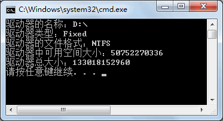

驱动器类型中的 Fixed 值代表的本地磁盘、驱动器中可用空间的大小和总大小的单位是字节 (B)。

如果需要对空间大小的单位进行转换，按照规则进行运算即可，即 1KB=1024B，1MB=1024KB，1GB=1024MB。

【实例 2】获取计算机中所有驱动器的名称和文件格式。

根据题目要求，需要使用 GetDrives 方法获取所有驱动器，代码如下。

```c#
class Program
{
    static void Main(string[] args)
    {
        DriveInfo[] driveInfo = DriveInfo.GetDrives();
        foreach(DriveInfo d in driveInfo)
        {
            if (d.IsReady)
            {
                Console.WriteLine("驱动器名称：" + d.Name);
                Console.WriteLine("驱动器的文件格式" + d.DriveFormat);
            }
        }
    }
}
```

执行上面的代码，效果如下图所示。

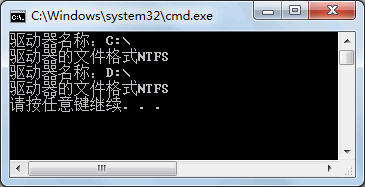

从上面的执行效果可以看出，在当前计算机中共有 2 个可用磁盘，文件格式都是NTFS。

## 2.Directoryinfo 文件夹操作

Directory 类和 Directoryinfo 类都是对文件夹进行操作的。

### 2.1方法

DirectoryInfo 类能创建该类的实例，通过类的实例访问类成员。

DirectoryInfo 类提供了一个构造方法，语法形式如下。

DirectoryInfo(string path)

在这里 path 参数用于指定文件的目录，即路径。

例如创建路径为 D 盘中的 test 文件夹的实例，代码如下。

```
DirectoryInfo directoryInfo = new DirectoryInfo("D:\\test");
```

需要注意的是路径中如果使用 `\`，要使用转义字符来表示，即 `\\`；或者在路径中将 `\` 字符换成 `/`。

DirectoryInfo 类中常用的属性和方法如下表所示。

| 属性或方法                                                   | 作用                                                         |
| ------------------------------------------------------------ | ------------------------------------------------------------ |
| Exists                                                       | 只读属性，获取指示目录是否存在的值                           |
| Name                                                         | 只读属性，获取 Directorylnfo 实例的目录名称                  |
| Parent                                                       | 只读属性，获取指定的子目录的父目录                           |
| Root                                                         | 只读属性，获取目录的根部分                                   |
| void Create()                                                | 创建目录                                                     |
| DirectoryInfo CreateSubdirectory(string path)                | 在指定路径上创建一个或多个子目录                             |
| void Delete()                                                | 如果目录中为空，则将目录删除                                 |
| void Delete(bool recursive)                                  | 指定是否删除子目录和文件，如果 recursive 参数的值为 True，则删除，否则不删除 |
| IEnumerable<DirectoryInfo>  EnumerateDirectories()           | 返回当前目录中目录信息的可枚举集合                           |
| IEnumerable<DirectoryInfo>  EnumerateDirectories(string searchPattern) | 返回与指定的搜索模式匹配的目录信息的可枚举集合               |
| IEnumerable<FileInfo> EnumerateFiles()                       | 返回当前目录中的文件信息的可枚举集合                         |
| IEnumerable<FileInfo> EnumerateFiles(string searchPattern)   | 返回与搜索模式匹配的文件信息的可枚举集合                     |
| IEnumerable<FileSystemInfo>  EnumerateFileSystemInfos()      | 返回当前目录中的文件系统信息的可枚举集合                     |
| IEnumerable<FileSystemInfo>  EnumerateFileSystemInfos(string searchPattern) | 返回与指定的搜索模式匹配的文件系统信息的可枚举集合           |
| DirectoryInfo[] GetDirectories()                             | 返回当前目录的子目录                                         |
| DirectoryInfo[] GetDirectories(string searchPattern)         | 返回匹配给定的搜索条件的当前目录                             |
| FileInfo[] GetFiles()                                        | 返回当前目录的文件列表                                       |
| FileInfo[] GetFiles(string searchPattern)                    | 返回当前目录中与给定的搜索模式匹配的文件列表                 |
| FileSystemInfo[] GetFileSystemInfos()                        | 返回所有文件和目录的子目录中的项                             |
| FileSystemInfo[] GetFileSystemInfos(string searchPattern)    | 返回与指定的搜索条件匹配的文件和目录的子目录中的项           |
| void MoveTo(string destDirName)                              | 移动 DirectoryInfo 实例中的目录到新的路径                    |

### 2.2实例

下面通过实例来演示 DirectoryInfo 类的使用。

#### a.创建文件夹

根据题目要求，代码如下。

```c#
class Program
{
    static void Main(string[] args)
    {
        DirectoryInfo directoryInfo = new DirectoryInfo("D:\\code");
        directoryInfo.Create();
        directoryInfo.CreateSubdirectory("code-1");
        directoryInfo.CreateSubdirectory("code-2");
    }
}
```

执行上面的代码即可完成相关文件夹的创建。磁盘中的目录结构如下图所示。

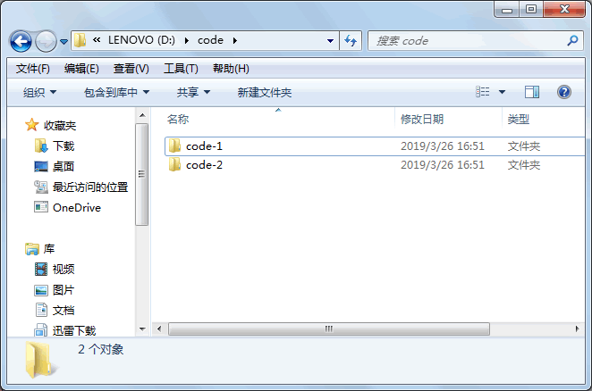

需要注意的是，在创建文件夹时即使磁盘上存在同名文件夹也可以直接创建，不会出现异常。

#### b.查看文件夹

根据题目要求，代码如下。

```c#
class Program
{
    static void Main(string[] args)
    {
        DirectoryInfo directoryInfo = new DirectoryInfo("D:\\code");
        IEnumerable<DirectoryInfo> dir = directoryInfo.EnumerateDirectories();
        foreach(var v in dir)
        {
            Console.WriteLine(v.Name);
        }
    }
}
```

执行上面的代码，效果如下图所示。

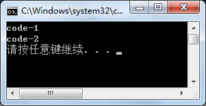

从上面的执行效果可以看出，在 code 文件夹下共有两个文件。

需要注意的是，EnumerateDirectories 方法只用于检索文件夹，不能检索文件。

#### c.文件夹删除

根据题目要求，使用 Delete 方法即可完成文件删除的操作，为了演示删除操作的效果,

在 code 文件夹中的 code-1 和 code-2 中分别添加一个 Word 文件。具体代码如下。

```c#
class Program
{
    static void Main(string[] args)
    {
        DirectoryInfo directoryInfo = new DirectoryInfo("D:\\code");
        directoryInfo.Delete(true);
    }
}
```

执行上面的代码即可将文件夹 code 删除。

>  需要注意的是，如果要删除一个非空文件夹，则要使用 Delete(True) 方法将文件夹中的文件一并删除，否则会岀现“文件夹不为空”的异常。

## 3.Directory 文件夹操作 - 静态

Directory 类是一个静态类， 不能创建该类的实例，直接通过“类名 . 类成员”的形式调用其属性和方法。

Directory 类省去了创建类实例的步骤，其他操作也与 Directoryinfo 类似。

下面通过实例来演示 Directory 类的应用。

### 实例

使用 Directory 类在 D 盘上操作 code 文件夹，要求先判断是否存在该文件夹，如果存在则删除，否则创建该文件夹。

根据题目要求，代码如下。

```c#
class Program
{
    static void Main(string[] args)
    {
        bool flag = Directory.Exists("D:\\code");
        if (flag)
        {
            Directory.Delete("D:\\code", true);
        }
        else
        {
            Directory.CreateDirectory("D:\\code");
        }
    }
}
```

执行上面的代码，即可完成文件夹 code 的删除或创建操作。

## 4.FileInfo 文件

File 类和 FileInfo 类都是用来操作文件的，并且作用相似，它们都能完成对文件的创建、更改文件的名称、删除文件、移动文件等操作。

File 类是静态类，其成员也是静态的，通过类名即可访问类的成员；FileInfo 类不是静态成员，其类的成员需要类的实例来访问。


在 FileInfo 类中提供了一个构造方法，语法形式如下。

```
FileInfo(string fileName)
```

在这里 fileName 参数用于指定新文件的完全限定名或相对文件名。

FileInfo 类中常用的属性和方法如下表所示。

| 属性或方法                                                   | 作用                                                         |
| ------------------------------------------------------------ | ------------------------------------------------------------ |
| Directory                                                    | 只读属性，获取父目录的实例                                   |
| DirectoryName                                                | 只读属性，获取表示目录的完整路径的字符串                     |
| Exists                                                       | 只读属性，获取指定的文件是否存在，若存在返回 True，否则返回 False |
| IsReadOnly                                                   | 属性，获取或设置指定的文件是否为只读的                       |
| Length                                                       | 只读属性，获取文件的大小                                     |
| Name                                                         | 只读属性，获取文件的名称                                     |
| Filelnfo CopyTo(string destFileName)                         | 将现有文件复制到新文件，不允许覆盖现有文件                   |
| Filelnfo CopyTo(string destFileName, bool overwrite)         | 将现有文件复制到新文件，允许覆盖现有文件                     |
| FileStream Create()                                          | 创建文件                                                     |
| void Delete()                                                | 删除文件                                                     |
| void MoveTo(string destFileName)                             | 将指定文件移到新位置，提供要指定新文件名的选项               |
| Filelnfo Replace(string destinationFileName, string destinationBackupFileName) | 使用当前文件对象替换指定文件的内容，先删除原始文件， 再创建被替换文件的备份 |

### 实例

下面通过实例来演示FileInfo类的应用。

在 D 盘的 code 文件夹下创建名为 test1.txt 的文件，并获取该文件的相关属性，然后将其移动到D盘下的 code-1 文件夹中。

根据题目要求，代码如下。

```c#
class Program
{
    static void Main(string[] args)
    {
        //在D盘下创建code文件夹
        Directory.CreateDirectory("D:\\code");
        FileInfo fileInfo = new FileInfo("D:\\code\\test1.txt");
        if (!fileInfo.Exists)
        {
            //创建文件
            fileInfo.Create().Close();
        }
        fileInfo.Attributes = FileAttributes.Normal;//设置文件属性
        Console.WriteLine("文件路径："+ fileInfo.Directory);
        Console.WriteLine("文件名称："+ fileInfo.Name);
        Console.WriteLine("文件是否只读："+ fileInfo.IsReadOnly);
        Console.WriteLine("文件大小：" +fileInfo.Length);
        //先创建code-1 文件夹
        //将文件移动到code-1文件夹下
        Directory.CreateDirectory("D:\\code-1");
        //判断目标文件夹中是否含有文件test1.txt
        FileInfo newFileInfo = new FileInfo("D:\\code-1\\test1.txt");
        if (!newFileInfo.Exists)
        {
            //移动文件到指定路径
            fileInfo.MoveTo("D:\\code-1\\test1.txt");
        }
    }
}
```

执行上面的代码，效果如下图所示。

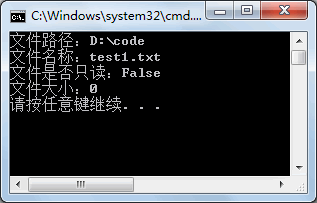

执行代码后 test1.txt 文件已经被移动到 code-1 中。

## 5.File 文件 - 静态

File 类同样可以完成与 FileInfo 类相似的功能，但 File 类中也提供了一些不同的方法。

File 类中获取或设置文件信息的常用方法如下表所示。

| 属性或方法                                                   | 作用                                   |
| ------------------------------------------------------------ | -------------------------------------- |
| DateTime GetCreationTime(string path)                        | 返回指定文件或目录的创建日期和时间     |
| DateTime GetLastAccessTime(string path)                      | 返回上次访问指定文件或目录的日期和时间 |
| DateTime GetLastWriteTime(string path)                       | 返回上次写入指定文件或目录的日期和时间 |
| void SetCreationTime(string path, DateTime creationTime)     | 设置创建该文件的日期和时间             |
| void SetLastAccessTime(string path, DateTime lastAccessTime) | 设置上次访问指定文件的日期和时间       |
| void SetLastWriteTime(string path, DateTime lastWriteTime)   | 设置上次写入指定文件的日期和时间       |

File 类是静态类，所提供的类成员也是静态的，调用其类成员直接使用 File 类的名称调用即可。

### 实例

根据题目要求，代码如下。

```c#
class Program
{
    static void Main(string[] args)
    {
        //在D盘下创建code文件夹
        Directory.CreateDirectory("D:\\code");
        Directory.CreateDirectory("D:\\code-1");
        string path = "D:\\code\\test1.txt";
        //创建文件
        FileStream fs = File.Create(path);
        //获取文件信息
        Console.WriteLine("文件创建时间：" + File.GetCreationTime(path));
        Console.WriteLine("文件最后被写入时间：" + File.GetLastWriteTime(path));
        //关闭文件流
        fs.Close();
        //设置目标路径
        string newPath = "D:\\code-1\\test1.txt";
        //判断目标文件是否存在
        bool flag = File.Exists(newPath);
        if (flag)
        {
            //删除文件
            File.Delete(newPath);
        }
        File.Move(path, newPath);
    }
}
```

执行上面的代码，效果如下图所示。

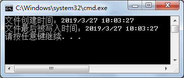

在实际应用中，与 File 类相比使用 Fileinfo 类完成文件的操作是比较常用的。

## 6.Path 路径 - 静态

Path 类主要用于文件路径的一些操作，它也是一个静态类。

Path 类中常用的属性和方法如下表所示。

| 属性或方法                                            | 作用                                     |
| ----------------------------------------------------- | ---------------------------------------- |
| string ChangeExtension(string path, string extension) | 更改路径字符串的扩展名                   |
| string Combine(params string[] paths)                 | 将字符串数组组合成一个路径               |
| string Combine(string path1, string path2)            | 将两个字符串组合成一个路径               |
| string GetDirectoryName(string path)                  | 返回指定路径字符串的目录信息             |
| string GetExtension(string path)                      | 返回指定路径字符串的扩展名               |
| string GetFileName(string path)                       | 返回指定路径字符串的文件名和扩展名       |
| string GetFileNameWithoutExtension(string path)       | 返回不具有扩展名的指定路径字符串的文件名 |
| string GetFullPath(string path)                       | 返回指定路径字符串的绝对路径             |
| char[] GetInvalidFileNameChars()                      | 获取包含不允许在文件名中使用的字符的数组 |
| char[] GetInvalidPathChars()                          | 获取包含不允许在路径名中使用的字符的数组 |
| string GetPathRoot(string path)                       | 获取指定路径的根目录信息                 |
| string GetRandomFileName()                            | 返回随机文件夹名或文件名                 |
| string GetTempPath()                                  | 返回当前用户的临时文件夹的路径           |
| bool HasExtension(string path)                        | 返回路径是否包含文件的扩展名             |
| bool IsPathRooted(string path)                        | 返回路径字符串是否包含根                 |

【实例】从控制台输入一个路径，输出该路径的不含扩展名的路径、扩展名、文件全 名、文件路径、更改文件扩展名。

根据题目要求，代码如下。

```c#
class Program
{
    static void Main(string[] args)
    {
        Console.WriteLine("请输入一个文件路径：");
        string path = Console.ReadLine();
        Console.WriteLine("不包含扩展名的文件名：" + Path.GetFileNameWithoutExtension(path));
        Console.WriteLine("文件扩展名：" + Path.GetExtension(path));
        Console.WriteLine("文件全名：" + Path.GetFileName(path));
        Console.WriteLine("文件路径：" + Path.GetDirectoryName(path));
        //更改文件扩展名
        string newPath = Path.ChangeExtension(path, "doc");
        Console.WriteLine("更改后的文件全名：" + Path.GetFileName(newPath));
    }
}
```

执行上面的代码，效果如下图所示。

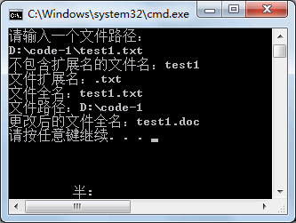

从上面的执行效果可以看出，使用 Path 类能很方便地获取与文件路径相关的信息。

## 7.流

  在计算机编程中，流就是一个类的对象，很多文件的输入输出操作都以类的成员函数的方式来提供。

计算机中的流其实是一种信息的转换。它是一种有序流，因此相对于某一对象，通常我们把对象接收外界的信息输入（Input）称为输入流，相应地从对象向外 输出（Output）信息为输出流，合称为输入/输出流（I/O Streams）。

对象间进行信息或者数据的交换时总是先将对象或数据转换为某种形式的流，再通过流的传输，到达目的对象后再将流转换为对象数据。

所以， 可以把流看作是一种数据的载体，通过它可以实现数据交换和传输。

流所在的命名空间也是System.IO，主要包括文本文件的读写、图像和声音文件的读写、二进制文件的读写等。

在 System.IO 命名空间中提供了多种类，用于进行文件和数据流的读写操作。

要使用这些类，需要在程序的开头包含语句：`using System.IO`。

流是字节序列的抽象概念，例如文件、输入/输出设备、内部进程通信管道等。

流提供一种向后备存储器写入字节和从后备存储器读取字节的方式。

除了和磁盘文件直接相关的文件流以外，流还有多种类型。

例如数据流 (Stream) 是对串行传输数据的一种抽象表示，是对输入/输出的一种抽象。

数据有来源和目的地，衔接两者的就是串流对象。用比喻的方式来说或，数据就好比水，串流对象就好比水管，通过水管的衔接，水由一端流向另一端。

从应用程序的角度来说，如果将数据从来源取出，可以试用输入 ( 读 ) 串流，把数据储存在内存缓冲区；如果将数据写入目的地，可以使用输出 ( 写 ) 串流，把内存缓冲区的数据写入目的地。

当希望通过网络传输数据，或者对文件数据进行操作时，首先需要将数据转化为数据流。

典型的数据流和某个外部数据源相关，数据源可以是文件、外部设备、内存、网络套接字等。

根据数据源的不同，.Net 提供了多个从 Stream 类派生的子类，每个类代表一种具体的数据流类型，比如磁盘文件直接相关的文件流类 FileStream，和套接字相关的网络流类 NetworkStream，和内存相关的内存流类 MemoryStream 等。  

## 8.StreamReader 读取文件

StreamReader 类用于从流中读取字符串。它继承自 TextReader 类。

### 8.1构造方法

StreamReader 类的构造方法有很多，这里介绍一些常用的构造方法，如下表所示。

| 构造方法                                       | 说明                                                         |
| ---------------------------------------------- | ------------------------------------------------------------ |
| StreamReader(Stream stream)                    | 为指定的流创建 StreamReader 类的实例                         |
| StreamReader(string path)                      | 为指定路径的文件创建 StreamReader 类的实例                   |
| StreamReader(Stream stream, Encoding encoding) | 用指定的字符编码为指定的流初始化 StreamReader 类的一个新实例 |
| StreamReader(string path, Encoding encoding)   | 用指定的字符编码为指定的文件名初始化  StreamReader 类的一个新实例 |

使用该表中的构造方法即可创建 StreamReader 类的实例，通过实例调用其提供的类成 员能进行文件的读取操作。

### 8.2常用方法

StreamReader 类中的常用属性和方法如下表所示。

| 属性或方法                                    | 作用                                                       |
| --------------------------------------------- | ---------------------------------------------------------- |
| Encoding CurrentEncoding                      | 只读属性，获取当前流中使用的编码方式                       |
| bool EndOfStream                              | 只读属性，获取当前的流位置是否在流结尾                     |
| void Close()                                  | 关闭流                                                     |
| int Peek()                                    | 获取流中的下一个字符的整数，如果没有获取到字符， 则返回 -1 |
| int Read()                                    | 获取流中的下一个字符的整数                                 |
| int Read(char[] buffer, int index, int count) | 从指定的索引位置开始将来自当前流的指定的最多字符读到缓冲区 |
| string ReadLine()                             | 从当前流中读取一行字符并将数据作为字符串返回               |
| string ReadToEnd()                            | 读取来自流的当前位置到结尾的所有字符                       |

### 8.3实例

下面通过实例来演示 StreamReader 类的应用。

【实例】读取 D 盘 code 文件夹下 test.txt 文件中的信息。

根据题目要求，先在 D 盘下创建文件夹并创建 test.txt 文件，然后写入两行字符，分别是 Hello 和 Lucy，代码如下。

```c#
class Program
{
    static void Main(string[] args)
    {
        //定义文件路径
        string path = @"D:\\code\\test.txt";
        //创建 StreamReader 类的实例
        StreamReader streamReader = new StreamReader(path);
        //判断文件中是否有字符
        while (streamReader.Peek() != -1)
        {
            //读取文件中的一行字符
            string str = streamReader.ReadLine();
            Console.WriteLine(str);
        }
        streamReader.Close();
    }
}
```

执行上面的代码，效果如下图所示。

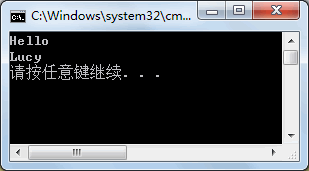

在读取文件中的信息时，除了可以使用 ReadLine 方法以外，还可以使用Read、ReadToEnd方法来读取。

## 9.StreamWriter 写入文件

StreamWriter 类主要用于向流中写入数据。

### 9.1构造方法

StreamWriter 类的构造方法也有很多，这里只列出一些常用的构造方法，如下表所示。

| 构造方法                                       | 说明                                                         |
| ---------------------------------------------- | ------------------------------------------------------------ |
| StreamWriter(Stream stream)                    | 为指定的流创建 StreamWriter 类的实例                         |
| StreamWriter(string path)                      | 为指定路径的文件创建 StreamWriter 类的实例                   |
| StreamWriter(Stream stream, Encoding encoding) | 用指定的字符编码为指定的流初始化 StreamWriter 类的一个新实例 |
| StreamWriter(string path, Encoding encoding)   | 用指定的字符编码为指定的文件名初始化 StreamWriter 类的一个新实例 |

在创建了 StreamWriter 类的实例后即可调用其类成员，完成向文件中写入信息的操作。

### 9.2常用方法

StreamWriter 类中常用的属性和方法如下表所示。

| 属性或方法                      | 作用                               |
| ------------------------------- | ---------------------------------- |
| bool AutoFlush                  | 属性，获取或设置是否自动刷新缓冲区 |
| Encoding Encoding               | 只读属性，获取当前流中的编码方式   |
| void Close()                    | 关闭流                             |
| void Flush()                    | 刷新缓冲区                         |
| void Write(char value)          | 将字符写入流中                     |
| void WriteLine(char value)      | 将字符换行写入流中                 |
| Task WriteAsync(char value)     | 将字符异步写入流中                 |
| Task WriteLineAsync(char value) | 将字符异步换行写入流中             |

在上表中给出的方法中，Write、WriteAsync、WriteLineAsync 方法还有很多不同类型写入的重载方法，这里没有一一列出。

### 9.3实例

下面通过实例演示 StreamWriter 类的应用。

【实例】向 D 盘 code 文件夹的 test.txt 文件中写入姓名和手机号码。

根据题目要求，代码如下。

```c#
class Program
{
    static void Main(string[] args)
    {
        string path = @"D:\\code\\test.txt";
        //创建StreamWriter 类的实例
        StreamWriter streamWriter = new StreamWriter(path);
        //向文件中写入姓名
        streamWriter.WriteLine("小张");
        //向文件中写入手机号
        streamWriter.WriteLine("13112345678");
        //刷新缓存
        streamWriter.Flush();
        //关闭流
        streamWriter.Close();
    }
}
```

执行上面的代码，即可将姓名和手机号码写入到名为 test.txt 的文件中。

## 10.FileStream 文件读写

文件读写流使用 FileStream 类来表示，FileStream 类主要用于文件的读写，不仅能读写普通的文本文件，还可以读取图像文件、声音文件等不同格式的文件。

在创建 FileStream 类的实例时还会涉及多个枚举类型的值， 包括 FileAccess、FileMode、FileShare、FileOptions 等。

### 10.1枚举属性

#### a.FileAccess 读写权限

FileAccess 枚举类型主要用于设置文件的访问方式，具体的枚举值如下。

* Read：以只读方式打开文件。
* Write：以写方式打开文件。
* ReadWrite：以读写方式打开文件。

#### b.FileMode 打开创建方式

FileMode 枚举类型主要用于设置文件打开或创建的方式，具体的枚举值如下。

* CreateNew：创建新文件，如果文件已经存在，则会抛出异常。
* Create：创建文件，如果文件不存在，则删除原来的文件，重新创建文件。
* Open：打开已经存在的文件，如果文件不存在，则会抛出异常。
* OpenOrCreate：打开已经存在的文件，如果文件不存在，则创建文件。
* Truncate：打开已经存在的文件，并清除文件中的内容，保留文件的创建日期。如果文件不存在，则会抛出异常。
* Append：打开文件，用于向文件中追加内容，如果文件不存在，则创建一个新文件。

#### c.FileShare 访问控制

FileShare 枚举类型主要用于设置多个对象同时访问同一个文件时的访问控制，具体的枚举值如下。

* None：谢绝共享当前的文件。
* Read：允许随后打开文件读取信息。
* ReadWrite：允许随后打开文件读写信息。
* Write：允许随后打开文件写入信息。
* Delete：允许随后删除文件。
* Inheritable：使文件句柄可由子进程继承。

#### d.FileOptions 高级选项

FileOptions 枚举类型用于设置文件的高级选项，包括文件是否加密、访问后是否删除等，具体的枚举值如下。

* WriteThrough：指示系统应通过任何中间缓存、直接写入磁盘。
* None：指示在生成 System.IO.FileStream 对象时不应使用其他选项。
* Encrypted：指示文件是加密的，只能通过用于加密的同一用户账户来解密。
* DeleteOnClose：指示当不再使用某个文件时自动删除该文件。
* SequentialScan：指示按从头到尾的顺序访问文件。
* RandomAccess：指示随机访问文件。
* Asynchronous：指示文件可用于异步读取和写入。

### 10.2构造方法

FileStream 类的构造方法有很多，这里介绍一些常用的构造方法，如下表所示。

| 构造方法                                                     | 说明                                                         |
| ------------------------------------------------------------ | ------------------------------------------------------------ |
| FileStream(string path, FileMode mode)                       | 使用指定路径的文件、文件模式创建 FileStream 类的实例         |
| FileStream(string path, FileMode mode, FileAccess access)    | 使用指定路径的文件、文件打开模式、文件访问模式创建 FileStream 类的实例 |
| FileStream(string path, FileMode mode, FileAccess access, FileShare share) | 使用指定的路径、创建模式、读写权限和共享权限创建 FileStream 类的一个新实例 |
| FileStream(string path, FileMode mode, FileAccess access, FileShare share, int bufferSize, FileOptions options) | 使用指定的路径、创建模式、读写权限和共享权限、其他 文件选项创建 FileStream 类的实例 |

下面使用 FileStream 类的构造方法创建 FileStream 类的实例，语法形式如下。

```c#
string path = "D:\\test.txt";
FileStream fileStream1 = new FileStream(path, FileMode.Open);
FileStream fileStream2 = new FileStream(path, FileMode.Open, FileAccess.Read);
FileStream fileStream3 = new FileStream(path, FileMode.Open, FileAccess.ReadWrite, FileShare.Read);
FileStream fileStream4 = new FileStream(path, FileMode.Open, FileAccess.Read, FileShare.Read, 10, FileOptions.None);
```

在创建好 FileStream 类的实例后，即可调用该类中的成员完成读写数据的操作。

### 10.3常用方法

FileStream 类中常用的属性和方法如下图所示。

| 属性或方法                                      | 作用                                                         |
| ----------------------------------------------- | ------------------------------------------------------------ |
| bool CanRead                                    | 只读属性，获取一个值，该值指示当前流是否支持读取             |
| bool CanSeek                                    | 只读属性，获取一个值，该值指示当前流是否支持查找             |
| bool CanWrite                                   | 只读属性，获取一个值，该值指示当前流是否支持写入             |
| bool IsAsync                                    | 只读属性，获取一个值，该值指示 FileStream 是异步还 是同步打开的 |
| long Length                                     | 只读属性，获取用字节表示的流长度                             |
| string Name                                     | 只读属性，获取传递给构造方法的 FileStream 的名称             |
| long Position                                   | 属性，获取或设置此流的当前位置                               |
| int Read(byte[] array, int offset, int count)   | 从流中读取字节块并将该数据写入给定缓冲区中                   |
| int ReadByte()                                  | 从文件中读取一个字节，并将读取位置提升一个字节               |
| long Seek(lorig offset, SeekOrigin origin)      | 将该流的当前位置设置为给定值                                 |
| void Lock(long position, long length)           | 防止其他进程读取或写入 System.IO.FileStream                  |
| void Unlock(long position, long length)         | 允许其他进程访问以前锁定的某个文件的全部或部分               |
| void Write(byte[] array, int offset, int count) | 将字节块写入文件流                                           |
| void WriteByte(byte value)                      | 将一个字节写入文件流中的当前位置                             |

### 10.4实例

下面通过实例来演示 FileStream 类的应用。

#### a.写入信息

在 D 盘 code 文件夹的 student.txt 文件中写入学生的学号信息。

根据题目要求，代码如下。

如果是中文的，bytes 数组的长度将不够用，改成使用

```c#
byte[] bytes= Encoding.UTF8.GetBytes(message);
```

的方式将数据从字符串类型转换为字节类型。

```c#
class Program
{
    static void Main(string[] args)
    {
        //定义文件路径
        string path = @"D:\\code\\student.txt";
        //创建 FileStream 类的实例
        FileStream fileStream = new FileStream(path, FileMode.OpenOrCreate, FileAccess.ReadWrite, FileShare.ReadWrite);
        //定义学号
        string msg = "1710026";
        //将字符串转换为字节数组
        byte[] bytes = Encoding.UTF8.GetBytes(msg);
        //向文件中写入字节数组
        fileStream.Write(bytes, 0, bytes.Length);
        //刷新缓冲区
        fileStream.Flush();
        //关闭流
        fileStream.Close();
    }
}
```

执行上面的代码，即可将学生的学号写入到文件 student.txt 中。

#### b.读取信息

【实例 2】从 D 盘的 code 文件夹中将 student.txt 文件中的学号读取出来，并显示到控制台上。

根据题目要求，代码如下。

```c#
class Program
{
    static void Main(string[] args)
    {
        //定义文件路径
        string path = @"D:\\code\\student.txt";
        //判断是否含有指定文件
        if (File.Exists(path))
        {
            FileStream fileStream = new FileStream(path, FileMode.Open, FileAccess.Read);
            //定义存放文件信息的字节数组
            byte[] bytes = new byte[fileStream.Length];
            //读取文件信息
            fileStream.Read(bytes, 0, bytes.Length);
            //将得到的字节型数组重写编码为字符型数组
            char[] c = Encoding.UTF8.GetChars(bytes);
            Console.WriteLine("学生的学号为：");
            //输出学生的学号
            Console.WriteLine(c);
            //关闭流
            fileStream.Close();
        }
        else
        {
            Console.WriteLine("您查看的文件不存在！");
        }
    }
}
```

执行上面的代码，效果如下图所示。

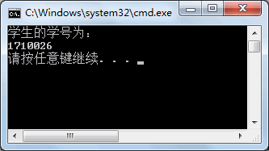

从上面的执行效果可以看出，已经将文件 student.txt 中的学号信息读取出来。

## 11.BinaryReader 读取二进制文件

二进制形式读取数据时使用的是 BinaryReader 类。

### 11.1构造方法

BinaryReader 类中提供的构造方法有 3 种，具体的语法形式如下。

#### a.第1种形式：
```c#
BinaryReader(Stream input)   //其中，input 参数是输入流。
```
#### b.第2种形式：
```c#
BinaryReader(Stream input, Encoding encoding)   //其中，input 是指输入流，encoding 是指编码方式。
```
#### c.第3种形式：
```c#
BinaryReader(Stream input, Encoding encoding, bool leaveOpen)  //其中，input 是指输入流，encoding 是指编码方式，leaveOpen 是指在流读取后是否包括流的打开状态。
```
下面分别使用不同的构造方法创建 BinaryReader 类的实例，代码如下。

```c#
//创建文件流的实例
FileStream fileStream = new FileStream("D:\\code\\test.txt", FileMode.Open);
BinaryReader binaryReader1 = new BinaryReader(fileStream);
BinaryReader binaryReader2 = new BinaryReader(fileStream, Encoding.UTF8);
BinaryReader binaryReader3 = new BinaryReader(fileStream, Encoding.UTF8, true);
```

在完成 BinaryReader 类的实例的创建后，即可完成对文件以二进制形式的读取。

### 11.2常用方法

BinaryReader 类中的常用属性和方法如下表所示。

| 属性或方法                                    | 作用                                                         |
| --------------------------------------------- | ------------------------------------------------------------ |
| int Read()                                    | 从指定的流中读取字符                                         |
| int Read(byte[] buffer, int index, int count) | 以 index 为字节数组中的起始点，从流中读取 count 个字节       |
| int Read(char[] buffer, int index, int count) | 以 index 为字符数组的起始点，从流中读取 count 个字符         |
| bool ReadBoolean()                            | 从当前流中读取 Boolean 值，并使该流的当前位置提升 1 个字节   |
| byte ReadByte()                               | 从当前流中读取下一个字节，并使流的当前位置提升 1 个字节      |
| byte[] ReadBytes(int count)                   | 从当前流中读取指定的字节数写入字节数组中，并将当前 位置前移相应的字节数 |
| char ReadChar()                               | 从当前流中读取下一个字符，并根据所使用的 Encoding 和从流中读取的特定字符提升流的当前位置 |
| char[] ReadChars(int count)                   | 从当前流中读取指定的字符数，并以字符数组的形式返回 数据，然后根据所使用的 Encoding 和从流中读取的特定字符将当前位置前移 |
| decimal ReadDecimal()                         | 从当前流中读取十进制数值，并将该流的当前位置提升 16 个字节   |
| double ReadDouble()                           | 从当前流中读取 8 字节浮点值，并使流的当前位置提升 8 个字节   |
| short ReadInt16()                             | 从当前流中读取 2 字节有符号整数，并使流的当前位置提升 2 个字节 |
| int ReadInt32()                               | 从当前流中读取 4 字节有符号整数，并使流的当前位置提升 4 个字节 |
| long ReadInt64()                              | 从当前流中读取 8 字节有符号整数，并使流的当前位置提升 8 个字节 |
| sbyte ReadSByte()                             | 从该流中读取 1 个有符号字节，并使流的当前位置提升 1 个字节   |
| float ReadSingle()                            | 从当前流中读取 4 字节浮点值，并使流的当前位置提升 4 个字节   |
| string ReadString()                           | 从当前流中读取一个字符串。字符串有长度前缀，一次 7 位地被编码为整数 |
| ushort ReadUInt16()                           | 从该流中读取的 2 字节无符号整数                              |
| uint ReadUInt32()                             | 从该流中读取的 4 字节无符号整数                              |
| ulong ReadUInt64()                            | 从该流中读取的 8 字节无符号整数                              |
| void FillBuffer(int numBytes)                 | 用从流中读取的指定字节数填充内部缓冲区                       |

在 BinaryReader 类中提供的方法并不是直接读取文件中指定数据类型的值，而是读取由 BinaryWriter 类写入到文件中的。

### 11.3实例

在上述方法中只有 Read 方法不要求读取的值必须由 BinaryWriter 类写入到文件中。

下面通过实例来演示 BinaryReader 类中 Read 方法的使用。

#### a.使用 BinaryReader 类读取记事本文件中的信息。

根据题目要求，在 D:\code 目录下创建一个记事本文件，并在其中输入 abc，使用 BinaryReader 类读取文件中的内容，代码如下。

```c#
class Program
{
    static void Main(string[] args)
    {
        FileStream fileStream = new FileStream(@"D:\\code\\test.txt", FileMode.Open);
        BinaryReader binaryReader = new BinaryReader(fileStream);
        //读取文件的一个字符
        int a = binaryReader.Read();
        //判断文件中是否含有字符，若不含字符，a 的值为 -1
        while(a!= -1)
        {
            //输出读取到的字符
            Console.Write((char)a);
            a = binaryReader.Read();
        }
    }
}
```

执行上面的代码，效果如下图所示。

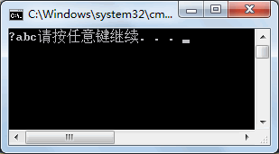

除了使用 Read 方法每次读取一个字符以外，也可以使用 Read 方法的其他重载方法将字符读取到一个字节数组或字符数组中。

#### b.将 test.txt 记事本中的内容读取到字节数组中。

根据题目要求，代码如下。

```c#
class Program
{
    static void Main(string[] args)
    {
        FileStream fileStream = new FileStream(@"D:\\code\\test.txt", FileMode.Open,FileAccess.Read);
        BinaryReader binaryReader = new BinaryReader(fileStream);
        //获取文件长度
        long length = fileStream.Length;
        byte[] bytes = new byte[length];
        //读取文件中的内容并保存到字节数组中
        binaryReader.Read(bytes, 0, bytes.Length);
        //将字节数组转换为字符串
        string str = Encoding.Default.GetString(bytes);
        Console.WriteLine(str);
    }
}
```

执行上面的代码，效果与实例 1 中一致。同样，在读取文件中的内容时也可以将内容存放到字符类型的数组中。

## 12.BinaryWriter 写入二进制数据

### 12.1构造方法

#### a.第1种形式：
```c#
BinaryWriter(Stream output)
```
#### b.第2种形式：
```c#
BinaryWriter(Stream output, Encoding encoding)
```
#### c.第3种形式：
```c#
BinaryWriter(Stream output, Encoding encoding, bool leaveOpen)
```
### 12.2常用方法

BinaryWriter 类中常用的属性和方法如下表所示。

| 属性或方法                               | 作用                                                   |
| ---------------------------------------- | ------------------------------------------------------ |
| void Close()                             | 关闭流                                                 |
| void Flush()                             | 清理当前编写器的所有缓冲区，使所有缓冲数据写入基础设备 |
| long Seek(int offset, SeekOrigin origin) | 返回查找的当前流的位置                                 |
| void Write(char[] chars)                 | 将字符数组写入当前流                                   |
| Write7BitEncodedInt(int value)           | 以压缩格式写出 32 位整数                               |

除了上面的方法以外，Write 方法还提供了多种类型的重载方法。

### 12.3实例

下面通过实例来演示 BinaryWriter 类的应用。

【实例】在 D 盘 code 文件夹的 test.txt 文件中写入图书的名称和价格，使用 BinaryReader 类读取写入的内容。

根据题目要求，代码如下。

```c#
class Program
{
    static void Main(string[] args)
    {
        FileStream fileStream = new FileStream(@"D:\\code\\test.txt", FileMode.Open, FileAccess.Write);
        //创建二进制写入流的实例
        BinaryWriter binaryWriter = new BinaryWriter(fileStream);
        //向文件中写入图书名称
        binaryWriter.Write("C#基础教程");
        //向文件中写入图书价格
        binaryWriter.Write(49.5);
        //清除缓冲区的内容，将缓冲区中的内容写入到文件中
        binaryWriter.Flush();
        //关闭二进制流
        binaryWriter.Close();
        //关闭文件流
        fileStream.Close();
        fileStream = new FileStream(@"D:\\code\\test.txt", FileMode.Open, FileAccess.Read);
        //创建二进制读取流的实例
        BinaryReader binaryReader = new BinaryReader(fileStream);
        //输出图书名称
        Console.WriteLine(binaryReader.ReadString());
        //输出图书价格
        Console.WriteLine(binaryReader.ReadDouble());
        //关闭二进制读取流
        binaryReader.Close();
        //关闭文件流
        fileStream.Close();
    }
}
```

执行上面的代码，效果如下图所示。

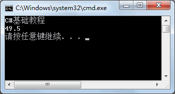

从上面的执行效果可以看出，使用 BinaryWriter 类可以很方便地将图书名称和价格写入到 test.txt 文件中。


