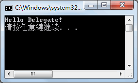
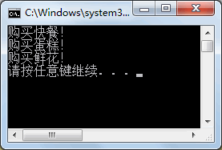
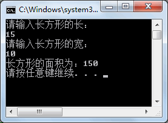
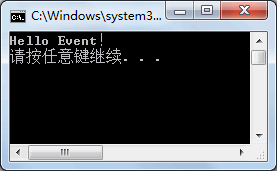

# 委托

C# 语言中的委托和事件是其一大特色，委托和事件在 Windows 窗体应用程序、 ASP.NET 应用程序、WPF 应用程序等应用中是最为普遍的应用。

通过定义委托和事件可以方便方法重用，并提高程序的编写效率。

C# 中的委托类似于 C 或 C++ 中函数的指针。委托是存有对某个方法的引用的一种引用类型变量。引用可在运行时被改变。

事件基本上说是一个用户操作，如按键、点击、鼠标移动等等，或者是一些出现，如系统生成的通知等。

## 1.委托(Delegate) 简介

  委托从字面上理解就是一种代理，类似于房屋中介，由租房人委托中介为其租赁房屋。

在 [C#](http://c.biancheng.net/csharp/) 语言中，委托则委托某个方法来实现具体的功能。

委托是一种引用类型，虽然在定义委托时与方法有些相似，但不能将其称为方法。

委托在使用时遵循三步走的原则，即定义声明委托、实例化委托以及调用委托。

从数据结构来讲，委托是和类一样是一种用户自定义类型。

委托是方法的抽象，它存储的就是一系列具有相同签名和返回回类型的方法的地址。

调用委托的时候，委托包含的所有方法将被执行。

委托是 C# 语言中的一个特色，通常将委托分为命名方法委托、多播委托、匿名委托，其中命名方法委托是使用最多的一种委托。  

## 2.命名方法委托

### 2.1定义语法

在 C# 语言中命名方法委托是最常用的一种委托，其定义的语法形式如下。
```c#
修饰符  delegate  返回值类型  委托名 ( 参数列表 );
```
从上面的定义可以看出，委托的定义与方法的定义是相似的。例如定义一个不带参数的委托，代码如下。

```c#
public delegate void MyDelegate();
```

在定义好委托后就到了实例化委托的步骤，命名方法委托在实例化委托时必须带入方法的具体名称。

### 2.2 实例化语法

实例化委托的语法形式如下。
```c#
委托名  委托对象名 = new 委托名 ( 方法名 );
```
委托中传递的方法名既可以是静态方法的名称，也可以是实例方法的名称。

需要注意的是，在委托中所写的方法名必须与委托定义时的返回值类型和参数列表相同。

### 2.3调用委托语法

在实例化委托后即可调用委托，语法形式如下。
```c#
委托对象名 ( 参数列表 );
```
在这里，参数列表中传递的参数与委托定义的参数列表相同即可。

### 2.4实例

下面分别通过两个实例来演示在委托中应用静态方法和实例方法的形式。

#### a.创建委托(静态方法)

在委托中传入静态方法于控制台输出“Hello Delegate!”。

根据题目要求，代码如下。

```c#
class Program
{
    public delegate void MyDelegate();
    static void Main(string[] args)
    {
        MyDelegate myDelegate = new MyDelegate(Test.SayHello);
        myDelegate();
    }
}
class Test
{
    public static void SayHello()
    {
        Console.WriteLine("Hello Delegate!");
    }
}
```

执行上面的代码，效果如下图所示。



若使用静态方法，在向委托中传递方法名时只需要用“`类名.方法名`”的形式。

#### b.创建委托(实例方法)

将实例 1 中的静态方法改成实例方法。

根据题目要求，代码如下。

```c#
class Program
{
    public delegate void MyDelegate();
    static void Main(string[] args)
    {
        MyDelegate myDelegate = new MyDelegate(new Test().SayHello);
        myDelegate();
    }
}
class Test
{
    public void SayHello()
    {
        Console.WriteLine("Hello Delegate!");
    }
}
```

执行上面的代码，效果与实例 1 中效果一致。

由于在委托中使用的是实例方法，则需要通过类的实例来调用方法，即使用“`new 类名 (). 方法名`”的形式。

除了使用匿名对象的方式调用方法以外，也可以先创建类的实例，再通过类的实例调用方法。

在了解了命名方法委托的写法以后，下面通过一个综合实例来演示命名委托的应用。

#### c.使用委托完成将图书信息按照价格升序排序的操作。

根据题目要求，先定义图书信息类，然后定义对图书价格排序的方法。图书信息类的代码如下。

```c#
class Book:IComparable<Book>
{
    //定义构造方法为图书名称和价格赋值
    public Book(string name,double price)
    {
        Name = name;
        Price = price;
    }
    //定义图书名称属性
    public string Name { get; set; }
    //定义图价格属性
    public double Price { get; set; }
    //实现比较器中比较的方法
    public int CompareTo(Book other)
    {
        return (int)(this.Price - other.Price);
    }
    //重写ToString方法，返回图书名称和价格
    public override string ToString()
    {
        return Name + ":" + Price;
    }
    //图书信息排序
    public static void BookSort(Book[] books)
    {
        Array.Sort(books);
    }
}
```

在 Main 方法中定义委托调用图书排序的方法，代码如下。

```c#
class Program
{
    //定义对图书信息排序的委托
    public delegate void BookDelegate(Book[] books);
    static void Main(string[] args)
    {
        BookDelegate bookDelegate = new BookDelegate(Book.BookSort);
        Book[] book = new Book[3];
        book[0] = new code_1.Book("计算机应用", 50);
        book[1] = new code_1.Book("C# 教程", 59);
        book[2] = new code_1.Book("VS2015应用", 49);
        bookDelegate(book);
        foreach(Book bk in book)
        {
            Console.WriteLine(bk);
        }
    }
}
```

执行上面的代码，效果如下图所示。


从上面的执行效果可以看出，通过委托调用的图书排序方法 (BookSort) 按照图书价格升序排列了图书信息。

需要注意的是，由于 Book[] 数组是引用类型，因此通过委托调用后其值也发生了相应的变化，即 book 数组中的值已经是完成了排序操作后的结果。

## 3.多播委托

语言中多播委托是指在一个委托中注册多个方法，在注册方法时可以在委托中使用加号运算符或者减号运算符来实现添加或撤销方法。

在现实生活中，多播委托的实例是随处可见的，例如某点餐的应用程序，既可以预定普通的餐饮也可以预定蛋糕、鲜花、水果等商品。

在这里委托相当于点餐平台，每一个类型的商品可以理解为在委托上注册的一个方法。

下面通过实例来演示多播委托的应用。

【实例】模拟点餐平台预定不同类型的商品。

根据题目要求，在实例中分别预定快餐、蛋糕、鲜花三类商品，代码如下。

```c#
class Program
{
    //定义购买商品委托
    public delegate void OrderDelegate();
    static void Main(string[] args)
    {
        //实例化委托
        OrderDelegate orderDelegate = new OrderDelegate(Order.BuyFood);
        //向委托中注册方法
        orderDelegate += Order.BuyCake;
        orderDelegate += Order.BuyFlower;
        //调用委托
        orderDelegate();
    }
}
class Order
{
    public static void BuyFood()
    {
        Console.WriteLine("购买快餐！");
    }
    public static void BuyCake()
    {
        Console.WriteLine("购买蛋糕！");
    }
    public static void BuyFlower()
    {
        Console.WriteLine("购买鲜花！");
    }
}
```

执行上面的代码，效果如下图所示。



如果已经购买了鲜花，在未调用委托时也可以撤销，在委托注册方法时使用 `-=` 操作符即可。

撤销购买鲜花操作的代码如下。

```
orderDelegate -= Order.BuyFlower;
```

如果添加了上述代码，则执行效果中就取消了购买鲜花的操作。

在使用多播委托时需要注意，在委托中注册的方法参数列表必须与委托定义的参数列表相同，否则不能将方法添加到委托上。

## 4.匿名委托

在 C# 语言中匿名委托是指使用匿名方法注册在委托上，实际上是在委托中通过定义代码块来实现委托的作用，具体的语法形式如下。

### 4.1定义委托
```
修饰符  delegate  返回值类型  委托名 ( 参数列表 );
```
### 4.2定义匿名委托
```
委托名  委托对象 = delegate
{
    //代码块
};
```
### 4.3调用匿名委托
```
委托对象名 ( 参数列表 );
```
通过上面 3 个步骤即可完成匿名委托的定义和调用，需要注意的是，在定义匿名委托时代码块结束后要在 

```
{}
```

 后加上分号。

下面通过实例来演示匿名委托的应用。

【委托】使用匿名委托计算长方形的面积。

根据题目要求，代码如下。

```
class Program{    public delegate void AreaDelegate(double length, double width);    static void Main(string[] args)    {        Console.WriteLine("请输入长方形的长：");        double length = double.Parse(Console.ReadLine());        Console.WriteLine("请输入长方形的宽：");        double width = double.Parse(Console.ReadLine());        AreaDelegate areaDelegate = delegate        {            Console.WriteLine("长方形的面积为：" + length * width);        };        areaDelegate(length, width);    }}
```

执行上面的代码，效果如下图所示。



从上面的执行效果可以看岀，在使用匿名委托时并没有定义方法，而是在实例化委托时直接实现了具体的操作。

由于匿名委托并不能很好地实现代码的重用，匿名委托通常适用于实现一些仅需要使用一次委托中代码的情况，并且代码比较少。

# 事件 : Event

在 [C#](http://c.biancheng.net/csharp/) 语言中，Windows 应用程序、 ASP.NET 网站程序等类型的程序都离不开事件的应用。

事件是一种引用类型，实际上也是一种特殊的委托。

通常，每一个事件的发生都会产生发送方和接收方，发送方是指引发事件的对象，接收方则是指获取、处理事件。事件要与委托一起使用。

事件定义的语法形式如下。

访问修饰符  event  委托名  事件名 ;

在这里，由于在事件中使用了委托，因此需要在定义事件前先定义委托。

在定义事件后需要定义事件所使用的方法，并通过事件来调用委托。

下面通过实例来演示事件的应用。

【实例 1】通过事件完成在控制台上输岀“Hello Event!”的操作。

根据题目要求，代码如下。

```c#
class Program
{
    //定义委托
    public delegate void SayDelegate();
    //定义事件
    public event SayDelegate SayEvent;
    //定义委托中调用的方法
    public void SayHello()
    {
        Console.WriteLine("Hello Event！");
    }
    //创建触发事件的方法
    public void SayEventTrigger()
    {
        //触发事件，必须与事件是同名方法
        SayEvent();
    }
    static void Main(string[] args)
    {
        //创建Program类的实例
        Program program = new Program();
        //实例化事件，使用委托指向处理方法
        program.SayEvent = new SayDelegate(program.SayHello);
        //调用触发事件的方法
        program.SayEventTrigger();
    }
}
```

执行上面的代码，效果如下图所示。



【实例 2】在事件中使用多播委托完成预定不同商品的操作。

根据题目要求，代码如下。

```c#
class Program
{
    static void Main(string[] args)
    {
        //创建MyEvent类的实例
        MyEvent myEvent = new MyEvent();
        //实例化事件，使用委托指向处理方法
        myEvent.BuyEvent += new MyEvent.BuyDelegate(MyEvent.BuyFood);
        myEvent.BuyEvent += new MyEvent.BuyDelegate(MyEvent.BuyCake);
        myEvent.BuyEvent += new MyEvent.BuyDelegate(MyEvent.BuyFlower);
        //调用触发事件的方法
        myEvent.InvokeEvent();
    }
}
class MyEvent
{
    //定义委托
    public delegate void BuyDelegate();
    //定义事件
    public event BuyDelegate BuyEvent;
    //定义委托中使用的方法
    public static void BuyFood()
    {
        Console.WriteLine("购买快餐！");
    }
    public static void BuyCake()
    {
        Console.WriteLine("购买蛋糕！");
    }
    public static void BuyFlower()
    {
        Console.WriteLine("购买鲜花！");
    }
    //创建触发事件的方法
    public void InvokeEvent()
    {
        //触发事件，必须和事件是同名方法
        BuyEvent();
    }
}
```

执行上面的代码，效果与实例 1 效果一致。

需要注意的是，在使用事件时如果事件的定义和调用不在同一个类中，实例化的事件只能出现在`+=`或者操作符的左侧。

在上面的代码中，实例化事件的代码只能写成`myEvent.BuyEvent += new MyEvent.BuyDelegate(MyEvent.BuyFood)`的形式，而不能使用`myEvent.BuyEvent = new MyEvent.BuyDelegate(MyEvent.BuyFood)`的形式。

事件是每一个 Windows 应用程序中必备的，很多事件的操作都是自动生成的。