# 异常

## 1.Exception

.NET Framework 类库中的所有异常都派生于 Exception 类，异常包括系统异常和应用异常。

默认所有系统异常派生于 System.SystemException，所有的应用程序异常派生于 System.ApplicationException。

系统异常包括 OutOfMemoryException、IOException、NullReferenceException。

常用的异常类如下图所示。

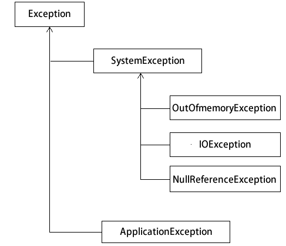

常用的系统异常类如下表所示。

| 异常类                          | 说明                |
| ------------------------------- | ------------------- |
| System.OutOfMemoryException     | 用 new 分配内存失败 |
| System.StackOverflowException   | 递归过多、过深      |
| System.NullReferenceException   | 对象为空            |
| Syetem.IndexOutOfRangeException | 数组越界            |
| System.ArithmaticException      | 算术操作异常的基类  |
| System.DivideByZeroException    | 除零错误            |

## 2.try catch finally

异常与异常处理语句包括三种形式，即 try catch、try finally、try catch finally。

在上述三种异常处理的形式中所用到关键字其含义如下：

* try：用于检查发生的异常，并帮助发送任何可能的异常。 
* catch：以控制权更大的方式处理错误，可以有多个 catch 子句。 
* finally：无论是否引发了异常，finally 的代码块都将被执行。 

下面我们将分别为大家讲解这三种形式的应用。

### 1) try catch

在 try 语句中放置可能出现异常的语句，而在 catch 语句中放置异常时处理异常的语句，通常在 catch 语句中输出异常信息或者发送邮件给开发人员等。

下面通过实例来演示 try catch 的应用。

另外，在处理异常时，catch 语句是允许多次使用的，相当于多分支的 if 语句，仅能执行其中一个分支。

【实例 1】在文本框中输入一个整数，并判断其是否大于 100。

根据题目要求，如果在文本框中输入的是一个字符串或者浮点数，就会出现类型转换错误，如下图所示。

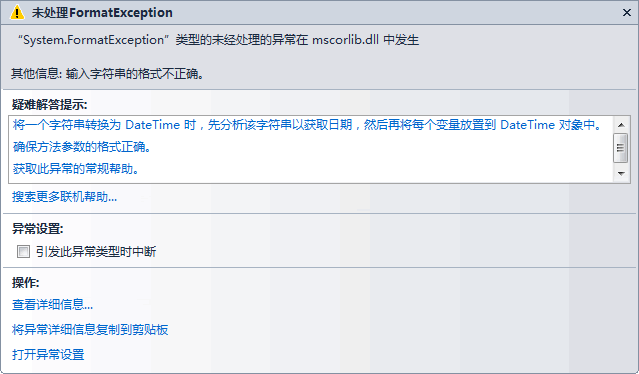

如果使用异常处理的语句来处理数据类型转换，则不会岀现上图中的提示，而是出现 catch 语句中弹出的消息框，实现的代码如下。

```c#
public partial class tryCatchForm : Form
{
    public tryCatchForm()
    {
        InitializeComponent();
    }
    //“确认”按钮单击事件
    private void button1_Click(object sender, EventArgs e)
    {
        //获取文本框中的值
        string str = textBox1.Text;
        //将字符串装换为整数
        try
        {
            int num = int.Parse(str);
            MessageBox.Show("您输入的数字是：" + num);
        }
        catch (Exception ex)
        {
            MessageBox.Show(ex.Message);
        }
    }
}
```

运行该窗体，输入字符串“abc”，并单击“确定”按钮，效果如下图所示。

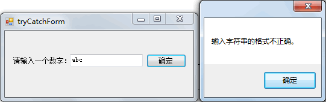

从运行效果可以看出，使用异常处理后不会再出现上面所示的异常提示，而是弹出 catch 子句中的消息框。

【实例 2】使用多个 catch 语句对程序做异常处理。

从控制台输入 5 个数存入整数数组中，首先判断输入的值是否为数值，再判断数组元素是否越界。

根据题目要求，创建控制台应用程序完成该实例，具体的代码如下。

```c#
class Program
{
    static void Main(string[] args)
    {
        //定义存放5个整数的数组
        int[] a = new int[5];
        try
        {
            for(int i = 0; i < a.Length; i++)
            {
                a[i] = int.Parse(Console.ReadLine());
            }
            for(int i = 0; i < a.Length; i++)
            {
                Console.Write(a[i] + " ");
            }
        }
        catch(FormatException f)
        {
            Console.WriteLine("输入的数字格式不正确！");
        }
        catch(OverflowException o)
        {
            Console.WriteLine("输入的值已经超出 int 类型的最大值！");
        }
        catch(IndexOutOfRangeException r)
        {
            Console.WriteLine("数组越界异常！");
        }
    }
}
```

运行该程序，效果如下图所示。

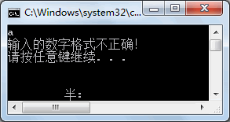

从运行效果可以看出，捕获该程序产生的异常类是 FormatException。

这样，在出现不同的异常时都会有相应的异常类来处理异常，这也是比较推荐的一种编程方法。

### 2) try finally

在 try finally 形式中没有单独对出现异常时处理的代码，finally 语句是无论 try 中的语句是否正确执行都会执行的语句。

通常在 finally 中编写的代码是关闭流、关闭数据库连接等操作，以免造成资源的浪费。

下面通过实例来演示 try finally 形式的应用。

【实例 3】验证 finally 语句的使用。

将实例 1 中的 catch 语句换成 finally 语句，代码如下。

```c#
public partial class tryCatchForm : Form
{
    public tryCatchForm()
    {
        InitializeComponent();
    }
    //“确认”按钮单击事件
    private void button1_Click(object sender, EventArgs e)
    {
        //获取文本框中的值
        string str = textBox1.Text;
        //将字符串装换为整数
        try
        {
            int num = int.Parse(str);
            MessageBox.Show("您输入的数字是：" + num);
        }
        finally
        {
            MessageBox.Show("finally 语句");
        }
    }
}
```

运行该窗体，单击“确定”按钮后效果如下图所示。

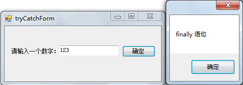

从运行效果可以看出，当文本框中输入的值是一个数字字符串时也会执行 finally 语句中的内容。

【实例 4】从文本框中输入当天的天气情况，并将其写入文件中，无论写入是否成功都将文件流关闭。

根据题目要求，使用 Windows 应用程序完成该实例，界面设计如下图所示。

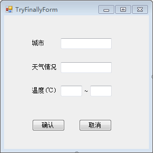

单击“确认”按钮后，将界面的文本框中的信息写入名为 weather.txt 的文本文件中, 代码如下。

```c#
public partial class TryFinallyForm : Form
{
    public TryFinallyForm()
    {
        InitializeComponent();
    }
    //"确认"按钮的单击事件
    private void button1_Click(object sender, EventArgs e)
    {
        //获取文本框
        string city = txtCity.Text;
        string msg = txtMsg.Text;
        string min = txtMin.Text;
        string max = txtMax.Text;
        //将文本框中的内容组成一个字符串
        string message = city + "：" + msg + "：" + min + "~" + max;
        //定义文件路径
        string path = "D:\\C#_test\\weather.txt";
        FileStream fileStream = null;
        try
        {
            //创建fileSteam类的对象
            fileStream = new FileStream(path, FileMode.OpenOrCreate);
            //将字符串转换成字节数组
            byte[] bytes = Encoding.UTF8.GetBytes(message);
            //向文件中写入字节数组
            fileStream.Write(bytes, 0, bytes.Length);
            //刷新缓冲区
            fileStream.Flush();
            //弹出录入成功的消息框
            MessageBox.Show("天气信息录入成功！");
        }
        finally
        {
            if (fileStream != null)
            {
                //关闭流
                fileStream.Close();
            }
        }
    }
}
```

运行该窗体，并在界面中填入所需的信息，单击“确认”按钮，效果如下图所示。

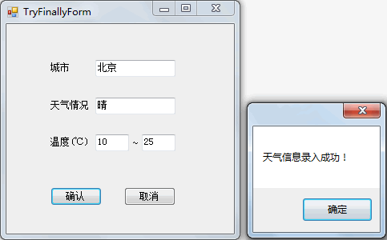

### 3) try catch finally

try catch finally 形式语句是使用最多的一种异常处理语句。

在出现异常时能提供相应的异常处理，并能在 finally 语句中保证资源的回收。

下面通过实例来演示 try catch finally 语句的应用。

【实例 5】使用 try catch finally 形式完成实例 4 的题目要求。

在实例 4 中使用了 try finally 的形式来处理异常，这样在岀现异常时并不会在程序中给予任何提示。

下面使用 try catch finally 的形式来实现，代码如下。

```c#
public partial class TryFinallyForm : Form
{
    public TryFinallyForm()
    {
        InitializeComponent();
    }
    //"确认"按钮的单击事件
    private void button1_Click(object sender, EventArgs e)
    {
        //获取文本框
        string city = txtCity.Text;
        string msg = txtMsg.Text;
        string min = txtMin.Text;
        string max = txtMax.Text;
        //将文本框中的内容组成一个字符串
        string message = city + "：" + msg + "：" + min + "~" + max;
        //定义文件路径
        string path = "D:\\C#_test\\weather.txt";
        FileStream fileStream = null;
        try
        {
            //创建fileSteam类的对象
            fileStream = new FileStream(path, FileMode.OpenOrCreate);
            //将字符串转换成字节数组
            byte[] bytes = Encoding.UTF8.GetBytes(message);
            //向文件中写入字节数组
            fileStream.Write(bytes, 0, bytes.Length);
            //刷新缓冲区
            fileStream.Flush();
            //弹出录入成功的消息框
            MessageBox.Show("天气信息录入成功！");
        }
        catch(Exception ex)
        {
            MessageBox.Show("出现错误！" + ex.Message);
        }
        finally
        {
            if (fileStream != null)
            {
                //关闭流
                fileStream.Close();
            }
        }
    }
}
```

运行该窗体，效果与实例 4 所示的一样，但是当程序出现错误时会弹出 catch 语句中的提示消息。

## 3.自定义异常

虽然在 

C#

 语言中已经提供了很多异常处理类，但在实际编程中还是会遇到未涉及的一些异常处理。

例如想将数据的验证放置到异常处理中，即判断所输入的年龄必须为 18〜45，此时需要自定义异常类来实现。

自定义异常类必须要继承 Exception 类。

声明异常的语句如下。

class 异常类名 :Exception
{
}

抛出自己的异常，语句如下

throw( 异常类名 );

下面通过实例来演示自定义异常的应用。

【实例】自定义异常类，判断从文本框中输入的年龄值处于 18〜45。

根据题目要求，设计一个 Windows 窗体，界面如下图所示。

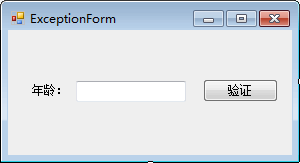

编写自定义异常类，代码如下。

```c#
class MyException :Exception
{
    public MyException(string message) : base(message)
    {
    
    }
}
```

在“验证”按钮的单击事件中根据输入的年龄判断是否抛出自定义异常，代码如下。

```c#
private void button1_Click(object sender, EventArgs e)
{
    try
    {
        int age = int.Parse(textBox1.Text);
        if (age < 18 || age > 45)
        {
            throw new MyException("年龄必须在18~45岁之间！");
        }
        else
        {
            MessageBox.Show("输入的年龄正确！");
        }
    }
    catch(MyException myException)
    {
        MessageBox.Show(myException.Message);
    }
    catch(Exception ex)
    {
        MessageBox.Show(ex.Message);
    }
}
```

运行该窗体，若在窗体上输入不符合要求的年龄，效果如下图所示。

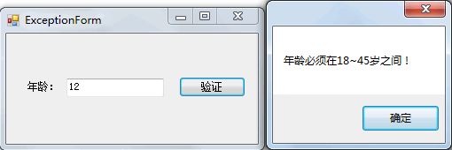

从运行效果可以看出，若在文本框中输入的年龄不在 18〜45 岁即会抛出自定的异常。

自定义异常也继承自 Exception 类，因此如果不直接处理 MyException 异常，也可以直接使用 Exception 类来处理该异常。

# 调试

## 1.Debug和Trace

在 C# 语言中允许在程序运行时输出程序的调试信息，类似于使用 Console.WriteLine 的方式向控制台输出信息。

所谓调试信息是程序员在程序运行时需要获取的程序运行的过程，以便程序员更好地解决程序中出现的问题，这种调试也被称为是非中断调试。

输出调试信息的类保存在 System.Diagnostics 命名空间中，通常用 Debug 类或 Trace 类实现调试时输出调试信息，具体的语句如下。

Debug.WriteLine();
Trace.WriteLine();

其中，Debug.WriteLine() 是在调试模式下使用的；Trace.WriteLine 除了可以在调试模式下使用，还可以用于发布的程序中。

下面通过实例来演示 Debug 类和 Trace 类的使用。

【实例】创建一个字符串类型的数组，在数组中存入从控制台输入的值，并输出每次向数组中存入的值。

本实例使用控制台程序完成，代码如下。

```c#
class Program
{
    static void Main(string[] args)
    {
        string[] str = new string[5];
        Debug.WriteLine("开始向数组中存值：");
        for(int i = 0; i < str.Length; i++)
        {
            str[i] = Console.ReadLine();
            Debug.WriteLine("存入的第{0}个值为{1}", i, str[i]);
        }
        Debug.WriteLine("向数组中存值结束！");
    }
}
```

运行该程序，在输岀界面中查看通过 Debug 类输出的信息，界面如下图所示。

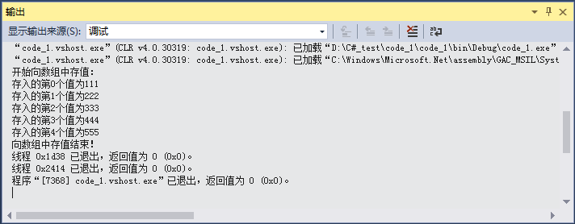

从输出窗口的内容可以看出，通过 Debug 类所打印的内容全部显示在该窗口中。

使用 Trace 类也能完成同样的效果，只需将上述代码中的 Debug 类换成 Trace 类即可。

> 提示：Trace 类的 WriteLine 方法中的参数不支持上述代码中 Debug 类的 WriteLine 方法的参数形式，只能传递字符串。

需要注意的是当程序在 Debug 状态下执行时使用 Debug 类打印的信息才会在输出窗口中显示，在 Release 状态下执行时只有 Trace 类输出的内容才会显示在输出窗口中。

更改程序执行的状态可以在 Visual Studio 2015 的工具栏中进行选择，如下图所示。


默认情况下，在 Visual Studio 2015 中的执行方式是 Debug，如果需要更改为其他状态, 可以在其下拉列表框中选择 Release 方式，并且在一个解决方案中不同的项目可以选择不同的执行方法。

在上图中 Debug 处的下拉列表框中选择“配置管理器”选项，弹出如下图所示的对话框。

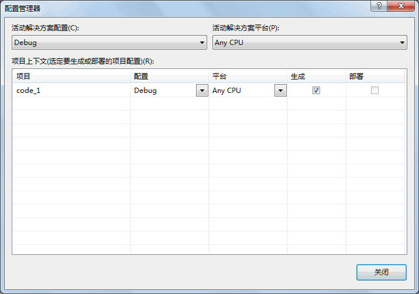

在其中通过选择“配置”栏中的选项即可为每个项目设置 Debug 形式或 Release 形式。

## 2.程序调试

在 

C#

 语言中程序调试主要指在 Visual Studio 2015 中调试程序，包括设置断点、监视断点，以及逐语句、逐过程、使用一些辅助窗口来调试程序。

在 Visual Studio 2015 的菜单栏中单击“调试”，菜单项如下图所示。

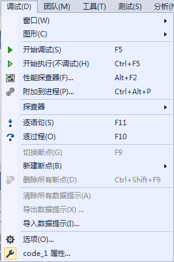

其中列出的内容即为调试时可用的选项，下面介绍其常用的调试功能。

### 1) 设置断点

所谓断点是程序自动进入中断模式的标记，即当程序运行到此处时自动中断。

在断点所在行的前面用红色的圆圈标记，设置标记时直接用鼠标单击需要设置断点的行前面的灰色区域即可，或者直接按键盘上的 F9 键。

例如在程序中设置断点，效果如下图

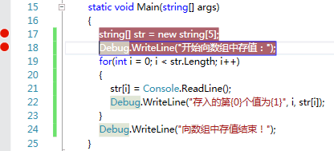

在设置断点时单击齿轮图标进入断点设置界面，如下图所示。

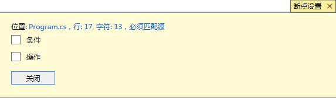

在该界面中允许为断点设置条件或操作，条件是指在满足指定条件时才会命中该断点。

此外，每个断点也允许设置多个条件，每个条件之间的关系是“与”的关系。界面如下图所示。

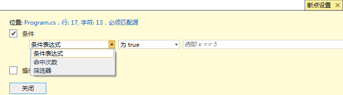

在设置条件时可以设置条件表达式、命中次数以及筛选器。

其中：

* 条件表达式是指一个布尔类型的表达式，如果满足条件则触发断点；
* 命中次数若满足指定次数，则触发断点；
* 筛选器用于限制只在某些进程和线程中设置断点。

在上图所示的界面中还可以为断点设置操作，用于指定在命中断点时打印追踪信息，界面如下图所示。

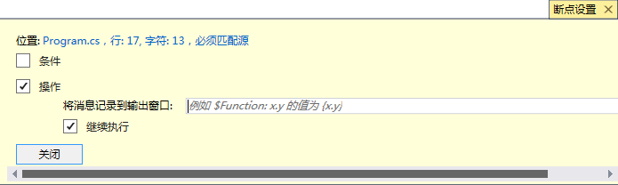

在该界面中，如果在“将消息记录到输出窗口”文本框中输出断点“string[] str = new string[5];”处，其中 str 的值，则可以写成“str={str}”的形式，在调试输出窗口中会发现“str=Null”的信息输出。

此外，右击断点，弹出的右键菜单如下图所示。

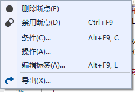

在该菜单中选择“条件”或“操作”命令也可以完成对断点的上述设置。

### 2) 管理断点

在断点设置完成后，还可以在上图所示的菜单中选择进行“删除断点”“禁用断点”“编辑标签”“导出”的操作。

其中：

* “删除断点”操作是取消当前断点，也可以再次单击断点的红点取消；
* “禁用断点”操作是指暂时跳过该断点，将断点设置为禁用状态后，断点的右键菜单中的“禁用断点”选项更改为“启用断点”，在需要该断点时还可以选择“启用断点”恢复断点；
* “编辑标签” 操作是为断点设置名称；
* “导出”操作是将断点信息导出到一个 XML 文件中存放。

### 3) 程序的调试过程

在设置好断点后，调试程序可以直接按 F5 键，或者直接在菜单栏中选择“调试”→“开始调试”命令。

在调试程序的过程中，可以直接使用工具栏上的调试快捷键，如下图所示，或者直接在菜单栏中选择所需的调试命令。


下面介绍常用的调试命令。

* 逐语句（）：按 F11 键也可以，用于逐条语句运行。
* 逐过程（）：按 F10 键也可以，过程是指可以将方法作为一个整体去执行，不会跳进方法中执行。
* 跳出（）：按 Shift+F11 组合键也可以，跳出是将程序的调试状态结束，并结束整个程序。

此外，在调试过程中右击，会出现如下图所示的右键菜单。

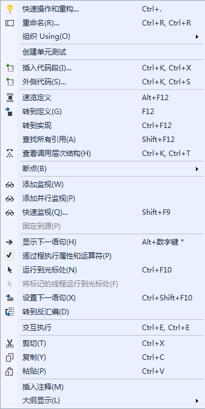

在该菜单中也可以选择相应的命令实现调试功能。

在调试过程中经常使用该菜单中的“运行到光标处”命令将程序执行到指定的光标处，忽略程序中设置的断点，用于快速调试程序和定位可能出错的位置。

### 4) 监视器

在调试程序的过程中经常需要知道某些变量的值在运行过程发生的变化，以便发现其在何时发生错误。

将程序中的变量或某个表达式放入监视器中即可监视其变化状态。

假设将 for 循环中的循环变量 i 加入监视器，在程序中右击变量 i，在弹出的如上图所示的菜单中选择“添加监视”命令，效果如下图所示。

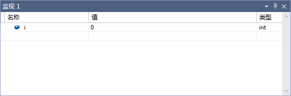

从上图中可以看出，在监视器界面的“名称”列中是变量名、“值”列中是当前变量 i 的值，“类型”列中是当前变量的数据类型。

在一个监视器中可以设置多个需要监视的变量或表达式。

对于监视器中不需要再监视的变量，可以右击该变量，在弹出的右键菜单中选择“删除监视”命令，如下图所示。

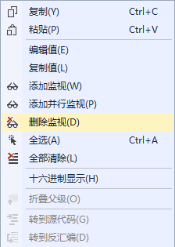

此外，通过上图所示的菜单还可以进行编辑值、复制值、全部清除等操作。

### 5) 快速监视

在调试程序时，如果需要监视变量或表达式的值也可以使用快速监视。

例如仍然要监视变量 i 的值，右击变量 i，在弹出的右键菜单中选择“快速监视”命令，弹出如下图所示的对话框。

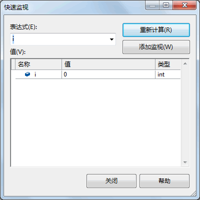

通常，快速监视用于查看变量当前值的状态，与直接加入监视不同的是快速监视一次只能监视一个变量。

此外，在“快速监视”对话框处于打开状态时程序是无法继续调试的，如果需要继续监视“快速监视”对话框中的变量，可以单击“添加监视”按钮将当前监视的变量加入到监视器界面中。

### 6) 即时窗口

在调试程序时，如果需要对变量或表达式做相关运算，在即时窗口中都可以实现，并显示当前状态下变量或表达式的值。

在调试时可以使用“调试”菜单中“窗口”下的命令，在“调试”菜单中单击“窗口”出现如下图所示的子菜单。

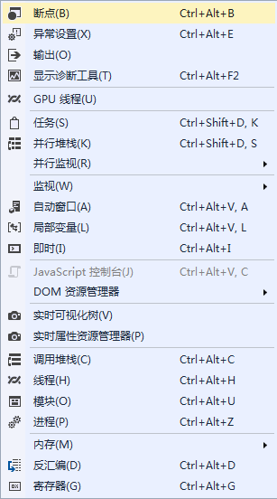

在其中选择“即时”命令即可出现即时窗口， 如下图所示。

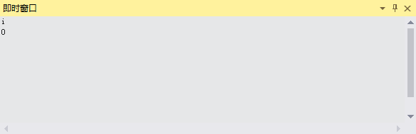

在即时窗口中输入变量 i 的值并按回车键，即出现当前 i 在程序运行到此时的值。