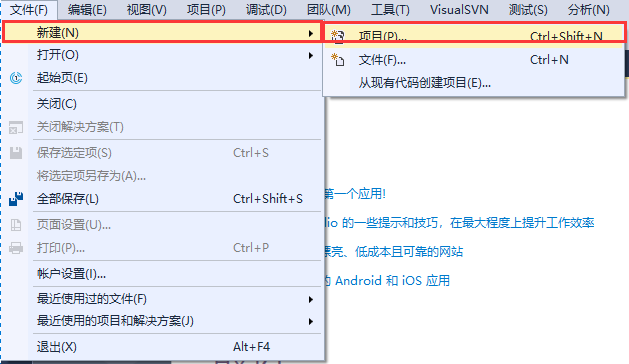
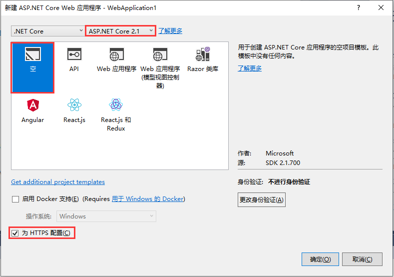

# 建立项目

## 1. VS 建立

### a. 文件 > 新建 > 项目

      

   2. 选择 ASP.NET Core Web 应用程序 > 确定

      

   3. 选择框架类型 > 选择空模板 > 取消选择 HTTPS

      

### b. dotnet 建立

   1. 在计算机上下载并安装 [.NET Core SDK](https://www.microsoft.com/net/download/)。

   2. 打开终端

      ```cmd
      dotnet new webapp -o aspnetcoreapp
      ```

   3. 运行

      ```cmd
      cd aspnetcoreapp
      dotnet run
      ```


## 2. 项目结构

1. 项目名 > 右击 > 
2. Connected Services
3. Dependencies
4. Properties
5. appsettings.json
6. Program.cs 项目启动
7. Startup.cs 项目配置

### 1. WebApplication-Test.csproj

```xml
<!-- 指明SDK -->
<Project Sdk="Microsoft.NET.Sdk.Web">

  <PropertyGroup>
    <!-- 说明使用的 .NET Cora 2.1 -->
    <TargetFramework>netcoreapp2.1</TargetFramework>
  </PropertyGroup>

  <ItemGroup>
    <Folder Include="wwwroot\" />
  </ItemGroup>

  <ItemGroup>
    <!-- 包名 -->
    <PackageReference Include="Microsoft.AspNetCore.App" />
    <!-- 包名 -->
    <PackageReference Include="Microsoft.AspNetCore.Razor.Design" Version="2.1.2" PrivateAssets="All" />
  </ItemGroup>

</Project>

```

### 2. Program.cs

```c#
namespace WebApplication_Test
{
    public class Program
    {
        public static void Main(string[] args)
        {
            CreateWebHostBuilder(args)
                .Build() // 创建
                .Run(); // 运行
        }

        public static IWebHostBuilder CreateWebHostBuilder(string[] args) =>
            // 使用 Startup类 配置
            WebHost.CreateDefaultBuilder(args).UseStartup<Startup>();
    }
}
```

### 3. Startup.cs

```c#
namespace WebApplication_Test
{
    public class Startup
    {
        // 
        public void ConfigureServices(IServiceCollection services)
        {
        }

        // 配置 HPPT 请求处理
        public void Configure(IApplicationBuilder app, IHostingEnvironment env)
        {
            if (env.IsDevelopment())
            {
                app.UseDeveloperExceptionPage();
            }
            // 所有http请求的处理方法
            app.Run(async (context) =>
            {
                await context.Response.WriteAsync("Hello World!");
            });
        }
    }
}
```


# Startup配置

# Controller

# Model

# Razor View

# 前端


