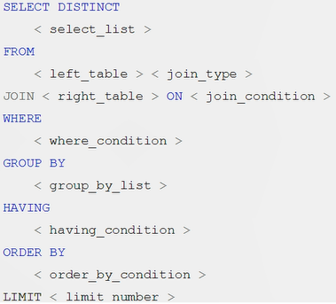
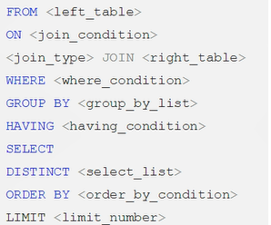
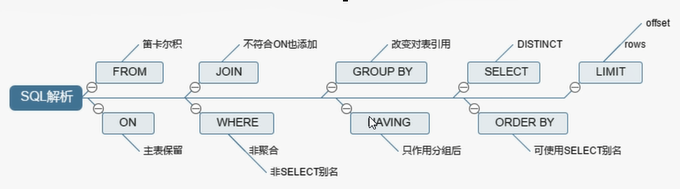

# SQL慢

> 性能下降SQL慢
>
> 执行时间长
>
> 等待时间长

1. 查询语句太烂
2. 索引失效
   1. 单值 *只用了一个字段建立索引*
   2. 复合 *用了两个以上的字段建立了索引*
3. 关联查询太多
4. 服务器调优及各个参数设置

# 常见通用的join查询

## SQL执行顺序

### 手写



### 机读



### 总结



## Join图


## 建表SQL

## 7种Join

```sql
select [select_list] from table_a a inner join table_b b on a.key = b.key;
```
```sql
select [select_list] from table_a a left join table_b b on a.key = b.key;
```
```sql
select [select_list] from table_a a right join table_b b on a.key = b.key;
```
```sql
select [select_list] from table_a a left join table_b b on a.key = b.key where b.key is null;
```
```sql
select [select_list] from table_a a right join table_b b on a.key = b.key where a.key is null;
```
```sql
select [select_list] from table_a a full outer join table_b b on a.key = b.key;
```
```sql
select [select_list] from table_a a full outer join table_b b on a.key = b.key where a.key is null or b.key is null;
```
```sql
select [select_list] from table_a left join table_b b on a.key = b.key 
union
select [select_list] from table_a right join table_b b on a.key = b.key;
```
```sql
select [select_list] from table_a a left join table_b b on a.key = b.key where b.key is null 
union 
select [select_list] from table_a a right join table_b b on a.key = b.key where a.key is null;
```

