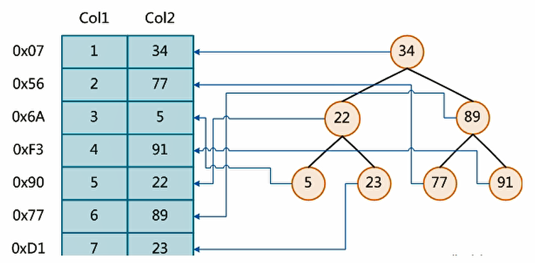
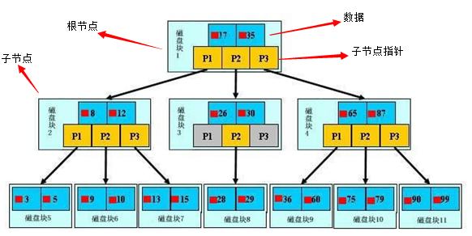

# 索引index

## 简介

MySQL官方对索引的定义为：索引（index）是帮助MySQL高效获取数据的数据结构；

可以得到索引的本质：索引式数据结构；

你可以简单的理解为“**排好序的快速查找数据结构**”

一般来说索引的本身也很大，不可能完全存储在内存中，因此索引往往是以索引文件的形式存储在磁盘上；

在数据结构之外，**数据库系统还维护着满足特定查找算法的数据结构**，这些数据结构以某种方式引用（指向）数据。

这样就可以在这些数据结构上实现高级查找算法。这种数据结构，就是索引。下图就是一种可能的索引方式示例：



> 左边是数据表，一共有两列七条记录，最左边的是数据记录的物理地址

为了加快Col2的查找，可以维护一个右边所示的二叉查找树，每个节点分别包含索引键值和一个指向对应数据记录物理地址的指针，这样就可以运用二叉查找在一定的复杂度内获取到响应数据，从而快速的检索出符合条件的记录。

> 数据本身之外，数据库还维护着一个满足特定查找算法的数据结构，这些数据结构以某种方式指向数据，这样就可以在这些数据结构的基础上实现高级查找算法，这种数据结构就是索引。

我们平时所说的索引，如果没有指明，就是指**B+树**索引，统称索引。当然除了B+树这种类型的索引。其中**聚集索引**，**次要索引**，**覆盖索引**，**复合索引**，**前缀索引**，**唯一索引**默认都是B+树索引，统称为索引。

当然除了B+索引这种类型的索引之外，还有**哈希索引**等；

## 优势

- 提高了数据检索的效率，降低数据库的IO成本；
- 降低了排序成本，降低了CPU的消耗

## 劣势

- 索引是要占用空间的；
- 降低了更新表的速度，对`insert`,`update`,`delete`

## 分类

- 单值索引
  - 一个索引只包含单个列，一个表可以有多个单列索引
- 唯一索引
  - 索引列的值必须唯一，但允许有空置
- 复合索引
  - 即一个索引包含多个列

### 基本语法

#### 创建

```sql
create [unique] index index_name on table_name (column_name(length));
```

```sql
alter table_name add [unique] index [index_name] on (column_name(length));
```

> 

#### 删除

```sql
drop index [index_name] on table_name;
```


#### 查看

```sq
show index from table_name;
```


#### 修改

- 主键索引

```sql
alter table table_name add primary key (column_name);
```

- 唯一索引

```sql
alter table table_name unique index_name (column_name);
```

- 普通索引

```sql
alter table table_name index index_name (column_name);
```

- 全文索引

```sql
alter table table_name fulltext index_name (column_name);
```


## 索引结构

### BTree索引



- 初始化介绍

一颗B树，浅蓝色的块我们称之为一个磁盘块，可以看到每个磁盘块包含几个数据项（深蓝色所示）和指针（黄色所示），如磁盘块1包含数据项17和35，包含指针P1，P2，P3，P1表示小于17的磁盘块，P2表示在17和35之间的磁盘块，P3表示大于35的磁盘块。

- 查找过程

如果要查找数据项29，那么首先会把磁盘块1由磁盘加载到内存，此时发生一次IO，在内存中用二分法查找确定29在17和35之间，锁定磁盘块1的P2指针，内存时间因为非常短（相比磁盘IO）可以忽略不计，通过磁盘块1的P2指针的磁盘地址把磁盘块3由磁盘加载到内存，发生第二次IO，29在26和30之间，锁定磁盘块3的P2指针，通过指针加载磁盘块8到内存，发生第三次IO，同时内存中做二分查找找到29，结束查询，总计三次IO；

真实的情况是，3层的B树可以表示上百万的数据，如果上百万的数据查找只需要三次IO，性能提高将是巨大的，如果没有索引，每个数据项都要发生一次IO，那么总共需要百万次的IO，显然成本非常非常高。

- Hash索引


- full-text全文索引


- R-Tree索引

## 何时使用索引

1. 主键自动建立唯一索引；
2. 频繁作为查询条件的字段应该创建索引；
3. 查询中与其他表关联的字段，外键关系建立索引；
4. 频繁更新的字段不适合创建索引；
5. where条件里用不到的字段不创建索引；
6. 高并发时，倾向使用组合索引；
7. 查询中排序的字段，排序字段若通过索引去访问将大大提高排序速度；
8. 查询中统计或分组字段

## 不使用

1. 表记录太少 （300万以上性能下降）；
2. 经常增删改的表；
3. 一个索引值重复率接近于1；

## 性能分析

### MySQL 查询分析器

1. MySQL中有专门的`select`优化器模块，主要功能：通过计算分析系统中收集到的统计信息，为客户端请求Query通过他认为最优的执行计划（他认为最优的数据检索方式不见得是DBA任务的最优的，这部分最耗费时间）
2. 当客户端向MySQL请求一条Query，命令解析器模块完成请求分类，区别出是`select`并转发给MySQL Query Optimizer时，MySQL Query Optimizer 首先会对整条query进行优化，处理掉一些常量表达式的预算，直接换算为常量值。并对Query中的查询条件进行简化和转换，如去掉一些无用或显而易见的田间、机构调整等。然后分析Query中的Hint信息（如果有），看显示Hint信息是否可以完全确定该Query的执行计划。如果没有Hint或Hint信息还不足以完成确定执行计划，则会读取所涉及对象的统计信息，根据Query进行写响应的计算分析，然后在得出最后的执行计划。

### 