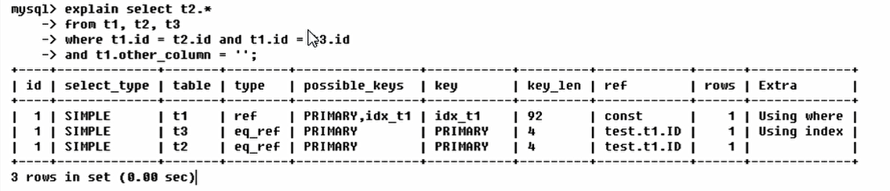
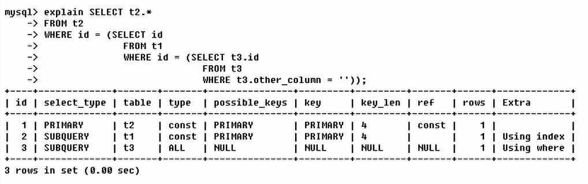
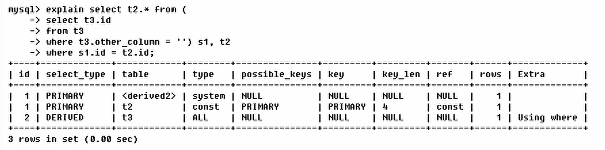
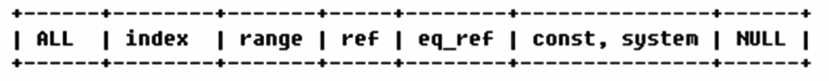

# Explain简介

使用explain关键字可以模拟优化器执行SQL查询语句，从而知道MySQL是如何处理你的SQL语句的。分析你的查询语句或是表结构的性能瓶颈；

```sql
explain select [select_list] from table_name
```

## 作用

- 表的读取顺序
- 数据读取操作的操作类型
- 哪些索引可以使用
- 哪些索引被实际使用
- 表之间的引用
- 每张表有多少行被优化器查询

## 使用

`explain sql` 可以查到的字段

| id   | select_type | table | type | possible_keys | key  | key_len | ref  | rows | Extra |


### id 执行顺序

select查询的序列号，包含一组数字，表示查询中执行select子句或操作表的顺序；

1. id 相同

- 同时按照顺序从上至下



2. id不同

- 值越大优先级越高



3. id相同与不同同时存在

- id相同,可以认为是一组,从上往下顺序执行
- id值越大,优先级越高，越先执行
- **衍生** = **DERIVED**



### select_type 查询类型

常见的值：

1. SIMPLE

   简单的select 查询，查询中不包含子查询或者UNION

2. PRIMARY

   查询中若包含任何复杂的子部分，最外层查询则被标记为

3. SUBQUERY

   在select或wherer列表中包含了子查询

4. DERIVED

   在FROM列表中包含的子查询被标记为DERIVED（衍生）MySQL会递归这些子查询，把结果放在临时表中

5. UNION

   若第二个select出现在UNION之后，则被标记为UNION；

   若UNION包含在FROM子句的子查询中，外层将会被标记为：DERIVED；

6. UNION RESULT

   从UNION表获取结果的SELECT

### table 数量来源

type 访问类型排列



显示查询使用了何种类型

从最好到最差的一次顺序（常见）

**system > const > eq_ref > ref > range > index > All**

一般来说，需要保证查询至少到range几倍，最好能达到ref级别。

- system
  - 表只有一行记录（等于系统表）
- const
  - 表示通过索引一次就可以找到了，const用于鼻尖primary key 或者unique索引。因为只匹配一行数据，所以很快，如果主键置于where列表中，MySQL就能将该查询转化为一个常亮；
- eq_ref
  - 唯一性索引扫描，对于每个索引建，表中只有一条记录与之匹配。常见于主键唯一和唯一索引；
- ref
  - 非唯一性索引扫描，返回匹配某个单独值的所有行。
  - 本质上就是一种索引访问，它返回所有匹配单独值的行。
  - 它可能会找到多个符合条件的行，所以他应该属于查找和扫描的混合体；
- range
  - 只检索给定范围的行，使用一个索引来选择行。
  - key列显示使用了哪个索引
  - 一般就是在你的where语句中出现了**between**、**<**、**>**、**in**等查询；
  - 这种范围扫描索引扫描比全表扫描的要好，因为它只需要于索引的某一点，而结束于另一点，不用扫描全部索引；
- index
  - full index、index与all区别为index类型只遍历索引树。可通常比all快，因为索引文件通常要比数据小。
- all
  - 全表遍历

### possible_keys

显示可能应用在这张表中的索引,一个或多个；

查询收集到的字段若存在索引，则该索引将会被累出，但不一定被查询实际使用


### keys

实际使用的索引，如果为null，则没有使用索引；

查询中若使用了覆盖索引，则该索引仅出现在可以列表中；

### key_len

表示索引中使用的字节数，可通过该列计算查询中使用的索引长度。在不损失精确性的情况下，长度越短越好；

key_len显示的值为索引字段的最大可能长度，并非实际使用长度，即key_len是根据表定义而得，不是通过表内检索出的

### ref

显示索引那一列被使用了，如果可能的话，是一个常数。

### rows

根据表统计信息及索引选用情况，大致估算出找到所需记录所需要读取的行数

### Extra

扩展


