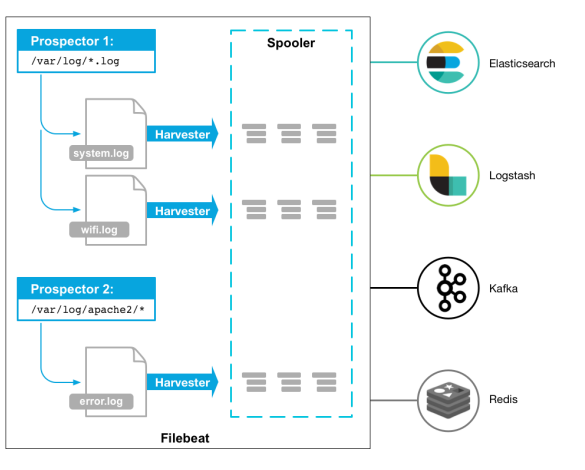

### 为什么用到ELK：

一般我们需要进行日志分析场景：直接在日志文件中 grep、awk 就可以获得自己想要的信息。但在规模较大的场景中，此方法效率低下，面临问题包括日志量太大如何归档、文本搜索太慢怎么办、如何多维度查询。需要集中化的日志管理，所有服务器上的日志收集汇总。常见解决思路是建立集中式日志收集系统，将所有节点上的日志统一收集，管理，访问。

一般大型系统是一个分布式部署的架构，不同的服务模块部署在不同的服务器上，问题出现时，大部分情况需要根据问题暴露的关键信息，定位到具体的服务器和服务模块，构建一套集中式日志系统，可以提高定位问题的效率。

一个完整的集中式日志系统，需要包含以下几个主要特点：

- 收集－能够采集多种来源的日志数据
- 传输－能够稳定的把日志数据传输到中央系统
- 存储－如何存储日志数据
- 分析－可以支持 UI 分析
- 警告－能够提供错误报告，监控机制

ELK提供了一整套解决方案，并且都是开源软件，之间互相配合使用，完美衔接，高效的满足了很多场合的应用。目前主流的一种日志系统。

### ELK简介：

ELK是三个开源软件的缩写，分别表示：Elasticsearch , Logstash, Kibana , 它们都是开源软件。新增了一个FileBeat，它是一个轻量级的日志收集处理工具(Agent)，Filebeat占用资源少，适合于在各个服务器上搜集日志后传输给Logstash，官方也推荐此工具。

Elasticsearch是个开源分布式搜索引擎，提供搜集、分析、存储数据三大功能。它的特点有：分布式，零配置，自动发现，索引自动分片，索引副本机制，restful风格接口，多数据源，自动搜索负载等。

Logstash 主要是用来日志的搜集、分析、过滤日志的工具，支持大量的数据获取方式。一般工作方式为c/s架构，client端安装在需要收集日志的主机上，server端负责将收到的各节点日志进行过滤、修改等操作在一并发往elasticsearch上去。

Kibana 也是一个开源和免费的工具，Kibana可以为 Logstash 和 ElasticSearch 提供的日志分析友好的 Web 界面，可以帮助汇总、分析和搜索重要数据日志。

Filebeat隶属于Beats。目前Beats包含四种工具：

1. 1. Packetbeat（搜集网络流量数据）
   2. Topbeat（搜集系统、进程和文件系统级别的 CPU 和内存使用情况等数据）
   3. Filebeat（搜集文件数据）
   4. Winlogbeat（搜集 Windows 事件日志数据）

### 官方文档：

Filebeat：

https://www.elastic.co/cn/products/beats/filebeat
https://www.elastic.co/guide/en/beats/filebeat/5.6/index.html

Logstash：
https://www.elastic.co/cn/products/logstash
https://www.elastic.co/guide/en/logstash/5.6/index.html

Kibana:

https://www.elastic.co/cn/products/kibana

https://www.elastic.co/guide/en/kibana/5.5/index.html

Elasticsearch：
https://www.elastic.co/cn/products/elasticsearch
https://www.elastic.co/guide/en/elasticsearch/reference/5.6/index.html

elasticsearch中文社区：
https://elasticsearch.cn/

 

### ELK架构图：

架构图一：


这是最简单的一种ELK架构方式。优点是搭建简单，易于上手。缺点是Logstash耗资源较大，运行占用CPU和内存高。另外没有消息队列缓存，存在数据丢失隐患。

此架构由Logstash分布于各个节点上搜集相关日志、数据，并经过分析、过滤后发送给远端服务器上的Elasticsearch进行存储。Elasticsearch将数据以分片的形式压缩存储并提供多种API供用户查询，操作。用户亦可以更直观的通过配置Kibana Web方便的对日志查询，并根据数据生成报表。

架构图二：


此种架构引入了消息队列机制，位于各个节点上的Logstash Agent先将数据/日志传递给Kafka（或者Redis），并将队列中消息或数据间接传递给Logstash，Logstash过滤、分析后将数据传递给Elasticsearch存储。最后由Kibana将日志和数据呈现给用户。因为引入了Kafka（或者Redis）,所以即使远端Logstash server因故障停止运行，数据将会先被存储下来，从而避免数据丢失。

架构图三：


此种架构将收集端logstash替换为beats，更灵活，消耗资源更少，扩展性更强。同时可配置Logstash 和Elasticsearch 集群用于支持大集群系统的运维日志数据监控和查询。

### Filebeat工作原理：

Filebeat由两个主要组件组成：prospectors 和 harvesters。这两个组件协同工作将文件变动发送到指定的输出中。



**Harvester（收割机）：**负责读取单个文件内容。每个文件会启动一个Harvester，每个Harvester会逐行读取各个文件，并将文件内容发送到制定输出中。Harvester负责打开和关闭文件，意味在Harvester运行的时候，文件描述符处于打开状态，如果文件在收集中被重命名或者被删除，Filebeat会继续读取此文件。所以在Harvester关闭之前，磁盘不会被释放。默认情况filebeat会保持文件打开的状态，直到达到[`close_inactive`](https://www.elastic.co/guide/en/beats/filebeat/5.5/configuration-filebeat-options.html#close-inactive)（如果此选项开启，filebeat会在指定时间内将不再更新的文件句柄关闭，时间从harvester读取最后一行的时间开始计时。若文件句柄被关闭后，文件发生变化，则会启动一个新的harvester。关闭文件句柄的时间不取决于文件的修改时间，若此参数配置不当，则可能发生日志不实时的情况，由scan_frequency参数决定，默认10s。Harvester使用内部时间戳来记录文件最后被收集的时间。例如：设置5m，则在Harvester读取文件的最后一行之后，开始倒计时5分钟，若5分钟内文件无变化，则关闭文件句柄。默认5m）。

**Prospector（勘测者）：**负责管理Harvester并找到所有读取源。

```
filebeat.prospectors:``- input_type: log`` ``paths:``  ``- /apps/logs/*/info.log
```

Prospector会找到/apps/logs/*目录下的所有info.log文件，并为每个文件启动一个Harvester。Prospector会检查每个文件，看Harvester是否已经启动，是否需要启动，或者文件是否可以忽略。若Harvester关闭，只有在文件大小发生变化的时候Prospector才会执行检查。只能检测本地的文件。

**Filebeat如何记录文件状态：**

将文件状态记录在文件中（默认在/var/lib/filebeat/registry）。此状态可以记住Harvester收集文件的偏移量。若连接不上输出设备，如ES等，filebeat会记录发送前的最后一行，并再可以连接的时候继续发送。Filebeat在运行的时候，Prospector状态会被记录在内存中。Filebeat重启的时候，利用registry记录的状态来进行重建，用来还原到重启之前的状态。每个Prospector会为每个找到的文件记录一个状态，对于每个文件，Filebeat存储唯一标识符以检测文件是否先前被收集。

**Filebeat如何保证事件至少被输出一次：**

Filebeat之所以能保证事件至少被传递到配置的输出一次，没有数据丢失，是因为filebeat将每个事件的传递状态保存在文件中。在未得到输出方确认时，filebeat会尝试一直发送，直到得到回应。若filebeat在传输过程中被关闭，则不会再关闭之前确认所有时事件。任何在filebeat关闭之前为确认的时间，都会在filebeat重启之后重新发送。这可确保至少发送一次，但有可能会重复。可通过设置[`shutdown_timeout`](https://www.elastic.co/guide/en/beats/filebeat/5.5/configuration-global-options.html#shutdown-timeout) 参数来设置关闭之前的等待事件回应的时间（默认禁用）。

 

### Logstash工作原理：

Logstash事件处理有三个阶段：inputs → filters → outputs。是一个接收，处理，转发日志的工具。支持系统日志，webserver日志，错误日志，应用日志，总之包括所有可以抛出来的日志类型。


 

**Input：输入数据到logstash。**

一些常用的输入为：

file：从文件系统的文件中读取，类似于tail -f命令

syslog：在514端口上监听系统日志消息，并根据RFC3164标准进行解析

redis：从redis service中读取

beats：从filebeat中读取

**Filters：数据中间处理，对数据进行操作。**

一些常用的过滤器为：

grok：解析任意文本数据，Grok 是 Logstash 最重要的插件。它的主要作用就是将文本格式的字符串，转换成为具体的结构化的数据，配合正则表达式使用。内置120多个解析语法。

官方提供的grok表达式：https://github.com/logstash-plugins/logstash-patterns-core/tree/master/patterns
grok在线调试：https://grokdebug.herokuapp.com/

mutate：对字段进行转换。例如对字段进行删除、替换、修改、重命名等。

drop：丢弃一部分events不进行处理。

clone：拷贝 event，这个过程中也可以添加或移除字段。

geoip：添加地理信息(为前台kibana图形化展示使用)

**Outputs：outputs是logstash处理管道的最末端组件。**一个event可以在处理过程中经过多重输出，但是一旦所有的outputs都执行结束，这个event也就完成生命周期。

一些常见的outputs为：

elasticsearch：可以高效的保存数据，并且能够方便和简单的进行查询。

file：将event数据保存到文件中。

graphite：将event数据发送到图形化组件中，一个很流行的开源存储图形化展示的组件。

**Codecs：codecs 是基于数据流的过滤器，它可以作为input，output的一部分配置**。Codecs可以帮助你轻松的分割发送过来已经被序列化的数据。

一些常见的codecs：

json：使用json格式对数据进行编码/解码。

multiline：将汇多个事件中数据汇总为一个单一的行。比如：java异常信息和堆栈信息。