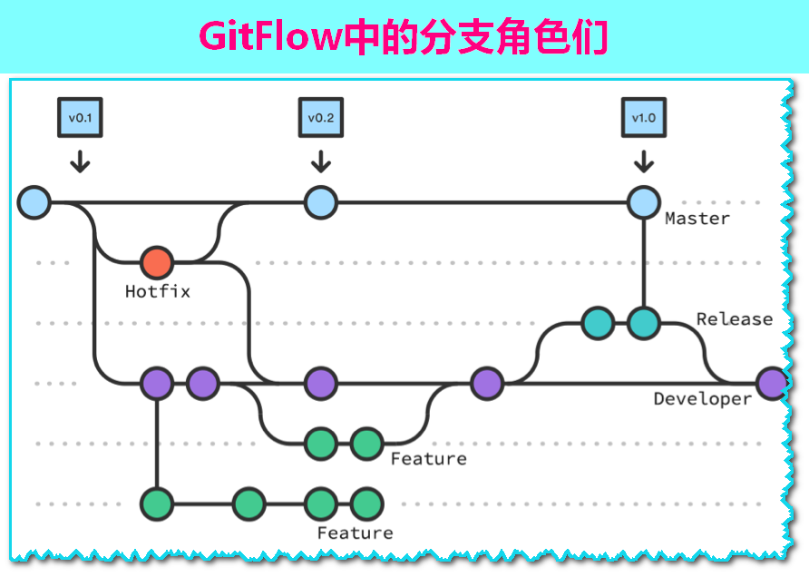
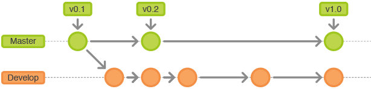
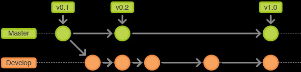
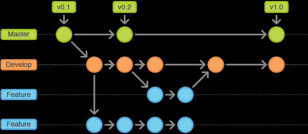
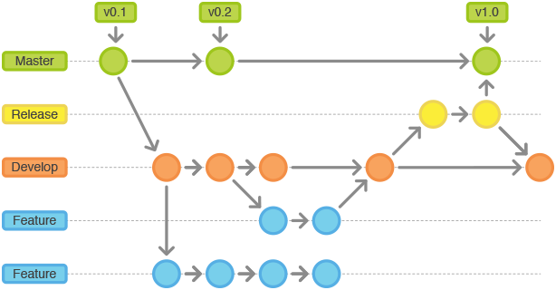
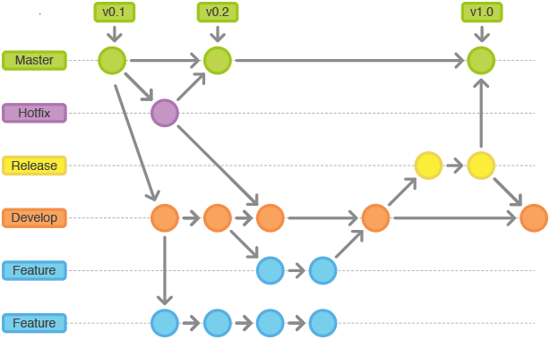

# git flow 

## master

## develop

## feature

## release

## hotfix

> 注意: 
> 1. 及时推送本地
> 2. 及时拉取最新代码, 建议一天一次
> 3. 及时从 master 同步代码, 保证本地代码为最新
> 4. `git flow xxx finish` 后需要手动推送 `branch` 和 `tag`
>    1. `git push --all`
>    2. `git push --tag`
> 5. 同一时刻只能 有一个 `relesas` 、 `hotfix` 
> 6. 版本在整个项目的生命周期内, 不能重复, 重复后不能自动 `tag`. 会导致 `git flow finish` 失败
> 7. `git flow xxx finish` 在 idea console 中 `Ctrl + C` 或 `Ese` 无法 退出 vi 编辑器 会打断 git flow 流程, 请使用 系统自带控制台使用;

