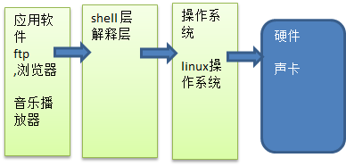
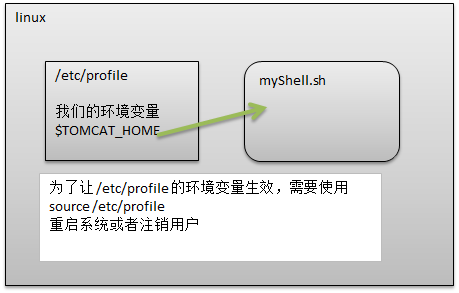

# Shell简介

Shell是一个命令解释器，它为用户提供了一个向linux内核发送请求以便运行程序的界面系统程序，用户可以用Shell来启动、挂起、停止甚至是编写一些程序。



# 入门

## 脚本格式要求

- 脚本以`#/bin/bash`开头

### HelloWorld

```sh
#!/bin/bash
echo "hello,world!"
```

## 执行

方式一 给权限

1. 执行权限（给所有者一个执行权限）

   ```sh
   chmod 744 helloWorld.sh
   ```

2. 执行脚本

   ```shell
   ./helloWorld.sh
   ```

   

方式二 不给权限

```sh
sh ./helloWorld.sh
```

# Shell 变量

定义变量时，变量名不加美元符号如：

```sh
your_name="runoob.com"
```

注意，变量名和等号之间不能有空格，这可能和你熟悉的所有编程语言都不一样。同时，变量名的命名须遵循如下规则：

* 命名只能使用英文字母，数字和下划线，首个字符不能以数字开头。
* 中间不能有空格，可以使用下划线（_）。
* 不能使用标点符号。
* 不能使用bash里的关键字（可用help命令查看保留关键字）。

有效的 Shell 变量名示例如下：

```sh
RUNOOB
LD_LIBRARY_PATH
_var
var2
```

以上语句将 /etc 下目录的文件名循环出来。


### 使用变量

使用一个定义过的变量，只要在变量名前面加美元符号即可，如：

```
your_name="qinjx"
echo $your_name
echo ${your_name}
```

变量名外面的花括号是可选的，加不加都行，加花括号是为了帮助解释器识别变量的边界，比如下面这种情况：

```
for skill in Ada Coffe Action Java; do
    echo "I am good at ${skill}Script"
done
```

如果不给skill变量加花括号，写成echo "I am good at $skillScript"，解释器就会把$skillScript当成一个变量（其值为空），代码执行结果就不是我们期望的样子了。

推荐给所有变量加上花括号，这是个好的编程习惯。

已定义的变量，可以被重新定义，如：

```
your_name="tom"
echo $your_name
your_name="alibaba"
echo $your_name
```

这样写是合法的，但注意，第二次赋值的时候不能写`$your_name="alibaba"`，使用变量的时候才加美元符（$）。

### 只读变量

使用 readonly 命令可以将变量定义为只读变量，只读变量的值不能被改变。

下面的例子尝试更改只读变量，结果报错：

```
#!/bin/bash
myUrl="http://www.google.com"
readonly myUrl
myUrl="http://www.runoob.com"
```

运行脚本，结果如下：

```
/bin/sh: NAME: This variable is read only.
```

### 删除变量

使用 unset 命令可以删除变量。语法：

```
unset variable_name
```

变量被删除后不能再次使用。unset 命令不能删除只读变量。

**实例**

```
#!/bin/sh
myUrl="http://www.runoob.com"
unset myUrl
echo $myUrl
```

以上实例执行将没有任何输出。

### 变量类型

运行shell时，会同时存在三种变量：

* **1) 局部变量** 局部变量在脚本或命令中定义，仅在当前shell实例中有效，其他shell启动的程序不能访问局部变量。
* **2) 环境变量** 所有的程序，包括shell启动的程序，都能访问环境变量，有些程序需要环境变量来保证其正常运行。必要的时候shell脚本也可以定义环境变量。
* **3) shell变量** shell变量是由shell程序设置的特殊变量。shell变量中有一部分是环境变量，有一部分是局部变量，这些变量保证了shell的正常运行

### 环境变量



1. `/etc/profile`中定义
2. `source /etc/profile` 使其生效

```sh
# 定义一个自己的环境变量
TOM="cat" #声明变量
export TOM #引入变量
```

## 位置参数变量

### 介绍

当指定一个shell脚本时，如果希望获取到命令行的参数信息，就可以使用到位置参数变量，比如：`./myshell.sh  100 200`这就是一个指定shell命令行，可以在myshell脚本中获取到参数。

### 基本语法

- `$n`：n为数字，`$0`表示命令本身，`$1-$9`代表第一个参数到第九个参数，十以上的参数需要用大括号包含，如：`${14}`；
- `$*`：这个变量代表命令行中所有的参数，`$*`把所有的参数看成一个整体；
- `$@`：这个变量页代表命令行中的所有参数，不过`$@`把每个参数区分对待；
- `$#：`这个变量代表命令行中所有参数的个数；

### 示例

```sh
echo "$0 $1 $2"
echo "$*"
echo "$@"
echo "$#"
```

```cmd
./myDome.sh 45 90
```

```text
./myDome.sh 45 90
45 90
45 90
2
```

## 预定义变量

### 介绍

就是shell设计者已经事先定义好的变量，可以直接在shell脚本中使用

### 基本语法

- `$$`：当前进程号
- `$!`：后台运行的最后一个进程的进程号
- `$?`：最后一次执行命令的返回状态，如果这个变量的值为0，证明上一个命令正常结束；

### 示例

```sh
#!/bin/bash
echo "当前进程=$$"
#后台方式运行的进程
./myDome.sh &
echo "后台的进程=$!"
echo "执行返回值=$?"
```

```cmd
当前进程=5344
后台的进程=
执行返回值=0
```

