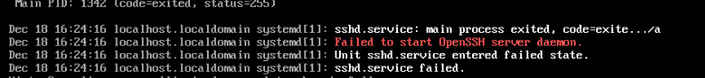
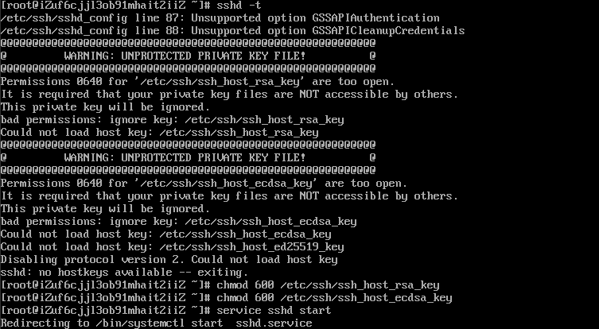
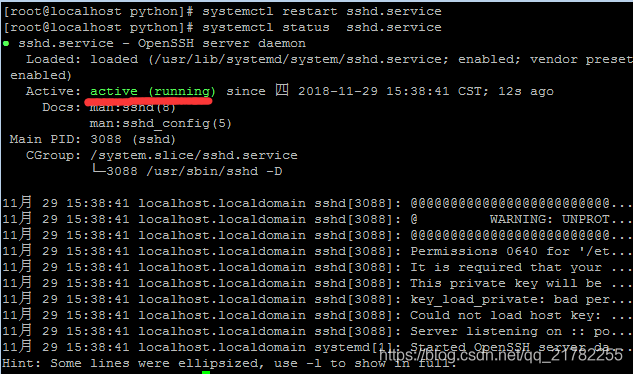

问题描述:
以前一直能够通过ssh来连接服务器,但是突然连接不上了. (**<u>CentOS</u>**)

解决思路:
首先通过命令查看SSH服务的状态:

# 解决一 : 没有/var/empty/sshd这个目录

首先通过命令查看SSH服务的状态:

```shell
systemctl status sshd
```

可以看到,有错误,但是没有显示详细信息:


使用命令,定位错误详细信息

```shell
sshd -t
```

可以看到是因为没有/var/empty/sshd这个目录

使用命令创建相关目录,然后重新启动sshd服务即可.

# 解决二 : 密钥没有权限

使用`sshd -t`检查



执行

```shell
chmod 600 /etc/ssh/ssh_host_rsa_key
chmod 600 /etc/ssh/ssh_host_ecdsa_key
service sshd start
```

或

```shell
chown -R root.root /var/empty/sshd
chmod 744 /var/empty/sshd
service sshd restart
```

故障解决

## 问题解决 ( 绿色 <b style="color:green">active (running)</b>)

