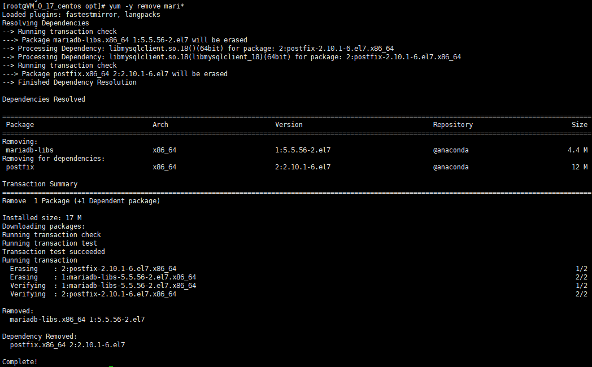
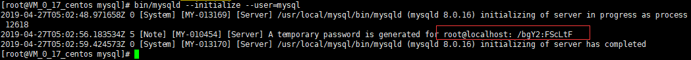

> 本文参照MySQL官方文档[2.2使用通用二进制文件在Unix / Linux上安装MySQL](https://dev.mysql.com/doc/refman/8.0/en/binary-installation.html)

# 下载

[mysql-8.0.16-linux-glibc2.12-x86_64.tar.xz](mysql-8.0.16-linux-glibc2.12-x86_64.tar.xz)

# 警告

##  插件

- 如果您以前使用操作系统本机程序包管理系统（如Yum或APT）安装了MySQL，则使用本机二进制文件安装时可能会遇到问题。确保您之前的MySQL安装已完全删除（使用您的包管理系统），并且还删除了任何其他文件，例如旧版本的数据文件。您也应该检查配置文件，如`/etc/my.cnf`或`/etc/mysql`目录，并删除它们。

  有关使用官方MySQL软件包替换第三方软件包的信息，请参阅相关的 [APT指南](https://dev.mysql.com/doc/mysql-apt-repo-quick-guide/en/)或[Yum指南](https://dev.mysql.com/doc/refman/5.7/en/replace-third-party-yum.html)。

- 

  MySQL依赖于`libaio` 库。如果未在本地安装此库，则数据目录初始化和后续服务器启动步骤将失败。如有必要，请使用适当的包管理器进行安装。例如，在基于Yum的系统上：

  ``` cmd
  shell> yum search libaio  # search for info
  shell> yum install libaio # install library
  ```

  或者，在基于APT的系统上：

  ```cmd
  shell> apt-cache search libaio # search for info
  shell> apt-get install libaio1 # install library
  ```

  ## 冲突

  > centOS 7 查看 MariaDB 是否安装
  >
  > 二者会冲突,建议卸载

  1. 查看

     ```cmd
     rpm -qa|grep mariadb
     ```

     

  2. 卸载

     ```cmd
     yum -y remove mari*
     ```

     

  3. 删除遗留

  ```cmd
  /etc/my.cnf
  /var/lib/mysql/
  ```

  ```cmd
  rm -rf /etc/my.cnf
  rm -rf /var/lib/mysql/
  ```

  

# 安装目录

要安装压缩的**tar**文件二进制分发版，请在您选择的安装位置（通常`/usr/local/mysql`）将其解压缩。这将创建下表中显示的目录。

* 安装目录布局

| 目录            | 目录的内容                                                   |
| --------------- | ------------------------------------------------------------ |
| `bin`           | [**mysqld**](https://dev.mysql.com/doc/refman/8.0/en/mysqld.html)服务器，客户端和实用程序 |
| `docs`          | 信息格式的MySQL手册                                          |
| `man`           | Unix手册页                                                   |
| `include`       | 包含（标题）文件                                             |
| `lib`           | 图书馆                                                       |
| `share`         | 用于数据库安装的错误消息，字典和SQL                          |
| `support-files` | 其他支持文件                                                 |

# 安装命令

## 1. 解压

   ```cmd
   tar -xvf mysql-8.0.16-linux-glibc2.12-x86_64.tar.xz 
   ```

## 2. 创建mysql文件夹

   ```cmd
   mkdir /usr/local/mysql
   ```

## 3. 移动

   ```cmd
   mv mysql-8.0.16-linux-glibc2.12-x86_64/* /usr/local/mysql/
   ```

   > 也可以使用链接文件指定路径
   >
   > ```cmd
   > ls -s 目标路径 连接路径
   > ```
   >
   > 

## 4. 创建一个mysql用户和组

   * 如果您的系统还没有用于运行[**mysqld**](https://dev.mysql.com/doc/refman/8.0/en/mysqld.html)的用户和组，则可能需要创建它们。以下命令添加`mysql`组和 `mysql`用户。您可能想要调用用户并将其他内容分组而不是`mysql`。如果是这样，请在以下说明中替换相应的名称。**useradd**和 **groupadd**的语法在不同版本的Unix / Linux上可能略有不同，或者它们可能有不同的名称，如 **adduser**和**addgroup**。

   ```cmd
   groupadd mysql
   useradd -r -g mysql -s /bin/false mysql
   ```

   > 注意
   >
   > 由于仅出于所有权目的而不是登录目的而要求用户，因此useradd命令使用 -r和-s /bin/false选项来创建对服务器主机没有登录权限的用户。如果您的useradd不支持它们，请忽略这些选项。

## 5. 为了避免每次调用输入路径

   ```cmd
   export PATH=$PATH:/usr/local/mysql/bin
   ```

# 初始化数据目录

## 1. 更改目录位置

```cmd
cd /usr/local/mysql
```

## 2.初始化

1. 该[`secure_file_priv`](https://dev.mysql.com/doc/refman/8.0/en/server-system-variables.html#sysvar_secure_file_priv)系统变量限制进口和出口业务到指定目录。创建一个目录，其位置可以指定为该变量的值：

   ```cmd
   mkdir mysql-files
   ```

   将目录用户和组所有权授予 `mysql`用户和`mysql` 组，并相应地设置目录权限：

   ```cmd
   chown mysql:mysql mysql-files
   chmod 750 mysql-files
   ```

2. 使用服务器初始化数据目录，包括`mysql`包含初始MySQL授权表的模式，该表确定如何允许用户连接到服务器

   ```cmd
   bin/mysqld --initialize --user=mysql
   ```

   
   
   * 注意:红框里面的随机密码
   
   >  注意:
   >
   >  如果缺少必需的系统库，数据目录初始化可能会失败。例如，您可能会看到如下错误：
   >
   >  ```cmd
   >  bin/mysqld: error while loading shared libraries: libnuma.so.1: cannot open shared object file: No such file or directory	
   >  ```
   >
   >  如果发生这种情况，您必须手动或使用系统的软件包管理器安装缺少的库。然后重试数据目录初始化命令。
   >
   >  安装方法
   >
   >  ```cmd
   >  yum -y install numactl
   >  ```
   
3. 启动服务

   ```cmd
   ./support-files/mysql.server start
   ```

   

4. 初始化后跟密码分配

   如果您使用[`--initialize`](https://dev.mysql.com/doc/refman/8.0/en/server-options.html#option_mysqld_initialize) 但未 [`--initialize-insecure`](https://dev.mysql.com/doc/refman/8.0/en/server-options.html#option_mysqld_initialize-insecure)初始化数据目录，请按以下方式连接到服务器 `root`：

   ```cmd
   mysql -u root -p
   ```

   输入随机密码

5. 连接成功后,修改密码

   ```cmd
   ALTER USER 'root'@'localhost' IDENTIFIED BY 'root-password';
   ```

   

# 开机自动启动
## 1.手动启动

```cmd
mysql.server start
mysql.server stop
```

## 2.自启

1. 要在服务器上自动启动和停止MySQL，必须将start和stop命令添加到`/etc/rc*`文件中的相应位置 ：

	```cmd
	cp mysql.server /etc/init.d/mysql ##配置
	chmod +x /etc/init.d/mysql ##启动权限
	```

2. 安装脚本后，激活它以在系统启动时运行所需的命令取决于您的操作系统。在Linux上，您可以使用**chkconfig**：

   ```cmd
   chkconfig --add mysql
   ```

3. 在某些Linux系统上，似乎还需要以下命令才能完全启用[**mysql**](https://dev.mysql.com/doc/refman/8.0/en/mysql.html) 脚本：

   ```cmd
   chkconfig --level 345 mysql on
   ```

   

