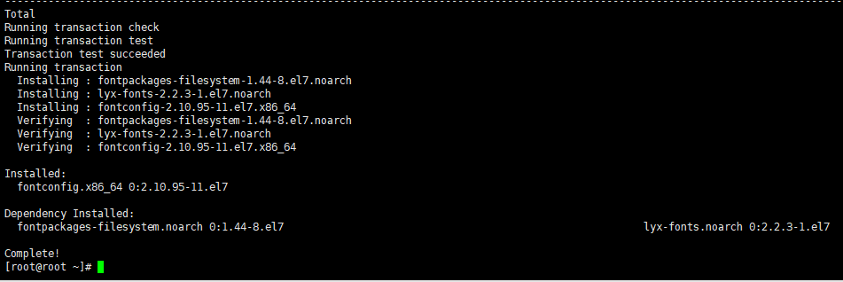
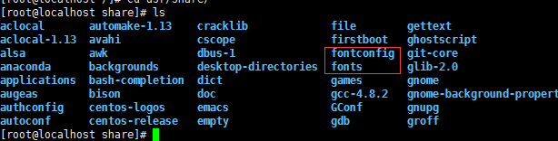
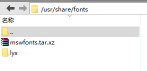
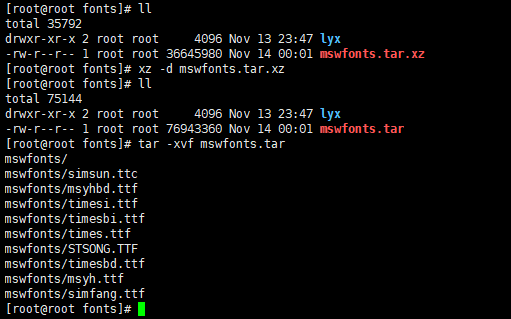
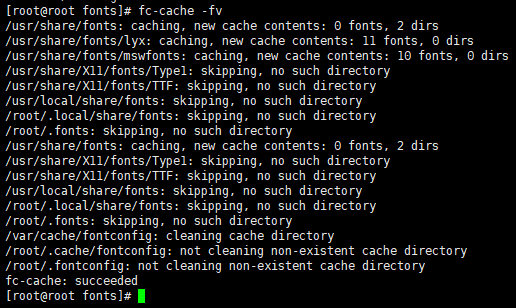
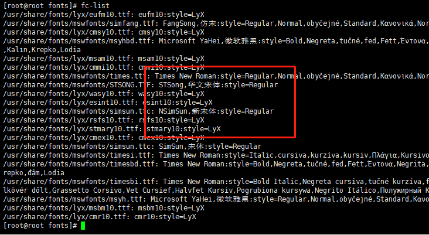

E&T: CentOS_7.4 64位; mswfonts.tar.xz; Xftp5; Xshell5;

 

最近在完成合同电子签署时,合同的中文参数在服务器出现中文乱码问题, 编码一致且正确, 最后定位为字体格式问题!

M1. 查看服务器是否安装字体库: # fc-list  (fc与参数直接无空格)

未安装。

 

M2. 安装字体库:

执行  yum -y install fontconfig

这时在/usr/shared目录就可以看到fonts和fontconfig目录了（之前是没有的）：

执行 yum -y group info fonts

注意: 若CentOS的版本较低, 执行yum -y groupinstall fonts命令!

M3. 上传字体文件到/usr/share/fonts 目录

由于本地多字体文件已压缩成mswfonts.tar.xz; 所以需要上传压缩包并解压

 

M5. 字体生效
执行 fc-cache -fv

在linux，把字体文件拷贝到字体目录后，执行fc-cache命令，fc-cache扫描字体目录并生成字体信息的缓存，然后应用程序就可以立即使用这些新安装的字体。

 

 

M6. 检出结果
再执行 fc-list 或 fc-list :lang=zh-cn

字体列表里面已有安装的字体, 若测试不生效,尝试重启服务器即可。