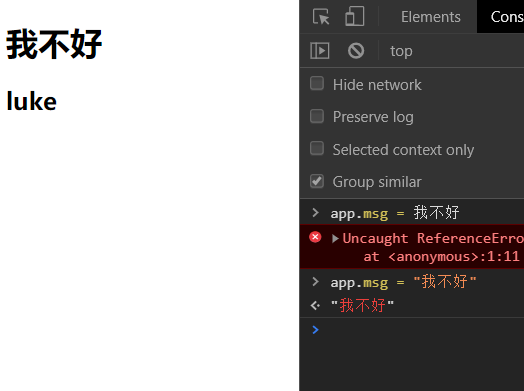
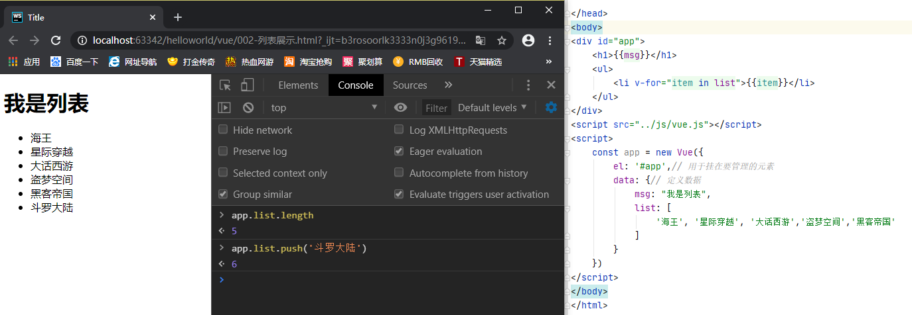
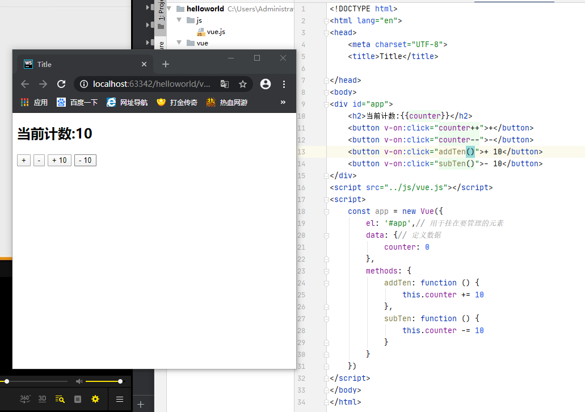

- VUE官网 https://cn.vuejs.org/

# Vue.js 是什么

- Vue (读音 /vjuː/，类似于 **view**) 
- Vue是一个渐进式的框架
  - 渐进式意味着你可以将Vue作为应用的一部分嵌入其中，带来更丰富的交互体验。
  - 获取如果你希望讲更多的业务逻辑使用Vue实现，那么Vue的核心库以及其生态系统。
- Vue有很多特点和Web开发中常见的高级功能
  - 解耦视图和数据
  - 可复用组件
  - 前端路由技术
  - 状态管理
  - 虚拟dom

# Vue.js的安装

## 1. CDN引入

对于制作原型或学习，你可以这样使用最新版本：

```html
<script src="https://cdn.jsdelivr.net/npm/vue/dist/vue.js"></script>
```

对于生产环境，我们推荐链接到一个明确的版本号和构建文件，以避免新版本造成的不可预期的破坏：

```html
<script src="https://cdn.jsdelivr.net/npm/vue@2.6.11"></script>
```

如果你使用原生 ES Modules，这里也有一个兼容 ES Module 的构建文件：

```html
<script type="module">
  import Vue from 'https://cdn.jsdelivr.net/npm/vue@2.6.11/dist/vue.esm.browser.js'
</script>
```

## 2. NPM

在用 Vue 构建大型应用时推荐使用 NPM 安装[[1\]](https://cn.vuejs.org/v2/guide/installation.html#footnote-1)。NPM 能很好地和诸如 [webpack](https://webpack.js.org/) 或 [Browserify](http://browserify.org/) 模块打包器配合使用。同时 Vue 也提供配套工具来开发[单文件组件](https://cn.vuejs.org/v2/guide/single-file-components.html)。

```sh
# 最新稳定版
$ npm install vue
```

# helloworld

> 声明式编程

```html
<!DOCTYPE html>
<html lang="en">
<head>
    <meta charset="UTF-8">
    <title>Title</title>

</head>
<body>
<div id="app">{{msg}}</div>
<script src="../js/vue.js"></script>
<script>
    // 声明式编程
    const app = new Vue({
        el:'#app',// 用于挂在要管理的元素
        data:{// 定义数据
            msg:"你好vue" 
        }
    })
</script>
</body>
</html>
```



> **el** : 属性指该属性的挂载到哪个元素上
> 
> **data** : 属性通常会存储一些数据

# 列表展示

```html
<!DOCTYPE html>
<html lang="en">
<head>
    <meta charset="UTF-8">
    <title>Title</title>

</head>
<body>
<div id="app">
    <h1>{{msg}}</h1>
    <ul>
        <li v-for="item in list">{{item}}</li>
    </ul>
</div>
<script src="../js/vue.js"></script>
<script>
    const app = new Vue({
        el: '#app',// 用于挂在要管理的元素
        data: {// 定义数据
            msg: "我是列表",
            list: [
                '海王', '星际穿越', '大话西游','盗梦空间','黑客帝国'
            ]
        }
    })
</script>
</body>
</html>
```



# 计数器

```html
<!DOCTYPE html>
<html lang="en">
<head>
    <meta charset="UTF-8">
    <title>Title</title>

</head>
<body>
<div id="app">
    <h2>当前计数:{{counter}}</h2>
    <button @click="counter++">+</button>
    <button v-on:click="counter--">-</button>
    <button @click="addTen()">+ 10</button>
    <button v-on:click="subTen()">- 10</button>
</div>
<script src="../js/vue.js"></script>
<script>
    const app = new Vue({
        el: '#app',// 用于挂在要管理的元素
        data: {// 定义数据
            counter: 0
        },
        methods: {
            addTen: function () {
                this.counter += 10
            },
            subTen: function () {
                this.counter -= 10
            }
        }
    })
</script>
</body>
</html>
```

