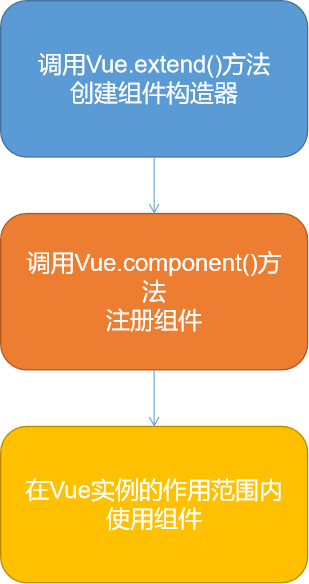

# 组件化

## 注册组件的基本步骤

1. 创建组件构造器
2. 注册组件
3. 使用组件



## 使用

### 1. 普通

```html
<div id="app">
  <cpn1></cpn1>
  <cpn2></cpn2>
</div>
<script src="../js/vue.js"></script>
<script>
  // 构建
  const cpn1 = Vue.extend({
    template:
        `<div><h2>我是全局组件</h2></div>`
  })
  const cpn2 = Vue.extend({
    template:
        `<div><h2>我是局部组件</h2></div>`
  })
  // 注册
  Vue.component('cpn1',cpn1)
  const app = new Vue({
    el: '#app',// 用于挂在要管理的元素
    data: {// 定义数据
      msg: []
    },
    components:{
      cpn2:cpn2
    }
  })
</script>
```

### 2. 父子组件

```html
<div id="app">
  <cpn1></cpn1>
  <cpn2></cpn2>
</div>
<script src="../js/vue.js"></script>
<script>
  // 构建
  const cpn1 = Vue.extend({
    template:
        `<div><h2>我是子组件</h2></div>`
  })
  const cpn2 = Vue.extend({
    template:
        `<div><h2>我是父组件</h2></div><cpn1></cpn1>`,
    components:{
      cpn1:cpn1
    }
  })
  // 注册
  Vue.component('cpn1',cpn1)
  Vue.component('cpn2',cpn2)
  const app = new Vue({
    el: '#app',// 用于挂在要管理的元素
    data: {// 定义数据
      msg: []
    },
    components:{
      cpn2:cpn2
    }
  })
</script>
```

### 3. 语法糖

```html
<div id="app">
  <cpn1></cpn1>
  <cpn2></cpn2>
</div>
<script src="../js/vue.js"></script>
<script>

  // 注册
  Vue.component('cpn1', {
    template:
        `<div><h2>@语法糖 : 我是全局组件</h2></div>`
  })
  const app = new Vue({
    el: '#app',// 用于挂在要管理的元素
    data: {// 定义数据
      msg: []
    },
    components: {
      cpn2: {
        template:
            `<div><h2>@语法糖 :我是局部局组件</h2></div>`
      }
    }
  })
</script>
```

### 4. 组件模板的抽离写法

`<script id="cpn1" type="text/x-template">`

`<template id="cpn2">`

```html
<div id="app">
  <cpn1></cpn1>
  <cpn2></cpn2>
</div>
<script src="../js/vue.js"></script>
<!-- script type="text/x-template"-->
<script id="cpn1" type="text/x-template">
  <div><h2>我是模板1</h2></div>
</script>
<!-- template -->
<template id="cpn2">
  <div><h2>我是模板2</h2></div>
</template>
<script>
  Vue.component(
      'cpn1', {
        template: '#cpn1'
      })
  const app = new Vue({
    el: '#app',// 用于挂在要管理的元素
    data: {// 定义数据
      msg: []
    },
    components: {
      cpn2: {
        template: '#cpn2'
      }
    }
  })
</script>
```

### 5. 组件参数

```html
<div id="app">
  <cpn></cpn>
</div>
<script src="../js/vue.js"></script>
<!-- template -->
<template id="cpn">
  <div><h2>{{title}}</h2></div>
</template>
<script>
  const app = new Vue({
    el: '#app',// 用于挂在要管理的元素
    data: {// 定义数据
      msg: []
    },
    components: {
      cpn: {
        template: '#cpn',
        data() {
          return {
            title: '组件传参数'
          }
        }
      }
    }
  })
</script>
```
