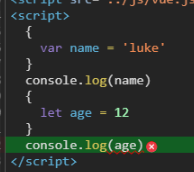
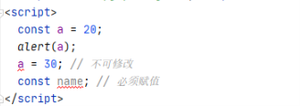

# VUE - ES^ 补丁

## let/var

- 事实上var的设计可以看成JavaScript语言设计上的错误, 但是这种错误多半不能修复和异常, 因为要向后兼容.
  
  - 大概十年前, Brendan EIch 就决定修复这个问题, 于是他添加了一关键字: `let`
  - 我们可以将let看成更完美的`var`

- 块级作用域
  
  - JS中使用var来声明一个变量时, 变量的作用域主要是和函数定义的有关.
  
  - 针对于其他块定义来说是没有作用域的, 比如 if/for 等, 这在开发过程中往往会引起一些问题.
    
    ```html
    <script>
    {
      var name = 'luke'
    }
    console.log(name)
    {
      let age = 12
    }
    console.log(age)
    </script>
    ```

    

> 控制台报错

## const的使用

- const关键字
  - 在很多语言都会有常量
  - 在JavaScript中也是如此, 使用`const`来修饰的标识符为常量 , 不可再次赋值
- 什么时候使用`const`呢?
  - 当我们的修饰符不会再次赋值是 , 就可以使用const来保证数据的安全性

```html
<script>
  const a = 20;
  alert(a);
  a = 30; // 不可修改
  const name; // 必须赋值
</script>
```



> 但是可以改变对象内部的属性 , 和java语言类似

```js
  const b = {a: "hello"}
  b.a = "world";
```

## 对象的增强的写法

```js
  // 声明类
  class obj {
    name;// 属性名
    age;
    address;
    // 函数
    run() {
      return this.age + '岁的' + this.name + '在' + this.address + 'runing';
    }
    // 构造函数 
    constructor(name, age, address) {
      this.name = name;
      this.age = age;
      this.address = address;
    }
  }

  console.log(new obj('雷鸣', 28, '城市运动公园').run())
```
