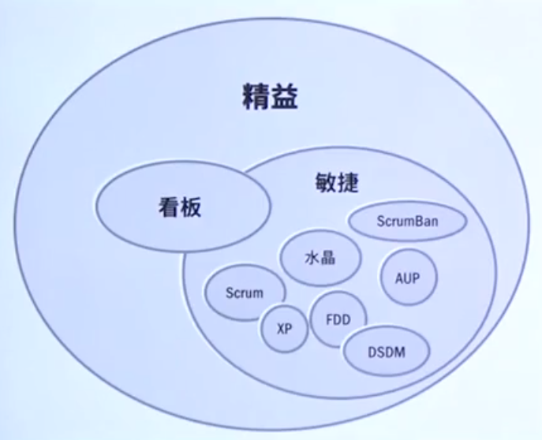
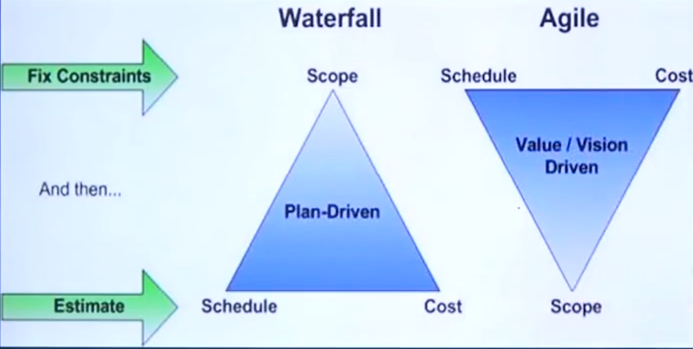
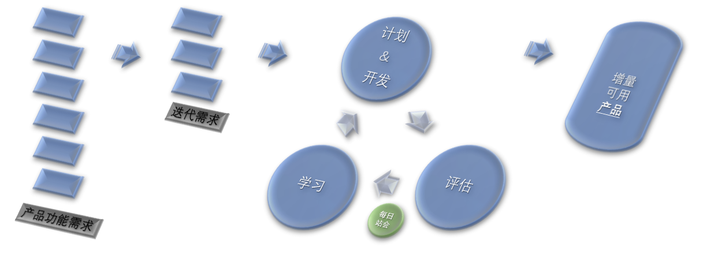
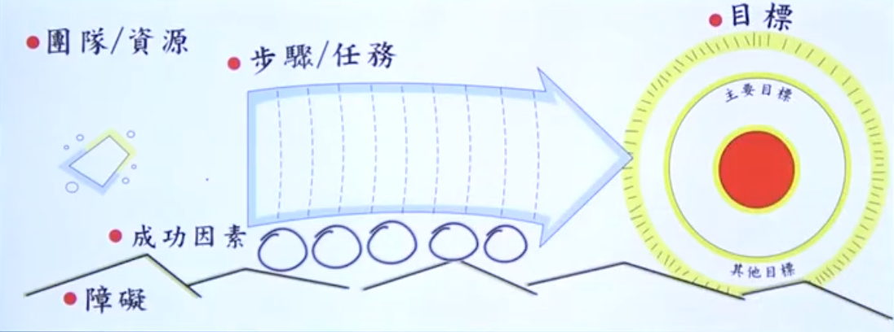
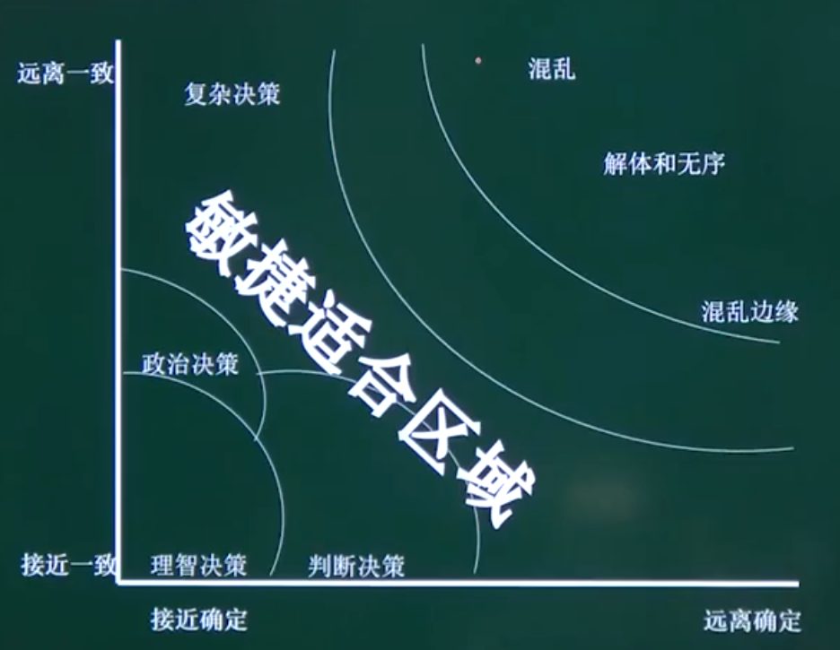
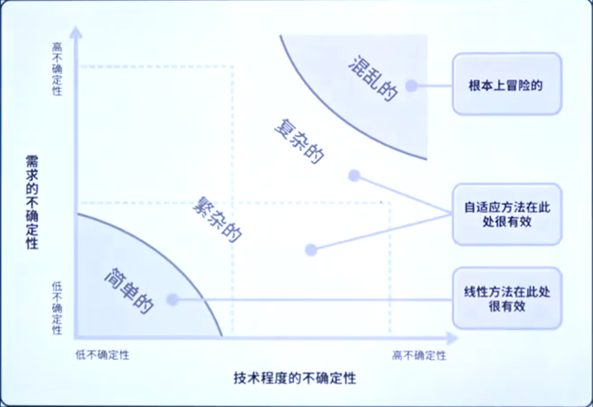

# 一、可确定的和高度不确定的工作

- 可确定的工作项目具有明确的流程 , 在以往类似项目中被证明是行之有效的 . 不确定性和风险通常较低

- 新的设计、解决问题和之前未做过的工作都是探索性的。他要求主图专家携手，解决问题，并创建方案。高度不确定的项目变化速度快，复杂性和风险也高。

- 传统预测法旨在预先确定大部分需求，并通过变更请求过程控制变更。

- 敏捷方法的出现是为了在短时间内探讨可行性，根据评估和反馈快速调整。

  

# 二、敏捷核心商业目标

> 创新、适应、快捷、适应、可靠

## 1. 持续**创新**

- 创新想法难于在结构化、权威的环境下产生，反而在适应性文化中易于产生

## 2. 产品**适应**性

- 未来客户的需求
- 降低变更成本和开发过程的整体性
- 技术卓越

## 3. **缩短**交付进度 

- 市场窗口，提升投入产出，加快投资回收期
- 减少边际收益功能
- 聚焦于增值活动，减少为了标准化的活动
- 选择和发展对项目具有合适技能的个人

## 4.  人和过程的**适应**性

- 快速响应产品和业务变化
- 视变化为动态商业环境中所必须的

## 5. **可靠**的结果

- 支持商业发展和盈利
- 探索类项目指标：愿景、成本、进度，而不是范围、时间、成本

# 三、敏捷的起源

1. 1950：美国国防部和国家航天局采用迭代和增量开发模式
2. 1960：演进式项目管理
3. 1970：丰田的精益理念
4. 1990：Scrum，极限编程，水晶方法，动态系统开发方法

# 四、敏捷宣言

- 个体的**互动** 而不是 **流程**和工具
- 工作的**软件** 而不是 详尽的**文档**
- 客户**合作** 而不是 合同**谈判**
- **响应**变化 而不是 遵循**计划**

### 1. **个体和互助**高于流程和工具

- 授权、自管理团队，授权做决策
- 管理者不需要每天干预团队、而是提供一个免于外界打扰的环境，消除创造产品的障碍
- 敏姐团队：通才的专家（Generalizing Specialist）
- 过程和工具需要合适的人来运用才能产生价值
- 过程和工具帮助团队重新思考最佳路线，实现团队解决问题的能力
- 团队成员不能面对面，工具可以支持，但不能替代对话

### 2. **工作的软件**高于详尽的文档

- 工作的产品是项目状态的最终量化结果
- 前期太多时间花在捕捉细节上
- 需求变化快，文档静态
- 传统项目管理时线性工作，很少交互与反馈；敏捷鼓励交互

### 3. **客户合作**高于合同谈判

- 谈判形成的合同往往是固化、死板的条文
- 让客户专注于商业决策
- 客户和开发团队形成**伙伴**关系
- 客户定义价值，其他干系人定义限制条件 

### 4. **响应变化**高于遵循计划

- 唯一不变就是变化
- 组织和客户对项目状态有共同的理解下，很容易相应变化
- 探索性项目强调展望并基于愿景进行探索，而不是详细计划和严格执行任务
- 低成本迭代开发具有适应性，计划、架构和设计与实际产品不断演进

# 五、核心概念

1. 项目**前期**更少的计划
2. 高技能的团队成员
3. 客户与开发团队间紧密的**交互**
4. 延迟的决策
5. **集成化**的质量活动
6. 迭代和增量交付的方式
7. **适应式**领导方式

# 六、敏捷是许多方法的总称

- 敏捷和看板是精益方法的子集
- 都是精益思想的具体实例
- 反映了以下概念：“关注价值“、”小批量“和”消除浪费“

## 1. 精益与看板方法

- 敏捷和看板方法视为精益思想的衍生物；
- 共性：交付价值、尊重人、减少浪费、透明化、适应变更以及持续改善等方面
- 看板方法受到最初的精益制造体系的启发，专门用于知识型工作。它在2000年代中期出现，是敏捷的一种替代法；
- 看板方法不如某些敏捷方法规范，破坏性也小，原因是“原地出发”方法。项目团队可以应用看板方法，并向其他敏捷方法发展。

## 2. 敏捷三角形

> - Scope：范围
> - Schedule：安排
> - Resources：资源

> - Vaule：价值
> - Constraints：约束
> - Quality：质量

## 3. 倒置的敏捷三角形

> Waterfall 》 Plan-Driven **计划驱动**
>
> - Scope：范围
> - Schedule：安排
> - Cost：成本

> Agile 》Value（价值）、Vision（愿景）、Driven（驱动）
>
> - Schedule：安排
> - Cost：成本
> - Scope：范围

## 4. 瀑布式 vs 敏捷

### 瀑布式

- 按照计划行事
- 需求稳定 

### 敏捷

- **动态目标**
- 需求不稳定

## 5. 敏捷与传统项目管理

| 流程组 | 传统项目管理活动                                             | 敏捷项目管理活动                                             |
| ------ | ------------------------------------------------------------ | ------------------------------------------------------------ |
| 启动   | - 制定项目章程                                               | - 制定项目愿景 - 制定目的和关键里程碑 - 制定项目章程   |
| 计划   | - 前期详尽的计划 - 范围/需求定义 - 变更控制过程        | - 前期更少的计划，持续计划 - 决策指南 - 干系人教育     |
| 执行   | - 项目经理指导和管理项目执行 - 团队交付工作结果并提交给用户来接受 | - 小规模迭代 ; 增量交付 - 用户与团队集成在一起 , 共同交付工作成果 - 项目经理的角色是领导者和协调者 - 团队是自组织的 , 并且共同承担完成工作的责任 |
| 监控   | - 状态报告 - 监控预算、范围、进度、质量、资源、风险 - 可交付成果验收 - 挣值 | - 每日站立会议 - 项目状态更新至少以月为单位 - 正式的关口评审和测试 - 问题和行动事项很关键 - 投入产出比 |
| 收尾   | - 教训 - 项目收尾                                         | - 每个迭代结束时都举行教训回顾会议 - 在每个迭代结束时都进行项目收尾 |

# 七、结论

## 传统项目

- 计划和构建产品
- 计划和优化
- 预测（定义，设计和构建）

## 敏捷项目管理

- 展望和演进产品
- 演进和适应
- 适应（展望，探索和适应）

## 斯泰西图

