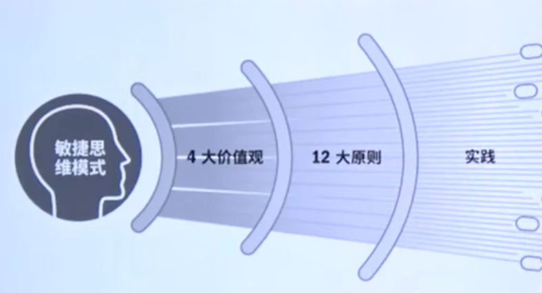

# 十二原则

准则1：尽早和持续交付有价值的软件

* 我们的最高目标是，通过**尽早**的**持续**的交付**有价值**的软件来满足客户。

准则2：拥抱变化

* **欢迎**提出变更，即使在项目开发**后期也不例外**。
* 敏捷过程要**善于利用**需求变更，帮助客户获取**竞争优势**。

准则3

* 要经常交付**可用的**软件，周期从几周到几个月不等，且**越短越好**。

准则4

* 项目实施过程中，**客户**与**开发人员**必须始终**通力合作**。

准侧5

* 要善于**激励**项目人员，给予它们所需的环境与支持，并**<u>*相信*</u>**他们能够完成任务。

准则6

* 无论是对开发人员还是团队**内部**，信息传达的沟通方法是**面对面**的交谈。

准则7

* **可用**的软件是衡量进度的**首要**衡量指标。

准则8

* 敏捷过程提倡**可持续的**开发。项目发起人、开发人员和用户应该**保持步调稳定**。

准则9

* 对**技术的精益求精**以及对设计的不断完善将**提高敏捷性**。

准则10

* **简洁**，即尽最大可能减少**不必要**的工作。这是一门艺术。砍掉一些不必要的工作。

准则11

* **最佳**的架构、需求和设计出自于**自组织团队**。【是否有一线决策权，一定是无领导状态、团队一致达成】

准则12

* 团队要**定期反省**怎样做才能更有效，并相应的**调整团队**的行为。

# 

## 准则1：尽早和持续交付有价值的软件

- 尽早
- 持续
- 有价值
- 开放式的快速更新，给客户带来优先级最高的价值
- **交付 vs. 合规**
  - 敏捷项目管理首要目标是交付价值给客户
  - 文档刚好够

## 准则2：拥抱变化

- 传统项目管理影响和控制会导致变化的因素
- 敏捷预期到需求会变化
- 拥抱变化，即使这些变化发生在项目后期
- 迅速应对和适应变化能给客户带来显著的竞争优势，从而应对新的机遇

## 准则3：迭代周期短

- 较短的迭代周期强化团队**持续关注客户**的价值。

## 准则4：业务与开发协作

- 传统项目中负责商业价值的人员和软件开发是严格分开工作的。
- 让每支团队都可以集中精力做他们擅长的事情。
- 敏捷项目管理提倡他们同一个地方一起工作。
- 他们的共同目标就是通过可用的软件向客户传递价值。

## 准侧5：提供环境与支持

- 避免微观管理。
- 建立强有力的团队并积极避免微观管理。
- 自律的团队而不是一个自上而下的指令。
- 分享空间：可视性和共同性。
- 给团队自由时间。

## 准则6：面对面沟通

- 非正式的**口头沟通**在敏捷管理中远比正式的书面沟通更普遍。
- 敏捷项目中的沟通都是**公开的**，任何团队成员都可以**自由参与**对话
- **渗透**式沟通
- **高带宽**沟通

## 准则7：可用软件是重要衡量指标

- 传统项目往往及其纠结的是，项目的不断更新使得文件成为一种负担。
- 真正的价值是通过结果来表达的，结果又是通过**可用**的软件来呈现的。（客户来定义可用）

## 准则8：可持续步伐

- 敏捷项目比传统项目有更高的工作强度。
- 保持一个稳定的可持续的进展速度，从而使得团队成员不会在迭代中期的尾端匆忙赶工。
- 理想的目标是保持一种可持续的速度，使团队成员不会感到过渡的压力和精疲力尽。

## 准则9：技术卓越

- 设计越完善，维护越简单。
- 稳定和优质的项目比劣质的项目更加允许团队快速应对变化。

## 准则10：简洁

- 这个准则被所有的敏捷方法所拥护，尤其是精益方法。
- 关键点是对客户价值保持专注和毫不犹豫的削减不增加价值的活动。
- 保持简单是最基本的原则。

## 准则11：自组织团队

- 自我组织是敏捷团队的核心元素之一。
- 当一个团队是自我组织型的，说明该团队自己决定工作如何分配及谁去做某个特定的工作。
- 传统项目和敏捷项目最显著的区别。
- 不仅小团队是自我组织的，较大的跨职能团队也可以是自我组织的。

## 准则12：适应和学习

- 传统项目里当项目或阶段完成是开会总是最常见的做法。
- 敏捷更频繁的回顾来完成这项工作。在一个回顾活动中，查看上个迭代周期中已完成的工作或发布，并评估下一次如何改进他们的做法。
- 每日站立会议及每天碰头15分钟是另一项协调团队努力方向、团队自我评定和自我调整的重要方式。