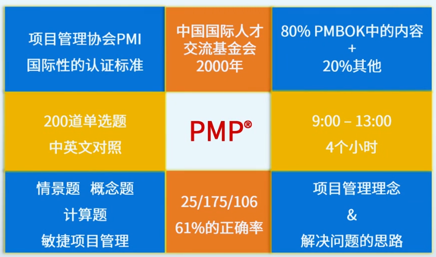
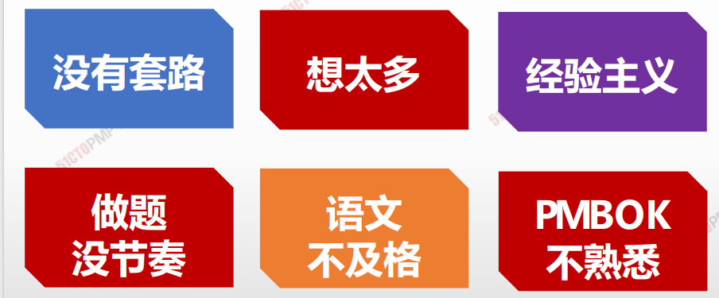

# 1. PMP考试简介

## 报考条件

1. 具有学士学位
   - 至少具有36个月的项目管理经验
2. 不具备学士学位
   - 至少具有60个月的项目经验

### 报考时间和地点

1. 考试时间

   每年3\6\9\12 四次

2. 考试地点

   国内有35个地区可以报考

# 2. 认证价值

- 升职加薪
- 提拔要求
- 竞标实力加分
- 管理能力提升
- 干系人管理

# 3. 四大挑战

1. 200道题 , 阅读量大
2. 一个知识点考核多次 , 投机概率很低
3. 大量的情景题 , 两难境地 , 思辨思维
4. 掌握方法/技术和工具 , 应用是一个长期而艰巨的过程

# 4. 考试题型与考点

1. 200道题目
2. 既考知识 , 又考应用
3. 西方价值观

1. 5大过程组
2. 10大领域
3. 49个过程活动
4. 132个工具与技术
5. 沟通
6. 人力资源管理
7. 财务会计
8. 合同管理
9.  …

1. 基本概念题
   - 掌握49个过程的4W1H 
   - PMBOK附录
2. ITTO
   - 输入输出工具技术
   - 关键字
     - 输入:
       - 需要什么
       - 审查什么
       - 参考什么
     - 输出
       - 产生什么
   - 理解核心定义和场景
     - 常考
       - 收集需求工具
       - 管理质量
       - 控制质量工具
       - 团队建设
       - 团队冲突的六种策略
       - 风险应对策略
       - 合同类型等
3. 情景题
   - 项目管理的思维
   - 积极主动的原则
   - 发现问题 - 分析问题 - 解决问题
   - 流程制度大于天
4. 计算题
   - 成本管理 >>> 挣值管理
   - 径路管理 >>> 关键路径
   - 风险管理 >>> EMV决策
5. 敏捷管理
   - 拥抱变更
   - 协同
   - 共享
   - 自纠
   - 团队

# 5. 考点分布

1. 整合管理

   章程的作用 \ 项目管理计划的内容和作用 \试试整体变更控制的书序与操作 (每次必考) , 变更的类型 , 结束项目需要完成的工作

2. 范围管理

   范围说明的作用 , WBS分解技术 , 确认范围的作用和前置后置活动

3. 进度管理

   里程碑的作用 , 关键路径的计算 (每次必考) , EVM

4. 成本管理

   质量成本的概念 , 应急储备与管理储备的辩证

5. 质量管理

   质量管理的作用 , 规划质量管理 , 管理质量  , 控制质量的活动内容

6. 资源管理

   资源管理的内容 , 建设团队的方法与管理学的应用 , 处理冲突的方式 (必考)

7. 沟通管理

   沟通的方法和技巧

8. 风险管理

   规划风险管理的顺序 , 消极风险的应对方式应用 , 风险应对策略

9. 采购管理

   合同类型 , 采购顺序 , 索赔应用 , 采购审计的作用

10. 相关管理

    相关登记册的内容 , 相关方分析的作用

# 6. 考试前提假设

1. 组织层面
   1. 公司是正规的
   2. 战略是正确的
2. 项目层面
   1. 项目是大项目
   2. 项目组织是矩阵型的
   3. 项目经理是正式任命的
3. 操作层面
   1. 项目管理时正规的
   2. 团队是积极主动的
   3. 项目经理不是玩政治的
   4. 暂时甲方

## 十条假设

> 你是一位身处美国 , 并经过专业训练 , 一家跨国公司的优秀项目经理

1. 我们是买方项目经理 , 在一家制度健全的组织工作
2. 我们所在组织是具有丰富组织过程资产的矩阵型组织
3. 公司有质量部门 , PMO动职能部门 , 并参与项目
4. 我们领导通情达理 , 我们客户遵从事实 , 听从建议
5. 组织以人为本 , 尊重个人 , 不提倡加班 , 保障成员利益
6. 专业的事情要交给专业的人来做
7. 人人都有职业道德 , 格尽职守 , 绝不偷奸耍滑 , 做事专业
8. 一项目文件 , 规范为准 , 不以领导的临时想法为准
9. 遇到问题 , 先分析影响 , 在做出决定 , 必要时提出变更 , 要审批 , 记录 , 通知并实施 , 最后做好经验总结
10. 技术问题一定要找到原因 , 人际关系问题则不建议深究原因

# 7. 答题策略

## 出现的套路

**答题时间**

试题简短、考点明确、计算简单、难以深入

**考题形式****

干扰选项的设置也是有规律可以总结的 

**分数统计**

每道题只有一个真正的考察点、过程组 

**教材为本**

考点大多源自教材，熟读教材就能应对自如 

## 出题人的意图

**有依据**

所有考题都来自于教材，部分就是原话 

**很实在**

通常会告知当前阶段、过程，对做题有帮助 

**有侧重**

考察点多，但是只有一个才是他希望考察的

## 选择题的宗旨

**查找原因时**

越准确的原因越好 

**采取措施时**

越完善、全面的措施，越积极面对的态度越好 

**步骤顺序时**

越临近该活动领域的过程活动越好 

**思辨过程比答案更重要！**

## 万能公式

**不等不靠不要不逃**

- 积极主动面对和解决问题
-  不要轻易寻求发起人和高层管理的帮助
- 更加不能拖延和逃避

## 救命锦囊

- 查找依据（找相关管理计划或规章制度）

- 分析原因（如果项目被迫终止，查找原因通常是最后考虑的选项）

- 分析影响（对变更）

- 分析偏差（对进度、成本、绩效）

- 制定并实施方案

**（已完成分析和排序）**

## 常见问题

## 解题避免的误区

**1 自己添加额外的条件，如：或许这个PM职权大，所以…** 

**2 质疑CCB、质检等权威结果，或者想讲道理、改变结果；**

**3** **被动地面对问题，选择消极的方法来应对问题；**

**4 有疑惑题目或选项，或者是新的术语，参考下英文的翻译。**

## 必备思维 : 美式思维

1. 诚实 内部公开
2. 发现问题 - 分析问题 - 解决问题 
3. 流程制度大于天
4. 预防为主 , 流程/制度/机制
5. 私下面对面 > 正式公开
6. 做事本分 
7. 阳光法则 - 勇于面对问题 , 对事不对人
8. 多记录经验 , 多总结教训
9. 契约精神 , 实事求是
10. 各有本分 - 多承担 , 多汇报
11. 不断完善持续改进

## 成人学习的四大特点

1. 坚持
2. 以考促学
3. 以学促用
4. 以用促精
5. 分享
6. 空杯

## 难点易点

1. 200道题 , 涉及面广
2. 知识深度不大 , 点到为止
3. 既考知识 , 又考应用
4. 计算题简单
5. 西方价值观
6. 知识点出自 <<PMBOK指南>>

## 学习认知四部曲

1. 知识点快速串讲 , 总结        
2. 课堂练习 , 增强感受            
3. 课后各模块真题勤加练习
4. 理解 , 背诵的要点

## 六步法

1. 听课 , 学习
2. 体会 , 思考
3. 实践 , 做题
4. 再思考
5. 茉莉 , 提升
6. 评测

# 8. PMP学什么

## 1. 硬技能

1. 5大过程组	
   1. 启动
   2. 规划
   3. 实施
   4. 监控
   5. 收尾	

1. 10大知识领域
   1. 整合管理
   2. 范围管理
   3. 进度管理
   4. 成本管理
   5. 质量管理
   6. 沟通管理
   7. 资源管理
   8. 风险管理
   9. 采购管理
   10. 相关方管理
2. 49个过程
3. 132个工具
4. 敏捷项目管理

## 2. 软技能

 	1. 战略与商务管理技能
      	1. 战略一致
      	2. 创新
      	3. 收益实现
      	4. 财务 / 市场营销 / HR
 	2. 人际关系与团队技能
      	1. 人际交往
      	2. 积极倾听
      	3. 冲突管理
      	4. 文化意识
      	5. 制定策略
      	6. 情商
      	7. 引导
      	8. 影响力
      	9. 会议管理
      	10. 观察 / 交流
      	11. 政治意识
 	3. 领导力技能
      	1. 谈判
      	2. 沟通
      	3. 激励
      	4. 问题解决能
      	5. 组织变革能力
      	6. 团队建设

## 3. 学习阶段

1. 快读
2. 精读
3. 跳读

