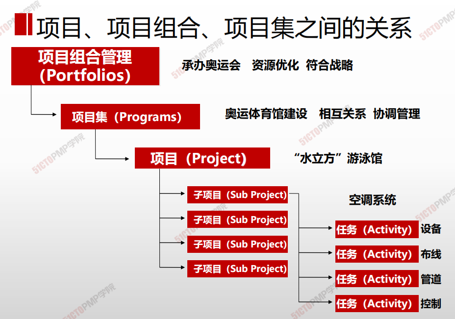
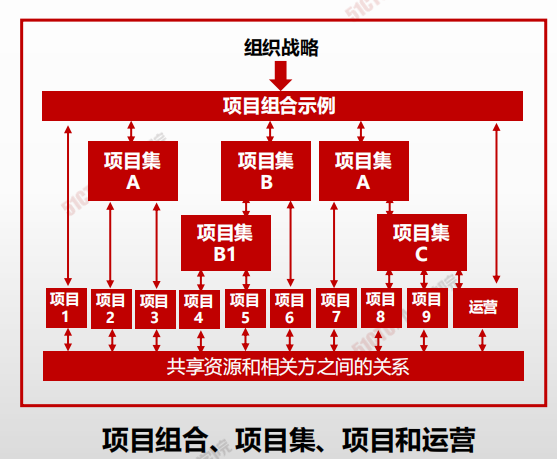
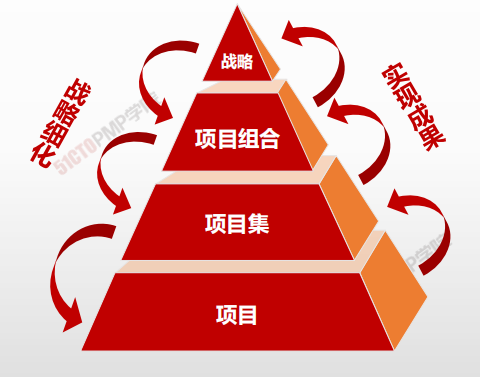

# 项目、项目组合、项目集之间的关系

- **项目集**

  是一组相互关联且被协调管理的项目。

  协调管理是为了获得对单个项目分别管理所无法实现的利益和控制。

- **项目集管理**

  是指对项目集进行统一协调管理，以实现项目集的战略目标和利益。项目集中的项目通过产生共同的结果或整体能力而相互联系。

- **项目组合**

  是指为便于有效管理、实现战略业务目标而组合在一起的项目、项目集和其他工作。项目组合中的项目或项目集不一定彼此依赖或有直接关系。

- **项目组合管理**

  是指为了实现特定的战略业务目标，对一个或多个项目组合进行的集中管理，包括识别、排序、授权、管理和控制项目、项目集和其他有关工作。

## 项目及管理

**项目管理注重项目本身的相互依赖关系**，以确定管理项目的最佳方法。**项目集管理**注重作为组成部分的项目与项目集之间的依赖关系，以确定管理这些项目的最佳方法。

**项目集和项目间依赖关系的具体管理措施可能包括**：

- 调整对项目集和项目的目的和目标有影响的组织或战略方向
- 将项目集范围分配到项目集组成部分
- 管理项目集组成部分之间的依赖关系，从而以最佳方式实施项目集
- 管理可能影响项目集内多个项目的项目集风险
- 解决作为组成部分的项目与项目集之间的问题
- 在同一个治理框架内变更需求
- 将预算分配到项目集内多个项目
- 确保项目集及其包含的项目能够实现效益

## 项目组合管理

**项目组合是指为实现战略目标而组合在一起管理的项目、项目集、子项目组合和运营工作**。项目组合管理是指为了实现战略目标而对一个或多个项目组合进行的集中管理。项目组合中的项目集或项目**不一定彼此依赖或直接相关**。

**项目组合管理的目标是：**

- 指导组织的投资决策。
- 选择项目集与项目的最佳组合方式，以达成战略目标。
- 提供决策透明度。
- 确定团队和实物资源分配的优先顺序。
- 提高实现预期投资回报的可能性。
- 实现对所有组成部分的综合风险预测的集中式管理。

## 区别

|                      | **项目组合**                                                 | **项目集**                                             |
| -------------------- | ------------------------------------------------------------ | ------------------------------------------------------ |
| **内容**             | 由项目、项目集或子项目组合构成，且组成部分需定期调整         | 由项目或子项目集构成；其组成部分基本稳定，可做必要调整 |
| **项目间的关系**     | 项目间不一定有内在联系，只是都要使用组织有限的资源； 各项目有优先级排序 | 项目间肯定有内在联系；各项目都完全平等，无优先级排序   |
| **管理的目的**       | 排列项目优先顺序，以便确定资源分配的优先顺序                 | 抓住各项目间的内在联系，获得更大效益                   |
| **与战略目标的关系** | 直接服务于组织的战略目标                                     | 通过项目组合，为组织的战略目标服务                     |
| **结束时间**         | 通常没有明确的结束时间（因为战略目标并非一成不变）           | 可能有或没有明确的结束时间                             |

### 关系

- **实现组织战略和相关优先级**
- 基于风险、资金和其他考虑因素对项目排列优先级
- 实现预期绩效和效益而分配人力、财力和实物资源

- 项目集和项目管理的重点在于**以正确的方式展开**项目集和项目；
- 项目组合管理则注重于**开展正确的项目集和项目**

## 职能

|  战略管理| 项目组合管理 |项目集管理| 项目管理 |运营管理  |
| ---- | ---- | ---- | ---- | ---- | ---- |
|工作内容|明确组织的战略目标|选择最有利于实现战略目标的一些项目|分析并利用各项目之间的有机联系|规范有序地开展单个项目|持续且有效地使用项目或项目集所形成的生产或服务能力|
|目的|确保组织的方向正确|确保做一系列正确的项目|确保获得比单个项目效益之和更大的效益|确保做出符合范围、进度、成本和质量要求的项目成果|确保实现商业价值和战略目标|
|负责人 |董事长 |总经理 |项目集经理 |项目经理 |职能经理|
|变更|主动追求变更，调整战略方向和目标|主动追求变更，调整项目组合的组成部分|必要时对项目集内容做变更，以扩大项目集效益|为配合项目集而变更，或为实现项目目标而变更|按标准化流程开展生产或服务，无须变更|
