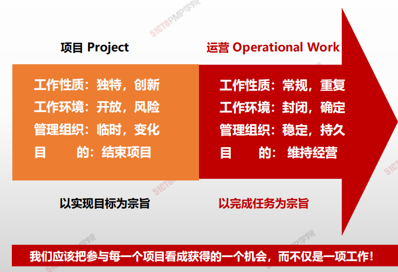
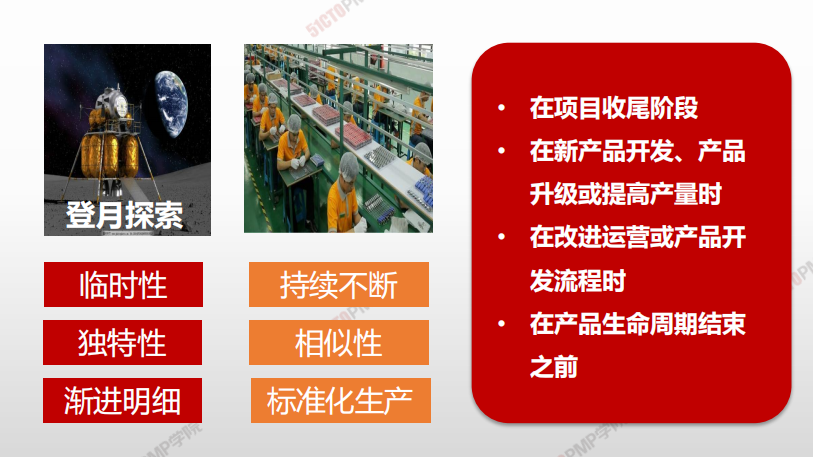

# **项目管理vs.运营管理**

| 不同/相同   | 比较项   | 项目管理               | 运营管理             |
| ----------- | -------- | ---------------------- | -------------------- |
| **不同**    | 负责人   | 项目经理               | 职能经理             |
| **不同**    | 实施组织 | 项目组、临时性组织     | 部门、稳定性组织     |
| **不同**    | 时限性   | 一次性                 | 持续不断             |
| **不同**    | 特性     | 独特性、风险与不确定性 | 重复性、应验与确定性 |
| **不同**    | 目的     | 实现目标，结束项目     | 维持运营             |
| **不同**    | 管理追求 | 效果导向，客户满意     | 效率导向             |
| **不同**    | 管理方法 | 用针对性的计划来指导   | 用标准化的操作规范   |
| <u>相同</u> | 实施主体 | 人                     | 人                   |
| <u>相同</u> | 资源约束 | 约束                   | 约束                 |
| <u>相同</u> | 主要活动 | 计划、执行和控制       | 计划、执行和控制     |

