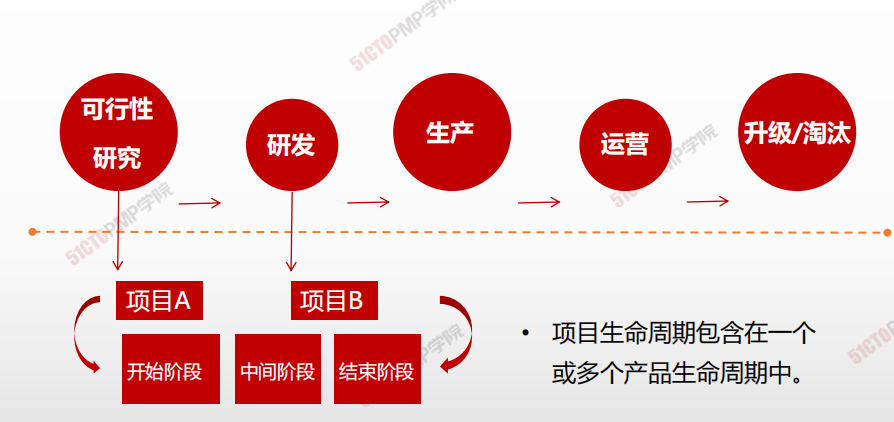
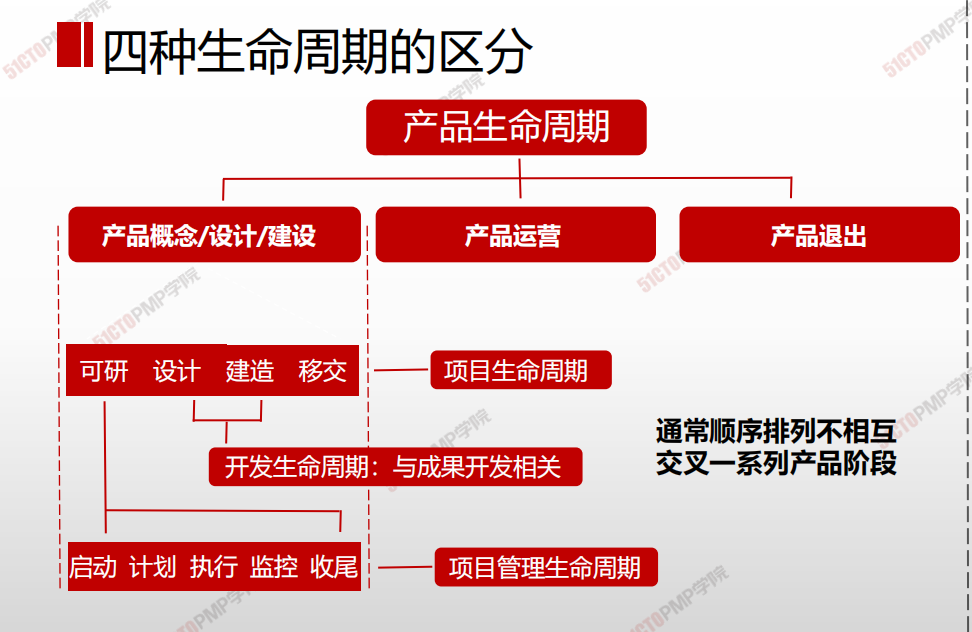

# 项目生命周期和产品生命周期

## 项目生命周期

从项目**开始到项目结束** ，所包含的**所有项目阶段的总和**：

- 开始项目
- 组织与准备
- 执行项目工作
- 结束项目

## 产品生命周期

产品生命周期指一个产品**从概念、交付、成长、成熟到衰退**整个演变过程的一系列阶段。

> 项目生命周期包含在一个或多个产品生命周期中。

> 通常顺序排列不互相交叉一系列产品阶段