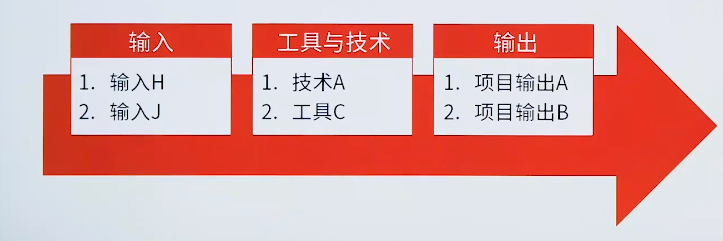
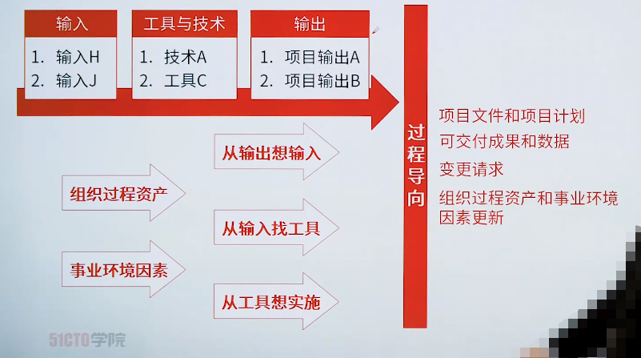

# 项目管理过程

> 项目生命周期是通过一系列项目管理活动进行的，即项目管理过程

示例说明了一个过程输入、工具、技术和输出的关系以及其他或成的关系。

每个项目管理过程**通过核实的项目管理工具和技术奖一个或多个输入转化成一个或多个输出**。输出可以是可交付成果的结果。结果是过程的最终成果。项目管理过程适用于全球各个行业。

**各项目管理过程通过它们所产生的的输出建立逻辑联系**。过程可能包含了在整个项目期间**项目重叠**的活动，一个过程的输出通常为一下两者之一：

	1. 另一个过程输入
	2. 项目或项目阶段的可交付成果

## 三从

 1. 从输出想输入
 2. 从输入找工具
 3. 从工具想实施

## 四得

 1. 项目文件和项目计划
 2. 可交付成果和数据
 3. 变更需求
 4. 组织过程资产和事业环境因素更新

> 过程迭代的次数和过程的相互作用因具体项目的需求而不同行

1. 一次货或仅在预定义开展的过程
2. 根据需要定期开展的过程
3. 贯穿项目始终执行的过程

| 人/事/物/财/鬼    |                   | **启动过程组**  | **规划过程组**                                               | **执行过程组**                            | **监控过程组**                         | **收尾过程组**    |
| ----------------- | ----------------- | --------------- | ------------------------------------------------------------ | ----------------------------------------- | -------------------------------------- | ----------------- |
|                   | **4.整合管理**    | 4.1制定项目章程 | 4.2制定项目管理计划                                          | 4.3指导与管理项目工作 4.4管理项目知识 | 4.5监控项目工作 4.6实施整体变更控制 | 4.7结束项目或阶段 |
| **事情管理**      | **5.范围管理**    |                 | 5.1规划范围管理5.2收集需求 5.3定义范围 5.4创建WBS    |                                           | 5.5确认范围 5.6控制范围             |                   |
| **事情管理**      | **6.进度管理**    |                 | 6.1规划进度管理 6.2定义活动 6.3排列活动顺序 6.4估算活动持续时间 6.5制定进度计划 |                                           | 6.6控制进度                            |                   |
| **事情管理**      | **7.成本管理**    |                 | 7.1规划成本管理 7.2估算成本 7.3制定预算              |                                           | 7.4控制成本                            |                   |
| **人\物有效协同** | **8.质量管理**    |                 | 9.1规划资源管理 9.2估算活动资源                           | 9.3获取资源 9.4建设团队               | 9.5管理团队                            |                   |
| **人\物有效协同** | **10.沟通管理**   |                 | 10.1规划沟通管理                                             | 10.2管理沟通                              | 10.3监督沟通                           |                   |
| **不确定性管理 ** | **11.风险管理**   |                 | 11.1规划风险管理 11.2识别风险 11.3实施风险定性分析 11.4实施风险定量分析 11.5规划风险应对 | 11.6实施应对                              | 11.7监督风险                           |                   |
| **人\物有效协同** | **12.采购管理**   |                 | 12.1规划采购管理                                             | 12.2实施采购                              | 12.3控制采购                           |                   |
| **人\物有效协同** | **13.相关方管理** | 13.1识别相关方  | 13.2规划相关方参与                                           | 13.3管理相关方参与                        | 13.4监督相关方参与                     |                   |