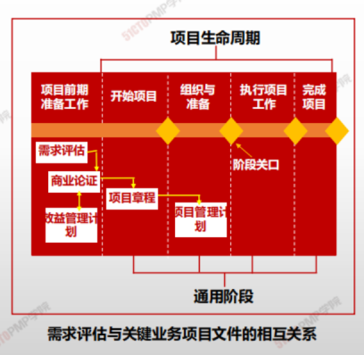
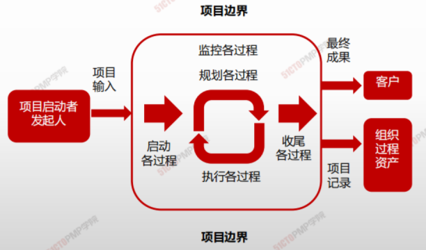
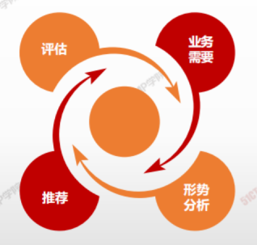

# 项目管理商业文件

- 项目经理需要确保项目管理方法紧扣商业意图在整个项目生命周期中，这两种文件项目依赖并得到反复定制和维护。
- **项目发起人**通常**负责项目商业论证文件的制定和维护。**
- **项目经理负责提出建议和见解**，使项目商业论证、项目管理计划、项目章程和项目效益管理计划中的成功标准相一致，并与组织的目的和目标保持一致。
- 项目经理应适当地为项目裁剪上述项目管理文件。某些组织会维护项目集层面的商业论证和效益管理计划。项目经理与相应的项目集经理合作，确保项目管理文件与项目集文件保持一致。

> 项目商业论证：文档化的经济<u>可行性研究报告</u>,用来对尚缺乏充分定义的所选方案的收益进行有效性论证,是启动后续项目管理活动的依据.

> 项目效益管理计划：对创造、提高和保持项目效益的过程进行定义的书面文件。

项目边界

## 项目商业论证

**在项目启动之前通过商业论证，可能会做出继续/终止项目的决策**

- 项目商业论证值文档化的经济可行性研究报告，用来对尚缺乏充分定义所选方案的收益进行有效性论证，是启动后续项目管理活动的依据。
- 商业论证列出了项目启动的目标和理由。它有助于在项目结束时根据项目目标衡量项目是否成功。
- 商业论证是一种商业文件，可在整个项目生命周期中使用。
- **在项目启动之前通过商业论证，可能会做出继续/终止项目的决策**
- 需求评估通常是在商业论证之前进行，包括了解业务目的、问题及机会，并提出处理建议。需求评估结果可能会在商业论证文件中进行总结。

> 通过将成果与目标和确定的成功标准进行比较，商业论证文件为衡量整个项目生命周期的成功和进展墓定了基础

## 项目效益管理计划

| -              | -                                                            |
| -------------- | ------------------------------------------------------------ |
| 目标效益       | 例如预计通过项目实施可以创造的有形价值和无形价值；财务价值体现为净现值 |
| 战略一致       | 例如项目效益与组织业务战略的一致程度                         |
| 实现效益的时限 | 例如阶段效益、短期效益、长期效益和持续效益                   |
| 效益责任人     | 例如在计划确定的整个时限内负责监督、记录和报告已实现效益的负责人 |
| 测量指标       | 例如用于显示已实现效益的直接测量值和间接测量值               |
| 假设           | 例如预计存在或显而易见的因素                                 |
| 风险           | 例如实现效益的风险                                           |

