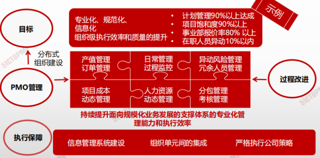

# 项目管理办公室

项目管理办公室（PMO）是对与项目相关的治理过程进行标准化，并促进资源、方法论、工具和技术共享的**一个组织结构**。PMO的职责范围可大可小，从提供项目管理支持服务，到直接管理一个或多个项目。

## PMO的几种类型

### 支持型

担当顾问的角色，向项目提供模板、最佳实践、培训，以及来自其他项目的信息和经验教训

### 控制性

不仅给项目提供支持，而且通过各种手段要求项目服从

### 指令性

直接管理和控制项目

> 为了确保项目复合组织业务目标PMO可能有权在每个项目生命周期中充当重要相关方的和关键决策

**PMO可以：**

- 提出建议
- 领导知识传递
- 终止项目
- 根据需要采取其它行动

> PMO的一个主要职能是通过各种方式向项目经理提供支持

**这些方式包括（但不限于）：**

- 对PMO所辖的全部项目的共享资源进行管理
- 识别和制定项目管理方法、最佳实践和标准
- 指导、辅助、培训和监督
- 通过项目审计，监督对项目管理标准、政策、程序和模板的遵守制度
- 制定和管理项目政策、程序、模板和其他共享文件（组织过程资产）
- 对跨项目的沟通进行协调

# 项目管理办公室

|      | **PM-项目经理** | **PMO-项目管理办公室** |
| ---- | --------------- | ---------------------- |
|**目标**| 项目本身 |企业整体|
|**范围**| 特定项目的制约范围内提交具体成果|全组织内|
|**重点** |特定项目的目标| 追求组织在战略上的需要，项目集范围的变更并探求与商业目标相关的潜在机会|
|**控制**|**资源**控制分配到项目的资源| 共享的组织资源，在各个项目上，最优化地使用公司资源|
|**内容**| 具体工作包范围、进度、成本和质量|整体风险、机会、项目之间关系|
|**汇报**|**内容**具体项目的绩效、项目信息 |从整体角度考虑对项目的看法|

