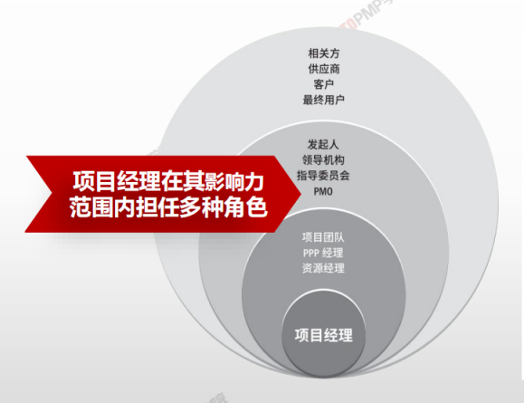
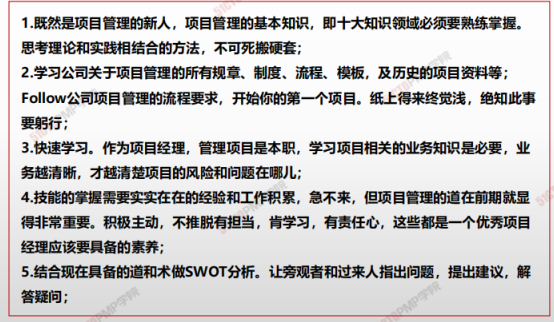
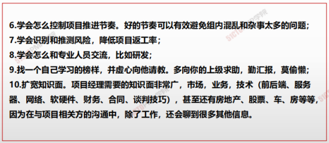

# 项目经理的角色概述

> 项目经理在领导项目团队达成项目目标方面发挥至关重要且项目管理角色需要符合组织要求

**领导者** **+** **管理者** **>>>>>** **项目目标**

|            | 大型项目的项目经理                                           |
| ---------- | ------------------------------------------------------------ |
| 成员与角色 | 一个大型的项目可能包括由一位项目经理领导的上百位项目成员。团队成员需要承担各种不同的角色，例如：设计、制造和设施管理。 |
| 团队职责   | 为项目成果负责                                               |
| 知识和技能 | 项目经理无需承担项目中的每个角色，但应具备项目管理知识、技术知识、理解和经验 |

- **职能经理**专注于对某个职能领域或业务部门的管理监督
- **运营经理**负责保证业务运营的高效性
- **项目经理**是由执行组织委派，<u>领导团队</u>实现项目目标的个人

项目经理 VS 职能经理

|              | 项目经理                        | 职能经理                      |
| ------------ | ------------------------------- | ----------------------------- |
| **扮演角色** | 找到适合的人去完成 - “**帅**”   | 带领他人完成工作 - “**将**”   |
| **知识结构** | 具有丰富经验及知识 - “**通才**” | 专业领域技术转件 - “**专才**” |
| **管理方式** | <u>目标管理，结果导向</u>       | <u>过程管理</u>               |
| **工作方法** | <u>系统的方法</u>               | 分析的方法                    |
| **责任权利** | 个人实力、**<u>责大权小</u>**   | **职位实力、<u>责权对等</u>** |
| **主要任务** | 技术、组织、协调、领导          | 技术，流程，标准，规范        |

# 项目经理的定义

1. 一个核心
   1. 整合
2. 两个角度
   1. 使项目目标与组织的战略目标一致
   2. 使团队中每个人朝同一个方向努力
3. 三个层面
   1. 过程层面
   2. 背景层面
   3. 认知层面、
4. 四大技能
   1. 项目管理技术
   2. 领导力
   3. 商业管理技能
   4. 战略管理技能
5. 五大关系
   1. 项目内部的关系
   2. 项目所在组织的关系
   3. 项目所在行业的关系、
   4. 项目与项目管理职业的关系
   5. 项目与其他职业的关系

## 影响力

> PM不能把整合授权给别人做，必须亲自做，整合是项目经理的重要职责
>
> 
>
> <u>**√**</u> 组织各专家做事的整合型人才
>
> ------
>
> 

 

> 优秀的项目经理
>
> - 是让团队的人都感到自己存在感
> - 你想给的不一定是团队成员想得到的，要给与团队成员所想要的
> - 抱有积极、理性、的思考模式看问题

> 新手项目经理的十条建议
>
> 1. 掌握项目管理的基本知识
> 2. 学习公司现有的项目管理内容
> 3. 重点学习风险管理、沟通管理
> 4. 积极主动、有责任心
> 5. 根据现有知识做好swot分析 （让旁观者提出建议并主动分析）
> 6. 控制项目推进的节奏
> 7. 学会知识的融会贯通
> 8. 学会和专业人士沟通（从成功者中获取经验）
> 9. 多汇报、多请教（有助于从更高的视野看待问题）
> 10. 扩展知识面

> swot https://www.zhihu.com/question/20904284

> 如果公司的规章制度不全，或没有。这时候就是发挥我才能的时刻