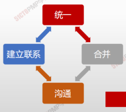
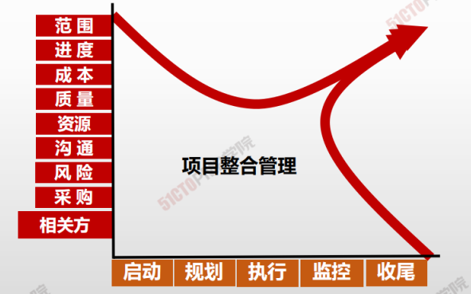
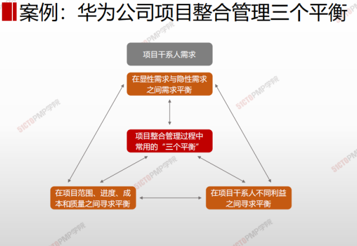
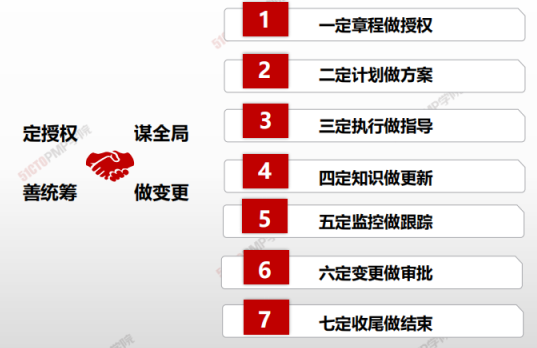

## 整合管理知识领域概述

|                | **启动过程组**  | **规划过程组**      | **执行过程组**                            | **监控过程组**                         | **收尾过程组**    |
| -------------- | --------------- | ------------------- | ----------------------------------------- | -------------------------------------- | ----------------- |
| **4.整合管理** | 4.1制定项目章程 | 4.2制定项目管理计划 | 4.3指导与管理项目工作 4.4管理项目知识 | 4.5监控项目工作 4.6实施整体变更控制 | 4.7结束项目或阶段 |

> 项目整合管理

项目整合管理包括多隶属于项目管理过程组的各种过程和项目管理活动进行 <u>识别、定义、组合、统一和协调</u>的各个过程。在项目管理中，整合艰巨 <u>统一、合并、沟通和建立联系</u>的性质，这些行为应该 <u>贯穿项目始终</u>

> **项目经理是整合者**

 

整合是指协调与统一。项目整合管理是项目管理的核心，是为了实现项目各要素之间的项目协调，并在互相矛盾、互相竞争的目标中寻找最佳平衡点。

整合管理通过项目资源的整合，将其它领域的相关要素有机地结合在一起，随着项目沿着其生命周期演化，这些**要素将围绕项目的目标而不断结合**起来。其特点：<u>全生命周期、综合性、全局性</u>

> 只要存在结合部，就需要整合。项目管理的思维就是整合

| -    | 知识领域           | 解释                                                         |
| ---- | ------------------ | ------------------------------------------------------------ |
| 4.1  | 制定项目章程       | 编写一份<u>正式批准</u>项目并且<u>授权项目经理</u>在项目活动中使用组织资源的文件的过程。 |
| 4.2  | 制定项目管理计划   | 定义、准备和协调项目计划的<u>所有组成部分</u>，并把它们<u>整合为一份综合项目管理计划</u>的过程。 |
| 4.3  | 指导与管理项目工作 | 为实现项目目标而领导和<u>执行</u>项目管理计划中<u>所确定的工作</u>，并<u>实施已批准变更</u>的过程。 |
| 4.4  | 管理项目知识       | 使用现有知识并生成新知识,以实现项目目标,并且帮助组织学习的过程。 |
| 4.5  | 监控过程           | 跟踪、审查和报告<u>整体项目进展</u>，以实现项目管理计划中确定的绩效目标的过程 |
| 4.6  | 实施整体变更控制   | 审查所有<u>变更</u>请求，<u>批准</u>变更，<u>管理</u>对可交付成果、组织过程资产、项目文件和项目管理计划的变更，并对变更处理结果进行国通的过程。 |
| 4.7  | 结束项目或阶段     | <u>终结</u>项目、阶段或合同的<u>所有</u>活动的过程           |

> 七个定
>
> 1. 一定章程做授权
> 2. 二定计划做方案
> 3. 三定执行做指导
> 4. 四定知识做更新
> 5. 五定监控做跟踪
> 6. 六定变更做审批
> 7. 七定收尾做结束

