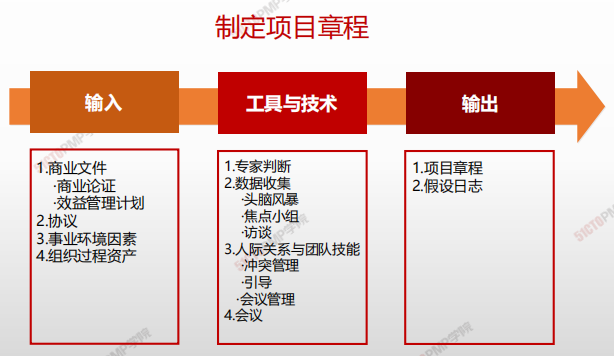
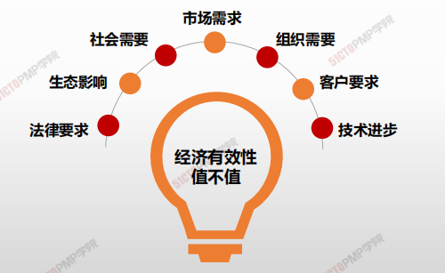
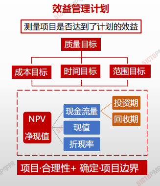
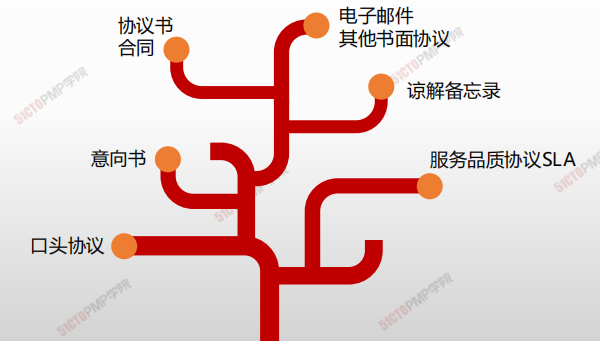
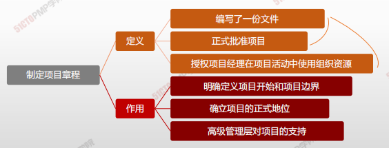
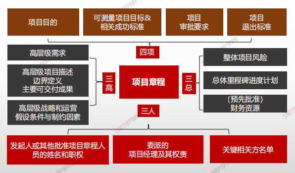

# 制定项目章程

> **项目章程：**是**<u>定制一份正式批准</u>项目或阶段的文件，**并记录能反映相关方需要和期望的<u>初步要求</u>的过程。它在项目执行组织与发起组织（或客户，如果是外部项目的话）之间建立起伙伴关系

- 项目章程是组织 <u>正式批准</u>项目的文件,<u>标志着项目的正式启动</u>。
- 项目章程经启动者签字，**即标志着项目获得批准。**
- 项目章程 <u>授权项目经理</u>在活动中动用组织的资源。
- 项目章程可 <u>由发起人编制</u>，或者有项目经理与发起机构合作编制。
- **项目有项目以外的机构来启动**
- **项目启动者或发起人应该具有一定的职权**，能为项目获取资金并提供资源。

## 4W1H

| 4W1H             | 制定项目章程                                                 |
| ---------------- | ------------------------------------------------------------ |
| what 做什么  | 编写一份正式批准项目并授权项目经理在项目活动中使用组织资源的文件。 作用：明确项目与组织战略目标之间的直接联系，确立项目的正式地位，并展 示组织对项目的承诺。 |
| why 为什么做 | 1澄清需求，把协议/SOW转化为项目章程； 2确定项目总体要求，项目概述； 3任命项目经理，授权项目经理可以动用组织资源； 4确定项目成功标准。 |
| who 谁来做   | 项目章程可由发起人编制，或者由项目经理与发起机构合作编制。 必须发起人批准。 |
| how 如何做   | 借鉴过去经验，结合本项目实际。 **专家判断、数据收集、人际关系与团队技能、会议** |

## 输入/工具技术/输出

1. 输入
   1. 商业文件
      - 商业论证
      - 效益管理计划
   2. 协议
   3. 事业环境因素
   4. 组织过程资产
2. 工具与技术
   1. 专家判断
   2. 数据收集
      - 头脑风暴
      - 焦点小组
      - 访谈
   3. 人际关系与团队技能
      - 冲突管理
      - 引导
      - 会议管理
   4. 会议

3. 输出
   1. 项目章程
   2. 假设日志

### 输入

#### 商业论证

确定项目是否达到了经济可行性研究的预期结果

#### 效益管理计划

#### 协议

协议定义了项目启动的初衷，协议有很多种形式：

### 工具技术

#### 专家判断

专家判断是有关专家根据自己的知识与经验对问题做出的判断

> 专家判断是最常用的工具与技术

> 专家判断 <u>适用于一切管理和技术工作</u>

> 专家判断来自于 具有相应专业知识、专业实践或培训经历的任何小组或个人

> 专家判断来自执行组织的内部或外部，项目团队的内部或外部

#### 头脑风暴

在短时间内获得大量创意，适用于团队环境，需要引导者进行引导

> 头脑风暴有两个部分构成：创意产生和创意分析

> 正常融洽和不受任何限制的气氛
>
> 打破常规，积极思考，畅所欲言，充分发表看法

#### 焦点小组

召集相关方和主题专家讨论项目风险、成功标准和其他议题，比一对一访谈更有利于互助交流。

> • 群体访谈，可以有6-10个被访谈者参加
>
> • 被访谈者通常是同一个领域的主题专家

> • 由主持人带领被访谈者开展互动讨论，更关注集体意见

#### 访谈

访谈是指通过与相关方直接交谈来了解高层级需求、假设条件、制约因素、审批标准以及其他信息。

> • 提出预设和即兴的问题，并记录他们的回答
>
> • 通常采取“一对一”的访谈，可以1:1(常用)、1:N、N:N

> • 相关方愿意且能说清楚需求
> • 有助于识别和定义项目可交付成果的特征和功能

#### 引导

#### 会议

**会议是指导与管理项目工作、监控项目工作、实施整体变更控制和结束项目或阶段的工具**

- 会议既可以是面对面的，也可以是远程虚拟的。

- 在项目执行、监控和收尾过程中，需要定期或不定期开会。

|                                           | 召开时间                              | 会议目的                                                     |
| ----------------------------------------- | ------------------------------------- | ------------------------------------------------------------ |
| 项目启动会议 （ Initiating Meeting ） | 启动阶段结束时召开项目启 动会议。 | 发布章程、任命项目经理，标志着项目的开始。                   |
| 项目开工会议 （kick-off meeting ）    | 项目管理计划完成后、实施之前。        | • 项目团队成员互相认识。 • 介绍项目背景及计划，正式批准综合性项目管理计划，并在相关方之间达成共识。 • 落实具体项目工作，明确个人和团队职责范围，获得团队成员承诺，为进入项目执行阶段做准备。 |

### 输出

#### 项目章程

- 项目章程是由项目启动者或发起人发布的，正式批准项目成立，并授权项目经理使用组织资源开展项目活动的文件。

- 它记录了关于项目和项目预期交付的产品、服务或成果的高层级信息。

  

  

#### 假设日志

- **在项目启动之前编制商业论证时，识别高层级的战略和运营假设条件与制约因素。**
- **这些假设条件与制约因素应纳入项目章程。**
- **较低层级的活动和任务假设条件在项目期间随着诸如定义技术规范、估算、进度和风险等活动的开展而生成。**
- **假设日志用于记录整个项目生命周期中的所有假设条件和制约因素**

# 小结

1. 掌握制定项目章程过程的含义和作用掌握商业论证的意义
2. 了解协议、事业环境因素和组织过程资产对项目启动的重要影响
4. 掌握头脑风暴、焦点小组、访谈等数据收集技术掌握项目章程的含义和包含的主要内容
6. 了解假设日志