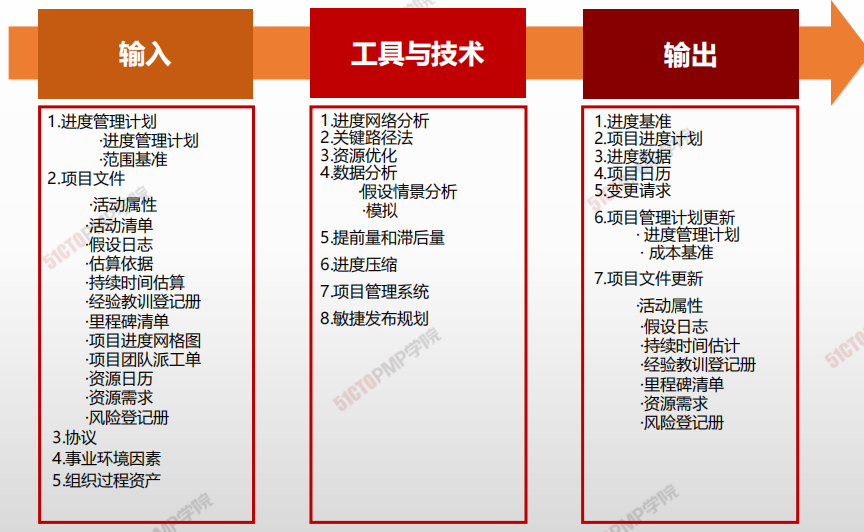
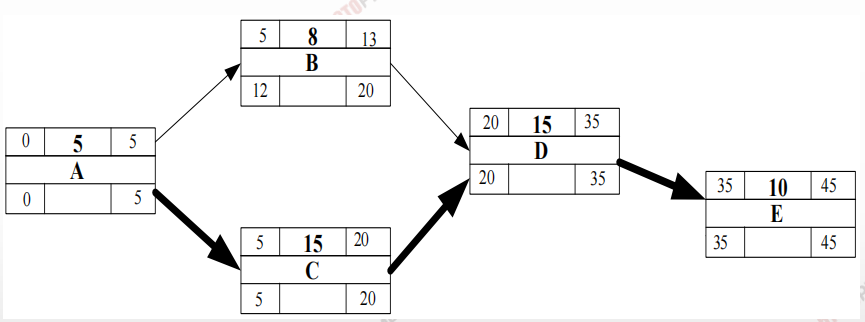
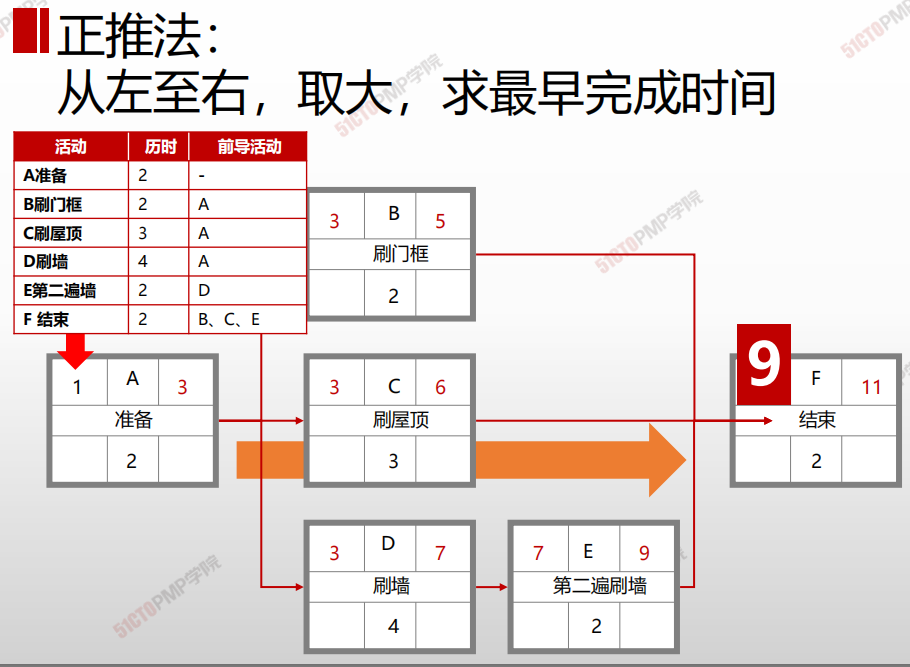
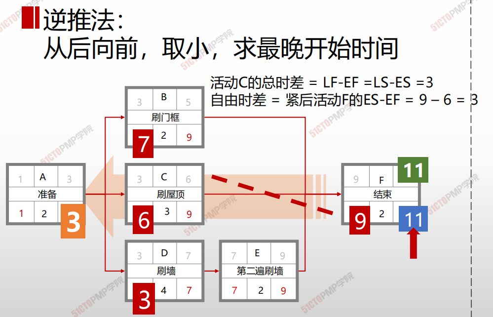
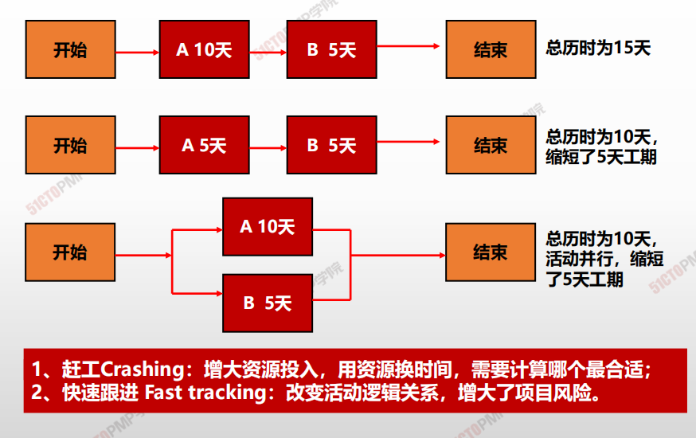
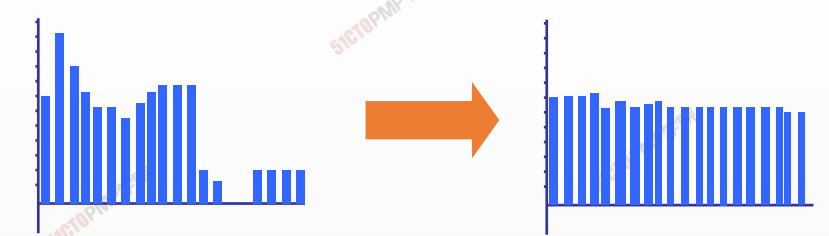
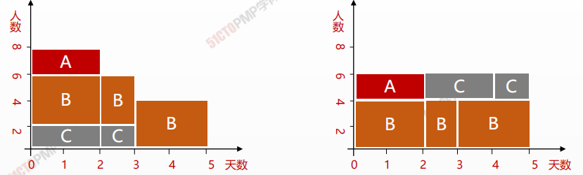
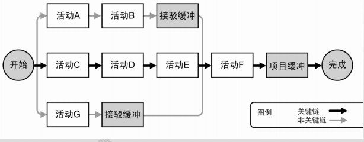
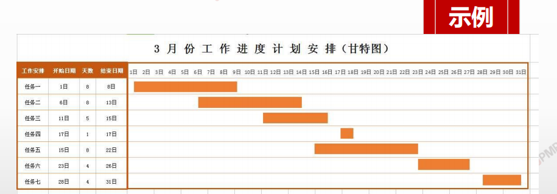

# 估算活动持续时间

## 4W1H

| 4W1H                | 估算活动持续时间                                             |
| ------------------- | ------------------------------------------------------------ |
| what 做什么     | 分析活动顺序、持续时间、资源需求和进度制约因素，创建进度模型，从而落实项目执行和监控的过程。 <u>作用：为完成项目活动而制定具有计划日期的进度模型。</u> |
| why 为什么做    | 为项目制定衡量标尺，项目人员确认开始和完成日期与资源日历没有冲突，也与其他项目或任务没有冲突，从而确认计划日期的有效性。 |
| who 谁来做      | 项目管理团队认可和批准。                                     |
| when 什么时候做 | 定义范围/定义活动/排列活动顺序/估算活动资源/估算活动持续时间之后。 |
| how 如何做      | 制定可行的项目进度计划是一个反复进行的过程。 <u>进度网络分析、关键路径法、资源优化、数据分析、提前量和滞后量、进度压缩、项目管理信息系统、敏捷发布规划</u> |

## 输入/工具技术/输出

1. 输入
   1. 进度管理计划
      - 进度管理计划
      - 范围基准
   2. 项目文件
      - 活动属性
      - 活动清单
      - 假设日志
      - 估算依据
      - 持续时间估算
      - 经验教训登记册
      - 里程碑清单
      - 项目进度网络图
      - 项目团队派工单
      - 资源日历
      - 资源需求
      - 风险登记册
   3. 协议
   4. 事业环境因素
   5. 组织过程资产
2. 工具与技术
   1. 进度网络分析
   2. 关键路径法
   3. 资源优化
   4. 数据分析
      * 假设情景分析
      * 模拟
   5. 提前量和滞后量
   6. 进度压缩
   7. 项目管理系统
   8. 敏捷发布规划
3. 输出
   1. 进度基准
   2. 项目进度计划
   3. 进度数据
   4. 项目日历
   5. 变更请求
   6. 项目管理计划更新
      - 进度管理计划
      - 成本基准
   7. 项目文件更新
      - 活动属性
      - 假设文件
      - 持续时间估计
      - 经验教训登记册
      - 里程碑清单
      - 资源需求
      - 风险登记册

### 关键路径法CPM（Critical Path Method）

> 网络图中最长工期的那条路线,决定项目最短的完成时间.

* **不考虑任何资源限制的情况下**，沿着项目进度网络路径进行逆推分析，计算出全部活动理论上的最早开始和完成日期、最迟开始和完成日期

### 进度压缩的两大方法

### **赶工（Crashing）**

通过增加资源，以最小的成本代价来压缩进度工期的一种技术。赶工的例子包括：批准加班、增加额外资源或支付加急费用，来加快关键路径上的活动。赶工只适用于那些通过增加资源就能缩短持续时间的，且位于关键路径上的活动。但赶工并非总是切实可行的，因它可能导致风险和/或成本的增加。

### **快速跟进（Fast Tracking）**

一种进度压缩技术，将正常情况下按顺序进行的活动或阶段改为至少是部分并行开展。例如，在大楼的建筑图纸尚未全部完成前就开始建地基。快速跟进可能造成返工和风险增加，只适用于能够通过并行活动来缩短关键路径上的项目工期的情况。为加快进度而使用提前量通常会增加相关活动之间的协调工作量，并增加质量风险。快速跟进还有可能增加项目成本。

|      | 赶工 | 快速跟进 |
| ---- | ---- | -------- |
|作用 |在不改变项目范围的情况，都可以加快进度工期||
|方法| 通过增加资源减少活动的持续时间，不改变活动的逻辑关系|不增加资源投入，将后续活动提前执行改变活动的逻辑关系|
|成本| 增加当前资源（成本）投入| 不增加当前资源（成本）投入，但是未来风险可能导致成本增加|
|风险 |导致风险增加，属于局部风险 |导致风险增加，属于全局风险|
|活动|关键路径活动，强调单位费率最低的活动|关键路径活动 |

**在不缩减项目范围的前提下，缩短进度工期，满足进度目标。**

### 资源平衡

> 如果出现资源短缺，就需要做资源平衡。资源平衡往往导致关键路径的改变，导致工期的延长。
> 如果各事期资源需求量起伏太大，就需要做资源平滑。资源平滑是在各浮动时间允许的范围内，在项目不同时间段调剂资源分配，不会导致项目工期的延长，一般也不会改变关键路径。

> 广义：资源平衡包括资源平滑。资源平滑是资源平衡的一种特殊形式。

## 资源平滑

> 使项目资源需求不超过预定的资源限制的一种技术。
>
> 
>
> 相对于资源平衡而言，资源平滑不会改变项目关键路径，完工日期也不会延迟。 
>
> 
>
> 也就是说，活动只在其自由和总浮动时间内延迟。因此，资源平滑技术可能无法实现所有资源的优化。

### 关键链

* 问题提出**帕金森定律**：工作会自动地膨胀占满所有可用的时间。如果安排给一个任务的时间有富余，人们就会放慢节奏消耗掉所有富余时间。
* 解决方案：最早开始法则 所有活动都越早越好，**砍掉每个活动的安全时间，****集中到路径末段** 就是准备项目缓冲。
  * 接驳缓冲Feeding buffer
  * 项目缓冲Project buffer
  * 资源缓冲 Resource buffer

### 甘特图&里程碑

