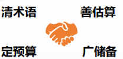
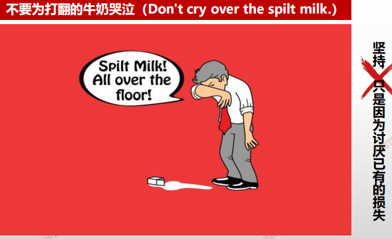

# 项目管理知识领域概述

|||||
| -------------- | ------------------------------------ | ----------- | ----------- |
| **7.成本管理** | 7.1规划成本管理 7.2估算成本  | 7.3制定预算 | 7.4控制成本 |

| 7.1  | 规划成本管理 | 确定如何估算、预算、管理、监督和控制项目成本的过程           |
| ---- | ------------ | ------------------------------------------------------------ |
| 7.2  | 估算成本     | 对项目活动所需货币资源进行估算的过程                         |
| 7.3  | 制定预算     | 汇总所有单个活动或工作包的估算成本，建立一个经批准的成本基准的过程。 |
| 7.4  | 控制成本     | 监督项目状态，以更新项目成本和管理成本基准变更的过程         |

> 一谋
>
> ​	规划成本管理
>
> 二估
>
> ​	成本估算【工作包或活动成本】
>
> 三定
>
> ​	成本预算【求重点、定基准—用来考核的】
>
> 四控
>
> ​	成本控制求挣值—找偏差

## 成本分类

### **可变成本**

随着产量或工作量而变的成本，如人员工资、消耗的耗材。

### **固定成本**

不随生产规模变化的非重复成本，如设备费用、场地租赁费用等。

### **直接成本**

能够<u>直接归属于</u>项目工作的成本，如项目组差旅费用、项目组人员工资和奖金、项目使用的物资等

### **间接成本**

一般管理费用客户或者几个项目<u>共同分担的成本，</u>如员工福利、保安费用、行政部门和财务部门费用等。

## 成本概念

### **储备**

- 应急储备：

  （单项目 - 已知的未知的）和管理储备（公司级 - 未知的未知的），主要为防范风险预留的成本；

- 管理储备：

  是一个单列的计划出来的成本，以备未来不可预见的事情发生时使用。包含成本或进度储备，以降低偏离成本或进度的风险。

### **质量成本**

- 在成本估算中，质量成本是必须考虑的因素。达到产品或服务质量而进行的全部工作所发生的的所有成本，包括为使所产生的产品或服务符合要求的所有工作 <u>及返工的工作</u>
- 分为质量保证成本（预防）和质量故障成本（损失），在项目前期和后期，质量成本较高。

### 沉没成本

- **指业已发生或承诺、无法收回的成本支出，如因事物造成的不可回收的投资。**

- **沉没成本是一种历史成本，对现有决策而言是不可控成本，不会影响当前行为或未来决策。**

- <u>在投资决策时应排除沉没成本的干扰</u>

  

### 机会成本

- 如果选择另一个项目而放弃这一项目收益所引发的成本，为了选择A，放弃B，B的收益就是A的机会成本。

  > **例如一名农民选择养猪就不能选择养鸡，则养猪的机会成本就是放弃养鸡的收益，养鸡的机会成本便会是放弃养猪的收益。**

- 机会必须是决策者可选择的项目
- 机会成本的概念基于固定资源的限制
- 指放弃的机会中收益最高的一个项目

> 任何选择皆有代价！最大的成本是有想法却不尝试的机会成本！

### 全生命周期成本

- 包括开发成本、生产成本、运维成本、处置成本

## 小结

| 成本术语       | 解释                                                         | 举例                                                         |
| -------------- | ------------------------------------------------------------ | ------------------------------------------------------------ |
| 可变成本       | 随生产或工作量而变的成本                                     | 如人员工资、消耗的原材料等                                   |
| 固定成本       | 不随生产规模编号的非重复成本                                 | 如设备费用、场地租赁费用等                                   |
| 直接成本       | 能够直接归属于项目工作的成本                                 | 如项目组差旅费用、项目组人员工资和奖金、项目使用的物资等     |
| 间接成本       | 一般管理费用科目或几个项目共同分担的成本                     | 如员工福利、安保费用、行政部门和财务部门费用等               |
| 沉没成本       | 指业已经发生或承诺、无法回收的成本支出，如因事物造成不可回收的投资<u>沉没成本是一种历史成本，对现有决策而言不可控成本，不会影响当前行为或未来的决策</u>在投资决策时应排除沉没成本的干扰 | 5块钱买了一袋烂苹果，吃一口是坏的，就别心疼钱了，就没必要再吃了 |
| 机会成本       | 如果选择另一个项目而放弃这一项目收益而引发的成本             | 任何选择都是由成本的                                         |
| 全生命周期成本 | 包括开发成本、生产成本、运维成本、处置成本                   | 需要考虑养护、处置的成本如养护轿车                           |

