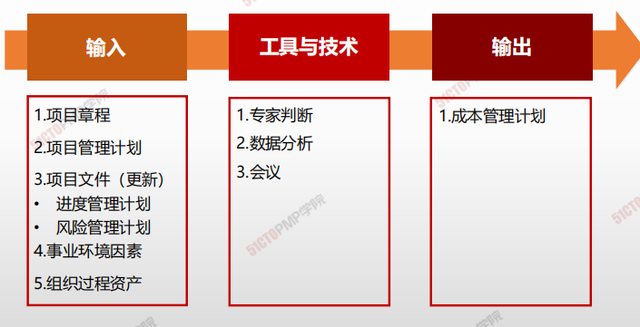
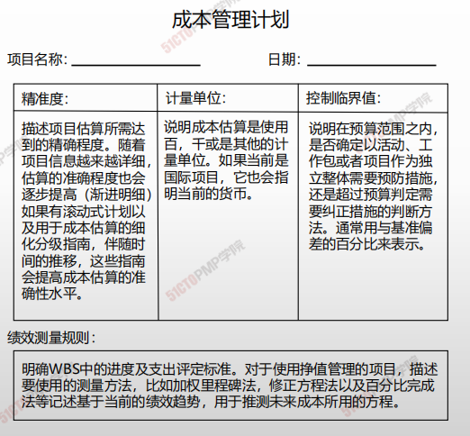
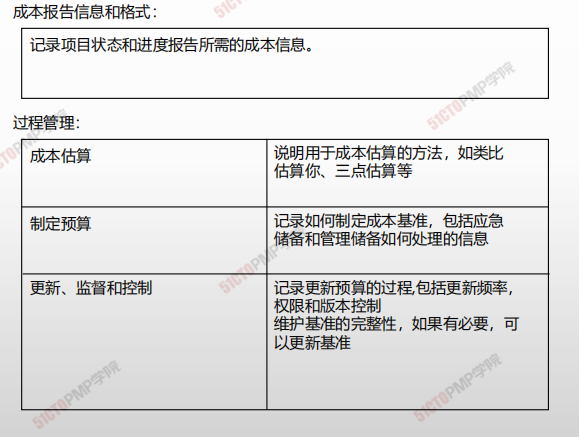

# 规划成本管理

## 4W1H

| 4W1H                | 规划成本管理                                                 |
| ------------------- | ------------------------------------------------------------ |
| what 做什么     | 确定如何估算、预算、管理、监督和控制项目成本的过程。 <u>作用：</u>在整个项目期间为如何管理成本提供指南和方向。本过程仅在展开一次或在项目的预定义点展开。 |
| why 为什么做    | 在项目规划阶段的早期就对成本管理工作进行规划，建立各成本管理过程的基本框架，以确保各过程的有效性及各过程质检的协调性 |
| who 谁来做      | 项目团队可能举行规划会议来制定成本管理计划。参会者可能包括项目经理、项目发起人、选定的项目团队成员、选定的相关方、项目成本负责人，以及其他必要人员。 |
| when 什么时候做 | 应该在项目规划阶段的早期就对成本管理工作进行规划，建立各成本管理过程的基本框架。 |
| how 如何做      | 通过规划输入输出，来确认项目成本管理的需求。 <u>专家判断、数据分析、会议</u> |

## 输入/工具技术/输出

1. 输入
   1. 项目章程
   2. 项目管理计划
   3. 项目文件（更新）
      - 进度管理计划
      - 风险管理计划
   4. 事业环境因素
   5. 组织过程资产
2. 工具与技术
   1. 专家判断
   2. 数据分析
   3. 会议
3. 输出
   1. 成本管理计划

### 成本管理计划

- **计量单位：**是货币，还是人天? 
- **精确度级别：**精确到千位还是万位，包含风险应急金与否；
- **准确度：**估算的准确度；可能包括应急储备。
- **组织程序的链接：**WBS中的各控制帐户都和组织会计体系连接。
- **控制临界值：**获得共识的成本偏差范围，通常用基准的百分比表示。
- **绩效测量规则：**
  1. 是否使用EVM 
  2. 确定WBS中的控制账户
  3. EV的度量方法：0/100，0/50/100，加权里程碑，完成百分比
  4. 计算EAC（完工预测）的公式
  5. 报告格式：成本报告的表格、频次等
- **其他细节和程序。**关于成本管理活动的其他细节包括：
  1. 对筹资方案的说明； 
  2. 处理汇率波动的程序； 
  3. 记录项目成本的程序

