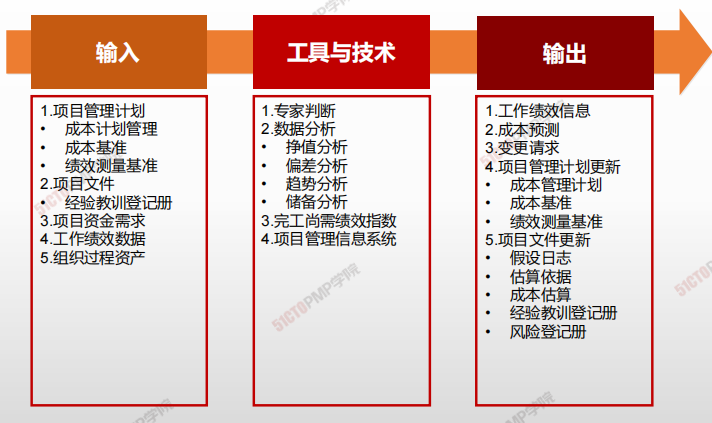
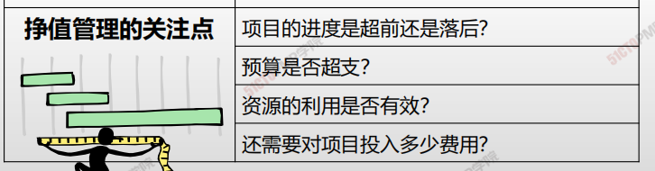
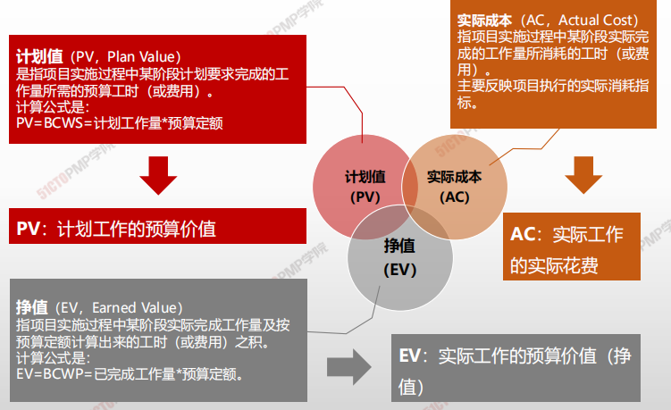
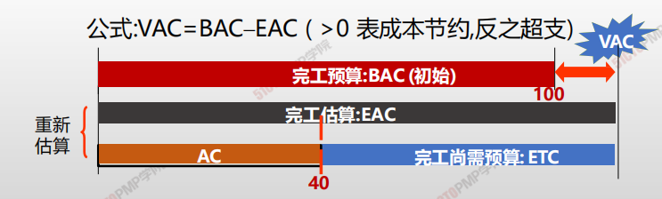
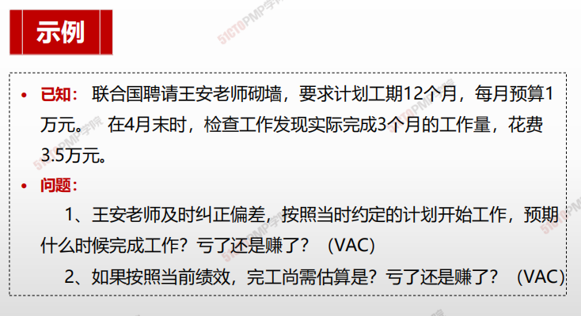
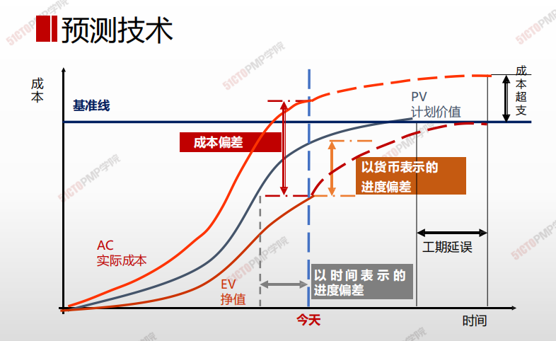
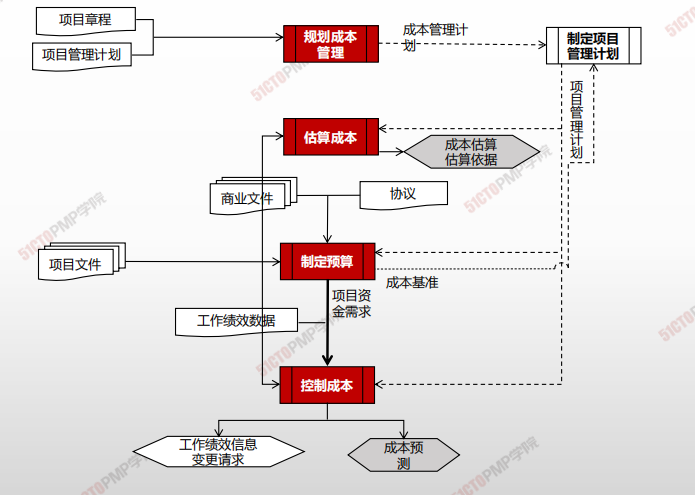

# 控制成本

## 4W1H

| 4W1H                | 控制成本                                                     |
| ------------------- | ------------------------------------------------------------ |
| what 做什么     | 控制成本是监督项目状态，以更新项目成本和管理成本基准变更的过程。 <u>作用：在整个项目期间保持对成本基准的维护。</u> |
| why 为什么做    | 在整个项目期间保持对成本基准的维护。                         |
| who 谁来做      | 项目经理与项目小组。                                         |
| when 什么时候做 | 本过程需要在整个项目期间开展。                               |
| how 如何做      | 在成本控制中，应重点分析项目资金支出与相应完成的工作之间的关系。有效成本控制的关键在于管理经批准的成本基准。 <u>专家判断、数据分析、完工尚需绩效指数、项目管理信息系统</u> |

## 输入/工具技术/输出

1. 输入
   1. 项目管理计划
      - 成本管理计划
      - 成本基准
   2. 项目文件
      - 经验教训登记册
   3. 项目资金需求
   4. 工作绩效数据
   5. 组织过程资产
2. 工具与技术
   1. 专家判断
   3. 数据分析
      - 挣值分析
      - 偏差分析
      - 趋势分析
      - 储备分析
   4. 完工尚需绩效指数
   5. 项目管理信息系统
3. 输出
   1. 工作绩效信息
   2. 成本预测
   3. 变更请求
   4. 项目挂历计划更新
      - 成本管理计划
      - 成本基准
      - 绩效测量基准
   5. 项目文件更新
      - 假设日志
      - 估算依据
      - 成本估算
      - 经验教训登记册
      - 风险等级册

### 挣值分析

| 挣值（Earned Value） | 表示在测量时点已完成的工作量的计划费用                       |
| -------------------- | ------------------------------------------------------------ |
| **挣值分析**         | 是**测量**执行情况的常用方法，整合了**范围，费用和进度的测量，**从而帮助项目管理者**评价**项目执行情况 |

### 挣值管理三个核心概念

#### 计划值PV

- **计划值**（PV，Plan Value）

  是指项目实施过程中某阶段计划要求完成的工作量所需的预算工时（或费用）。

- 计算公式是：

  - PV = BCWS = 计划工作量*预算定额

> **PV**：计划工作的预算价值

#### 实际成本AC

- **实际成本**（AC，Actual Cost）

  指项目实施过程中某阶段实际完成的工作量所消耗的工时（或费用）。

  主要反映项目执行的实际消耗指标。

> AC：实际工作的实际花费

#### 挣值EV

- **挣值**（EV，Earned Value）

  指项目实施过程中某阶段实际完成工作量及按预算定额计算出来的工时（或费用）之积。

- 计算公式是：
  
  - EV = BCWP = 已完成工作量*预算定额。

> **EV：**实际工作的预算价值（挣值）

### 挣值管理相关公式

|                  | 简称 | 说明         | 公式说明                           |
| ---------------- | ---- | ------------ | ---------------------------------- |
| **完工预算**     | BAC  | 完工预算     | 整个项目的预算（总的PV）           |
| **应该干多少**   | PV   | 计划值       | 实际完成工作的预算值               |
| **干了多少**     | EV   | 挣值         | 实际完成工作的预算值               |
| **花了多少**     | AC   | 实际成本     | 实际花费成本                       |
| **剩下工作成本** | ETC  | 完工尚需估算 | 剩下的工作还需要多钱               |
| **全部工作成本** | EAC  | 完工估算     | 实际成本+完工尚需估算 **AC + ETC** |
|                  | VAC  | 完工估算     | **VAC = BAC - EAC**                |
|                  | SV   | 进度偏差     | 挣值 - 计划值 （**EV - PV**)       |
|                  | SPI  | 进度偏差知识 | 挣值 / 计划值 (**EV / PV**)        |
|                  | CV   | 成本偏差     | 挣值 - 实际成本 (**EV - AC**)      |
|                  | CPI  | 成本偏差指数 | 挣值 / 实际成本 (**EV / AC**)      |

### 使用挣值管理分析绩效

**CV = EV -AC**

**SV = EV - PV**

**CPI = EV / AC**

**SPI = EV / PV**

| 偏差分析     | 偏差为正：>0                         | 偏差为负：<0                         |
| ------------ | ------------------------------------ | ------------------------------------ |
| 成本偏差(CV) | 节约成本                             | 成本超支                             |
| 进度偏差(SV) | 工期提前(货币单位)                   | 工期滞后(货币单位)                   |
| SV和CV同时   | 成本节约，**按此绩效，工期将会提前** | 成本超支，**按此绩效，工期将会滞后** |

| 偏差分析         | 原因分析                                       |
| ---------------- | ---------------------------------------------- |
| CV为正，SV为负   | 资源没到位，没开工，所以省钱，几度落后         |
| CV进为负，SV为正 | 可能在赶工，拿资源换时间，所以花钱多，进度提前 |

| 绩效分析          | 绩效指数>1     | 绩效指数<1     |
| ----------------- | -------------- | -------------- |
| 工期绩效指数(SPI) | 工期提前       | 未完成计划     |
| 成本绩效指数(CPI) | 比计划成本节约 | 比计划成本超支 |

### 预测技术（完工估算）

| 参数名                  | 含义与公式                                                   | 备注   | 记忆法             |
| ----------------------- | ------------------------------------------------------------ | ------ | ------------------ |
| 完工总**预**算值（BAC） | 所有计划成本的和 **BAC = 总的PV**                            | 未做   | 所有的活           |
| 完工**尚需**估算（ETC） | 当前时间点，项目剩余工作完工估算                             | 同左   | 剩下的活           |
| （ETC）                 | ETC = 剩下工作量对应的计划值 = 总计划值 - 已完成的计划值（EV） ，即 ETC = BAC - EV | 非典型 | 悔改，按照计划执行 |
| （ETC`）                | ETC` = 剩下工作量对应计划值 / 成本绩效指数 = ETC / CPI = (BAC - EV) / CPI | 典型   | 一错再错，执迷不悟 |
| 完工估算（EAC）         | 项目整体完工估算成本，等于AC+完工尚需估算 即 EAC = AC + ETC` |        |                    |

- <u>完工预算(Budget at completion, BAC)</u>
- <u>完工估算(Estimate at completion, EAC)</u>
- <u>完工尚需估算(Estimate to complete, ETC)</u>
- <u>完工时偏差 (Variance At Completion, VAC)</u>

| 情景                                   | 计算公式                               |
| -------------------------------------- | -------------------------------------- |
| 以前估算假设不成立，剩余工作重新估算   | EAC = AC + ETC                         |
| 如果没有骗车或者偏差不典型             | EAC = AC + BAC - EV = BAC - CV         |
| 如果有典型偏差，即以当前CPI完成ETC工作 | EAC = AC + (BAC - EV ) / CPI = BAC/CPI |
| 假设CPI与SPI将同时影响ETC工作          | EAC = AC - (BAC - EV)/ CPI×SPI         |

> CPI = EV / AC

- 完工尚需绩效指数 (**TCPI**) 

  TCPI = (BAV - EV) / (BAC - AC ) 或 (EAC - AC)

  完成剩余工作所需的成本与剩余预算之比

### 预测技术（完工估算）-典型偏差

**典型偏差**：为纠正偏差，一意孤行

**ETC`** = 剩下工作量对应计划值 /  成本绩效指示 = ETC/CPI = (BAC-EV)/**CPI**

### 预测技术（完工估算）-非典型偏差

**非典型偏差**：纠正偏差，按计划进度：

ETC=剩下工作量对应的计划值 =总计划值-已完成工作的计划值（EV），即ETC=BAC-EV=12-3=9万。所有工作将于第13个月完成

### 预测技术

### 挣得进度

**对挣值管理 (EVM)的理论和实践进行扩展，引入挣得进度 (ES)。**

进度指标如SV用货币单位衡量而不是时间单位，这样就不太直观。SV进度偏差（SV=EV-PV）进度偏差为-1000美元，根据这个货币单位的进度偏差数据不太容易直观了解当前进度到底落后多久。二是项目在快要完工到完工这一时间，无论进度落后多少，EV将会越来越接近PV和BAC并最终完工时等于PV和BAC，这样SV将会越来越接近于0并最终最终完工时等于0

**对挣值管理 (EVM)的理论和实践进行扩展，引入挣得进度 (ES)**

1. 控制成本4W1H
2. 成本控制
3. 成本控制-ITTO：挣值分析
4. 挣值管理三个核心概念
5. 挣值管理相关公式
6. 小练习
7. 使用挣值管理分析绩效（在不引入挣得进度的概念下）
8. 预测技术（完工估算）
9. 预测技术（完工估算）-典型偏差
10. 预测技术（完工估算）-非典型偏差
11. 预测技术

