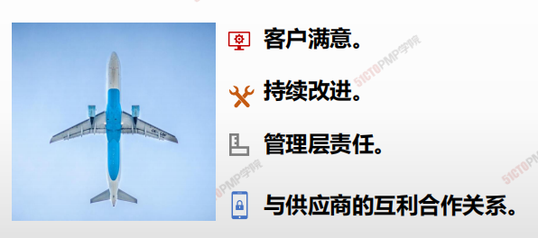
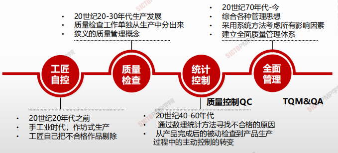
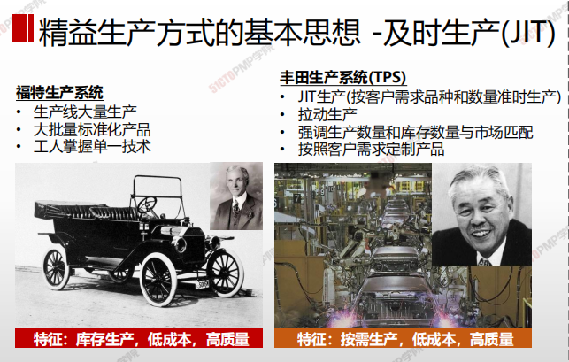
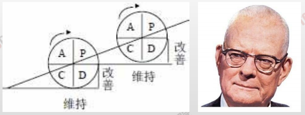
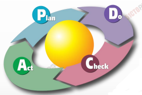
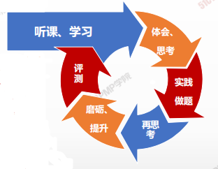
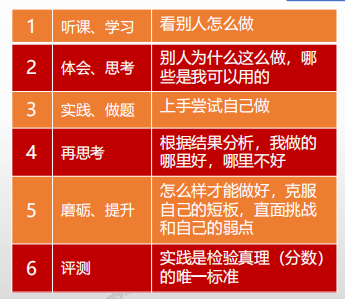

# 质量管理概述

| 8.1  | 规划质量管理 | **识别**项目及其可交付成果的**质量要求和/或标准**，并**书面描述**项目将**如何证明**符合质量要求和/或标准的过程。 |
| ---- | ------------ | ------------------------------------------------------------ |
| 8.2  | 管理质量     | 管理质量是把组织的质量政策用于项目，并将质量挂历计划转化为可执行的质量活动的过程。 |
| 8.3  | 控制质量     | 为了评估绩效，确保项目输出完整、正确，并满足客户的期望，而监督和记录质量管理活动执行结果的过程。 |

## 项目质量管理的核心概念

**代价最大的方法是让客户发现缺陷。这种方法可能会导致担保问题、召回、商誉受损和返工成本。**

- **控制质量过程包括先检测和纠正缺陷，再将可交付成果发送给客户。该过程会带来相关成本，主要是评估成本和内部失败成本。**
- **通过质量保证检查并纠正过程本身，而不仅仅是特殊缺陷。**
- **将质量融入项目和产品的规划和设计中。**
- **在整个组织内创建一种关注并致力于实现过程和产品质量的文化。**

## 项目质量管理概述

1. **QS（遵从组织质量体系）**

2. **QP（制定质量计划 —— 找标准、找方案）**

3. **QM（实施质量管理 —— 强调过程中努力）**

4. **QC （落实质量控制 —— 强调结果处的检查）**

5. **QI （坚持持续改进）**

   

> 质量的定义：**过程、产品或服务满足明确（或隐含）的需求能力的特征。**
>
> ​															—————————————美国质量管理协会

------------------

1. 内在的质量特性：性能、特性、强度、精度。
2. 外在质量特性：外形、包装、色泽、味道。
3. 经济质量特性：寿命、成本、价格、运营维护费用。
4. 环保质量特性：产品对于环境保护或环境污染。

---------

* **质量概念是主观的，也是客观的。**
* **达到用户的要求就是高质量。**
* **质量是可度量的**

## 质量的本质内涵

> 质量是唯一不能妥协的，没有质量的生产是一种破坏！

> 质量考研的是人心，更考验的是人性！

## 质量与等级

* 等级（Grade）偏低“**对用途相同但技术特性不同**的产品或服务的级别**分裂**”
* 质量（Quality）偏低永远是个问题，**等级较低则不见得是个问题**
* 等级低、质量高的产品是许多厂商市场份额的重要杀手锏
* 确定并交付所要求的质量与等级水准乃是项目经理与项目管理团队的职责

* [x] **质量：有无缺陷**
* [x] **等级：功能多少，反应设计意图**

> 低质量是个问题，低等级不一定是个问题

## 属性抽样 vs 变量抽样

* **属性抽样 <u>结果为合格或不合格</u>**
* **变量抽样 <u>表名合格的程度，不下结论，只出结果</u>**

| 属性抽样 | 对一个产品的一个或多个属性的测试。产品的属性可以是重量、规模、功能等。结果或为不合格 |
| -------- | ------------------------------------------------------------ |
| 变量抽样 | 在连续的量表上标明结果所处的位置，以此表明合格的程度一个流程的变化过程被测量并且记录下来，以此决定流程的能力。 |

## 质量管理理论的发展

| 传统的质量观点                   | 现代质量管理观点                                     |
| -------------------------------- | ---------------------------------------------------- |
| 质量是检查出来的                 | 质量是规划出来的，而非检查出来的                     |
| 质量就是指产品的质量             | 质量不只是产品还包括过程                             |
| 缺陷是不可避免的                 | 事情一次作对成本最低 - 零缺陷                        |
| 质量管理是质量部门人员的事情     | 质量管理，人人有责                                   |
| 对于质量事故，基层人员负主要责任 | 质量责任高层管理者承担85%                            |
| 质量越高越好                     | 质量就是符合要求、使用、客户满意，需要考虑成本与收益 |
| 改进质量主要靠检查和返工         | 改进质量靠预防和评估                                 |

## 精益生产方式的基本思想 - 及时生产

> 精益生产方式为JIT生产方式、准时制生产方式、适时生产方式或看板生产方式

-----

Just In Time (JIT），翻译为中文是“旨在需要的时候，按需要的量，生产所需的产品”。

精：少而精，不投入多余的生产要素， 只在适当时间生产必要的产品

益：所有经营活动有益有效，具有经济意义(产出)

---

## 质量管理大师：戴明

---

• PDCA循环：*计划P:* 提高当前的实践；*执行D:* 计划的实施；*检查C:* 通过测试来观察是否得到了期望的结果；*行动A:* 实施纠正行动

• 戴明提出“用不间断周期”，即产品设计、制造、测试和销售——市场调查——重新设计

• 戴明认为高质量会带来高生产率，从而能在较长时间内保持竞争力

• 戴明还阐述说：85%的质量问题应由管理层负责，另外15%由团队成员负责。

项目经理负质量管理责任。团队成员负把事情做对的成果责任。

• 鼓励高层参与到质量计划之中

• 预防胜于检查

---

## PDCA 循环

PDCA循环分为四个阶段

**P（计划）：**从问题的定义到行动计划

**D（实施）：**实施行动计划

**C（检查）：**评估结果

**A（处理）：**标准化和进一步推广

### PDCA循环的具体应用

1. **PLAN**
   1. 分析现状，找出存在的问题
      1. 确认问题
      2. 收集和组织数据及材料
      3. 设定目标和方法
   2. 分析产生问题的各种原因或影响因素
   3. 找出影响的主要因素（如：因果图）
   4. 制定措施，提出行动计划
      1. 寻找可能的解决方法
      2. 测试并选择 （模拟）
      3. 提出行动计划和相应的资源
2. **DO**
   1. 实施行动计划
3. **CHECK**
   1. 评估结果（分析数据）
4. **ACT**
   1. 标准化和进一步推广
   2. 下一个改进机会中重新使用PDCA循环

## 质量管理大师：朱兰

---

• 核心思想是“适用性”(Fitness for Use)。 

• 适用性就是通过遵守技术规范，使项目符合项目干系人及客户的期望。

• 定义了质量与等级的区别

• 提出质量计划->质量控制->质量改进的质量

三部曲

• 第一个提出由客户来决定质量

• 质量螺旋：为了获得产品的适用性，需要进行一系列工作活动。同时在这个全过程的不

断循环中螺旋式提高。

• 质量要满足使用

• 内部：便利性、操作性

• 外部：客户

---

## 质量管理大师：克劳士比-零缺陷(Crosby)

---

• 质量的定义为“符合预先的要求”，与需求一致

• 质量源于预防：预防系统保证质量，而不是评估（检验）

• 质量的执行标准是“零缺陷(Zero Defect)”，而不是“这很接近了”的态度

• 质量是用非一致性成本来衡量的：“不一致的代价”，而不是“指数”。

---