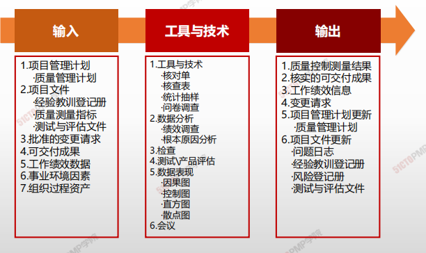
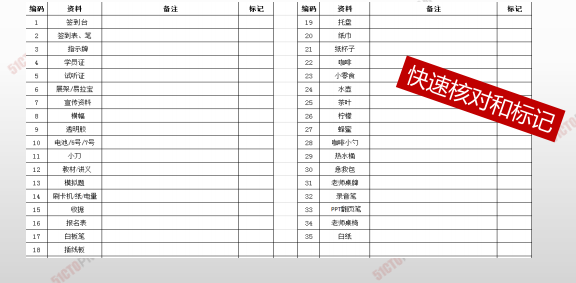
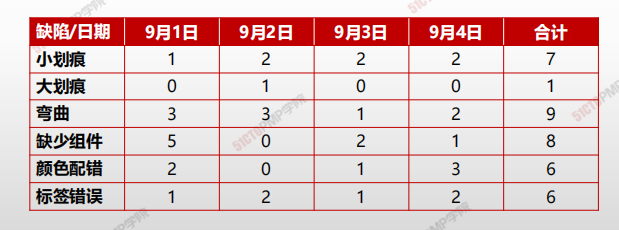
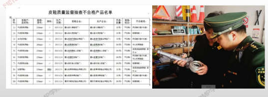
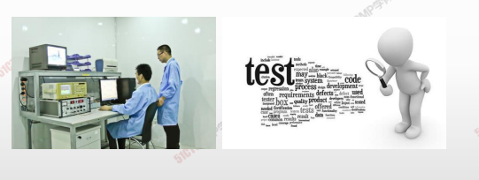
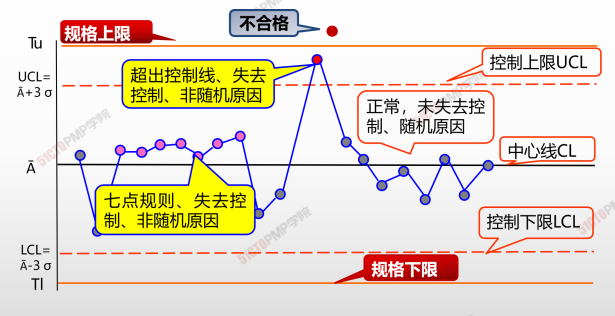

#  控制质量

## 4W1H

| 4W1H                | 控制质量工作                                                 |
| ------------------- | ------------------------------------------------------------ |
| what 做什么     | 是为了评估绩效，确保项目输出完整、正确且满足客户期望，而监督和记录质量管理活动执行结果的过程。 <u>作用</u>：核实项目可交付成果和工作已经达到主要相关方的质量要 求，可供最终验收。 |
| why 为什么做    | 在用户验收和最终交付之前测量产品或服务的完整性、合规性和适用性。 |
| who 谁来做      | 组织中的质量控制部门或名称相似的组织单元。                   |
| when 什么时候做 | 执行之后，对项目产品、服务或成果进行的检查评估。             |
| how 如何做      | 在整个项目期间应执行质量控制，用可靠的数据来证明项目已经达到发起人和/或客户的验收标准。 <u>工具与技术、数据分析、检查、测试/产品评估、数据表现、会议</u> |

## 输入/工具技术/输出

1. 输入

   1. 项目管理计划
      - 质量管理计划
   2. 项目文件
      - 经验教训登记册
      - 质量测量指标
      - 测试与评估文件
   3. 批准的变更请求
   4. 可交付成果
   5. 工作绩效数据
   6. 事业环境因素
   7. 组织过程资产

2. 工具与技术

   1. 数据收集
      - 核对单
      - 核查表
      - 统计抽样
      - 问卷调查

   3. 数据分析
      - 绩效调查
      - 根本原因分析
   2. 检查
   3. 测试、产品评估
   4. 数据表现
      - 因果图
      - 控制图
      - 直方图
      - 散点图
   5. 会议

3. 输出

   1. 质量控制测量结果
   2. 核实的可交付成果
   3. 工作绩效信息
   4. 变更请求
   5. 项目管理计划更新
      - 质量管理计划
   6. 项目文件更新
      - 问题日志
      - 经验教训登记册
      - 风险登记册
      - 测试与评估文件

   

## 核对单

- **核对单是一种结构化工具**
- 通常列出特定组成部分，用来核实所要求的一系列步骤是否已得到执行或检查需求列表是否已得到满足

## 核查表

- **<u>核查表、又称计数表</u>**，用于合理排列各种事项，以便有效的收集潜在质量问题的有用数据。在开展检查以识别缺陷是，用核查表收集属性数据就特别方便，例如关于缺陷数量或后果的数据。

## 统计抽样

- 从 **<u>目标总体中选取部分样本</u>**用于检查，理论基础是概率统计

## 测试、产品评估

**<u>与检查一样，核实可交付成果的质量是否合格</u>**

# 根本原因分析

- 确定引起 <u>偏差、缺陷或风险的根本原因</u>的一种分析技术。一项根本原因可能引起多项偏差、缺陷或风险。
- 识别问题的根本原因并且解决问题。消除所有根本原因可以杜绝问题再次发生。

# 控制图

# 管理质量 & 控制质量

| 管理质量（质量保证）                         | 控制质量                               |
| -------------------------------------------- | -------------------------------------- |
| 事中 “ 做 ” 质量                             | 事后 “ 控 ” 质量                       |
| 由工作执行者边执行、边开展                   | 有专门质量控制人员在事后开展           |
| 发现系统原因导致的过程偏差，据此开展过程改进 | 发现特殊原因导致的过程偏差，并加以纠正 |
| 预防工作成果的质量缺陷                       | 发现和补救工作成果的质量缺陷           |
| 从整体着眼的质量管理体系建设                 | 从局部着眼的具体质量问题纠正           |
| 过程控制、机制建立                           | 成果控制、关注纠偏                     |

# 质量管理常用工具特点和适用场景小结

| 质量工具 | 特点和适用场景 |
| -------- | -------------- |
| 因果图、石川图、鱼骨图| 寻找原因/根本原因/所有原因。|
|流程图 |各步骤之间的相互关系+回退根本原因分析+预测可能发生的质量问题。|
|核查表：又称计数表 |在开展检查以识别缺陷时，用核查表收集属性。（表格形式展示居多）趋势图 未来结果预测（预测偏差等）。|
|帕累托图|引起问题的最大最主要原因、80/20法则，是一种特殊形式的直方图。|
|控制图|项目过程是否稳定、是否在可控范围内、项目整体情况。-7点同一侧、7点连续上升/下降、如超出控制线，则均为失控，需要调整；（b）控制上限和下限设在±3西格玛的位置。|
|直方图|过程变量的分布的形状和宽度来确定过程中出现问题的原因，描述集中趋势、特定组内的频率、分散程度和统计分布形状。（柱状形式）|
|散点图|以确定两个变量间是否存在可能的联系。数据点越接近对角线两个变量之间的关系就越密切。|
|亲和图 |根据原因之间的关系（亲和性）进行分组。|
|核对单| 结构化的检查，防止检查过程中遗漏。|

\1. 

控制质量强调核实可交付成果的正确性

\2. 

开展控制质量过程的结果，是核实的可交付成果，

它是确认范围过程的一项输入

\3. 

预防胜于检查

\4. 

统计抽样省时省力，而且减少对产品的破坏

\5. 

质量管理的适用场景和特点