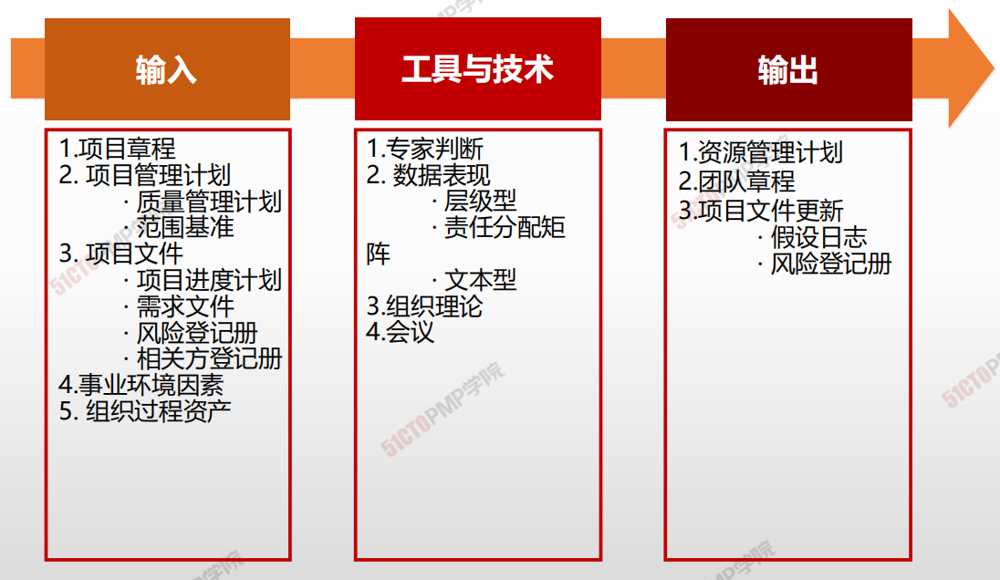
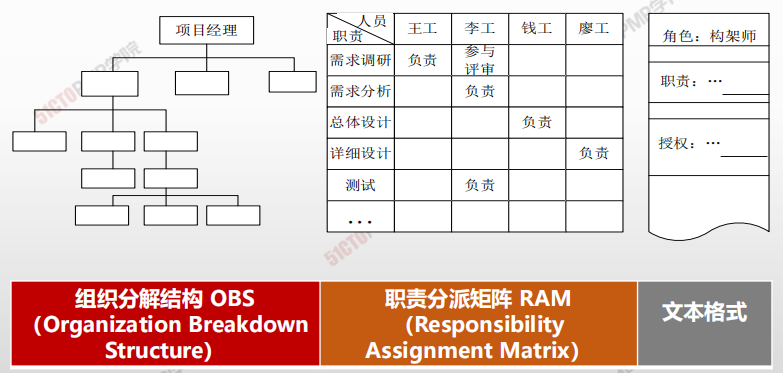
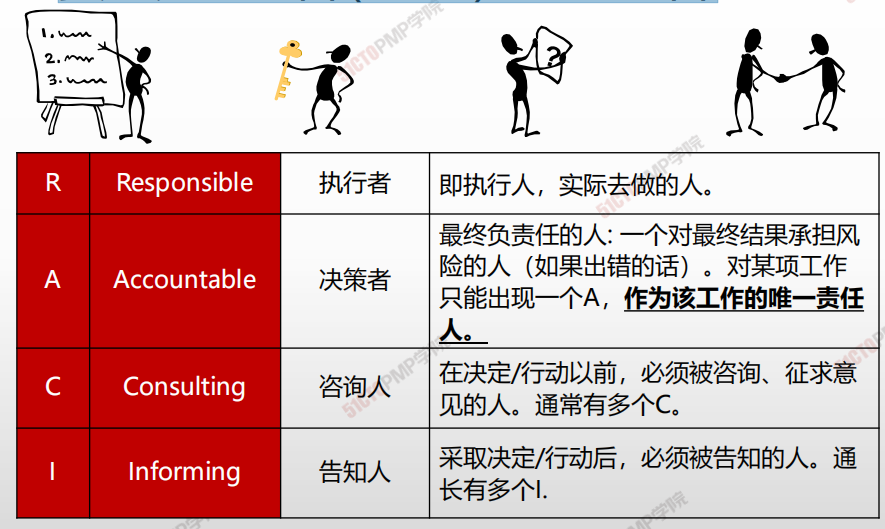
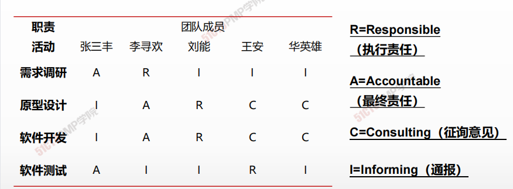

# **规划资源管理**

## 4W1H

| 4W1H                | **规划资源管理**                                             |
| ------------------- | ------------------------------------------------------------ |
| what 做什么     | 规划资源管理是定义如何估算、获取、管理和利用团队以及实物资源的过程。 作用：根据项目类型和复杂程度确定适用于项目资源的管理方法和管理程度 |
| why 为什么做    | 资源规划用于确定和识别一种方法，以确保项目的成功完成有足够的可用资源，从而对项目成本、进度、风险、质量和其他项目领域造成显著影响。 |
| who 谁来做      | 项目管理团队。                                               |
| when 什么时候做 | 项目早期。                                                   |
| how 如何做      | 有效的资源规划需要考虑稀缺资源的可用性和竞争，并编制相应的计划。 <u>专家判断、数据表现、组织理论、会议</u> |

## 输入/工具技术/输出

1. 输入

   1. 项目章程
   2. 项目管理计划
      - 质量管理计划
      - 范围基准
   3. 项目文件
      - 项目进度计划
      - 需求文件
      - 风险登记册
   4. 事业环境因素
   5. 组织过程资产

2. 工具与技术

   1. 专家判断
   5. 数据表现
      - 层级行
      - 责任分配矩阵
      - 文本型
   6. 组织理论
   7. 会议
   
3. 输出

   1. 资源管理计划
   2. 团队章程
   3. 项目文件更新
      - 假设日志
      - 风险登记册

   ## 三种组织结构图的职位描述
   
   

组织结构图和职位描述，最常用的有三种方式：

**<u>层级型、矩阵型和文本格型</u>**的角色描述

## 责任分配矩阵(RAM)-RACI矩阵

## 责任分配矩阵(RAM)

- 可以采用责任分配矩阵显示工作包或活动与项目团队成员之间的关系。矩阵图可以**确保任何一项任务都只有一个人负责，**从而避免混乱。
- 在大型项目中，可在多个层次上制定责任分配矩阵。高层次的RAM定义各小组分别负责WBS哪部分工作。低层次的RAM可在各小组内为具体活动分配角色，职责和职权。

## 规划资源管理-输出：资源管理计划

资源管理计划提供了关于如何分类、分配、管理和释放项目资源的指南。

资源管理计划分为团队管理计划和实物资源管理计划。

资源管理计划可能包括（但不限于）：

- **识别资源。**用于识别和量化项目所需的团队和实物资源的方法。
- **获取资源。**关于如何获取项目所需的团队和实物资源的指南。
- **角色与职责。**
- **项目组织图。**项目组织图以图形方式展示项目团队成员及其报告关系。
- **项目团队资源管理。**关于如何定义、配备、管理和最终遣散项目团队资源的指南。
- **培训。**针对项目成员的培训策略。
- **团队建设。**建设项目团队的方法。
- **资源控制。**依据需要确保实物资源充足可用、并未项目需求优化实物资源采购，而采用的方法。包括有关整个项目生命周期期间的库存、设备和用品管理的信息。
- **认可计划。**将给予团队成员哪些认可和奖励，以及何时给予。

## 团队章程

**<u>团队章程是为团队创建团队价值观、共识和工作指南的文件。</u>**团队章程可能但不限于：

- 团队价值观
- 沟通指南
- 决策标准和过程
- 处理过程
- 会议指南
- 团队共识

---

- <u>对于接受行为确定了明确的期望</u>
- <u>有助于减少误解，提高生产力</u>
- <u>团队成员可以了解彼此重要的价值观</u>

---

1. 规划资源管理是定义如何估算、获取、管理和利用团队以及实物资源的过程

2. 组织图与职位描有三种格式，即层级型、矩阵型和文本型

3. 组织分解结构（OBS）用图形的形式从上至下地描述团队中的角色和关系

4. 责任分配矩阵RAM用来显示分配给每个工作包的项目资源

5. RAM的一种特殊形式是RACI矩阵，把人员与任务之间的责任关系分为四类

6. 团队章程是为团队创建团队价值观、共识和工作指南的文件