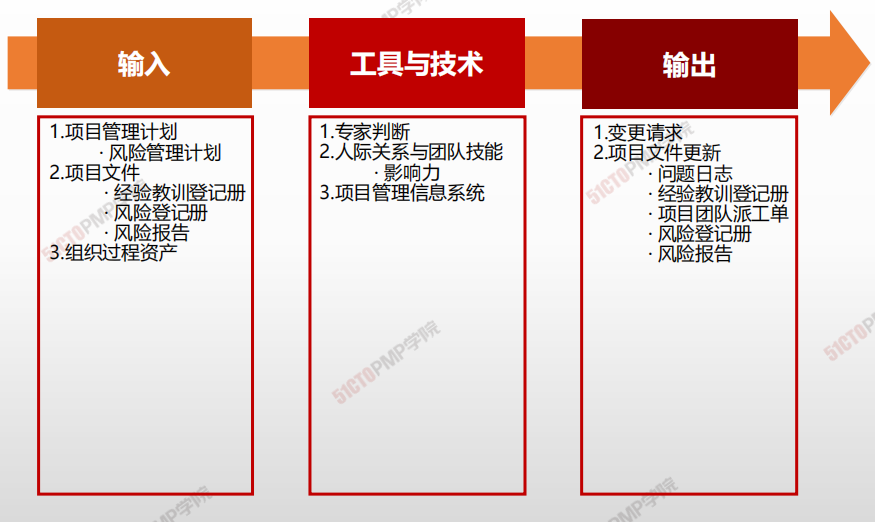
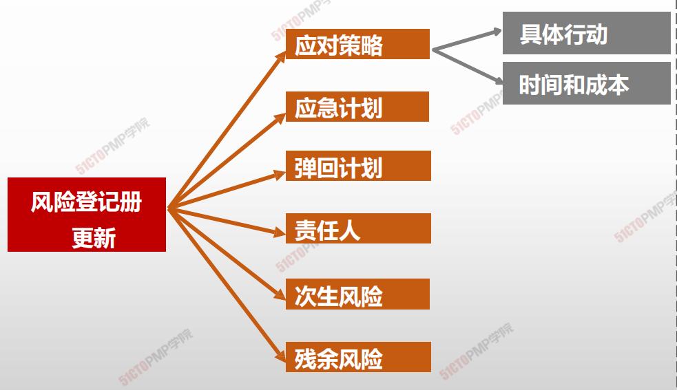

# 实施风险应对

## 4W1H

| 4W1H                | **实施风险应对**                                             |
| ------------------- | :----------------------------------------------------------- |
| what 做什么     | 实施风险应对是执行商定的风险应对计划的过程。 作用：确保按计划执行商定的风险应对措施，来管理整体项目风险敞口、最小化单个项目威胁，以及最大化单个项目机会。 |
| why 为什么做    | 适当关注实施风险应对过程，能够确保已商定的风险应对措施得到实际执行。 |
| who 谁来做      | 项目经理或人员就施展影响力，指定的风险责任人执行             |
| when 什么时候做 | 本过程需要在整个项目期间开展。                               |
| how 如何做      | 项目团队努力识别和分析风险并制定应对措施，然后把经商定的应对措施记录在风险登记册和风险报告中，但是不采取实际行动去管理风险。 <u>专家判断、人际关系与团队技能、项目管理信息系统</u> |

## 输入/工具技术/输出

1. 输入
   1. 项目管理计划
      - 风险管理计划
   2. 项目文件
      - 经验教训登记册
      - 风险登记册
      - 风险报告
   4. 组织过程资产
2. 工具与技术
   1. 专家判断
   2. 人际关系与团队技能
      - 引导
   3. 项目管理信息系统
3. 输出
   1. 变更请求
   3. 项目文件更新
      - 问题日志
      - 经验教训登记册
      - 项目团队派工单
      - 风险登记册
      - 风险报告

## 更新后的风险登记册

