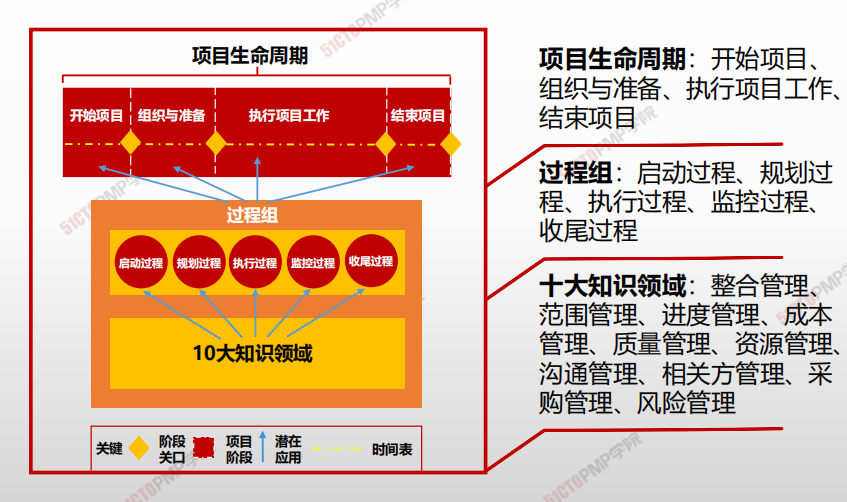
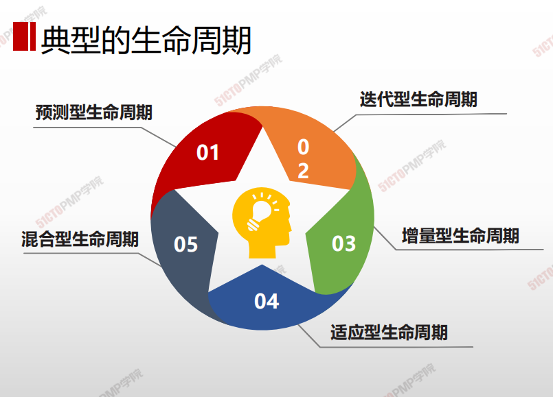
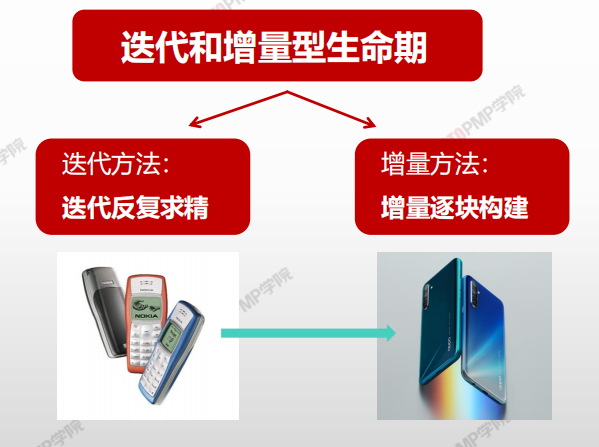
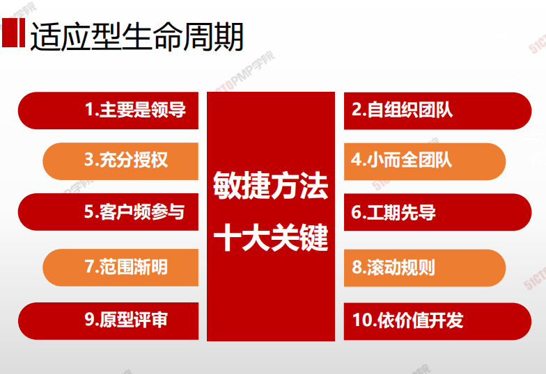

# 项目和开发生命周期

> 项目生命周期指项目从**启动到完成所经历的一系列结算**。它为项目管理提供了**一个基本的框架**。不论项目涉及的具体工作是什么，这个基本的框架都适用。这些阶段之间的关系可以**顺序、迭代或交叠**进行。

> 项目声明周期可以是预测型或适应性。项目生命周期内通常有一个或多个阶段与产品、服务或成果的开发相关，这些阶段称为**开发生命周期**。开发生命周期可以是**预测型、迭代型、增量型、适应性或混合型**的模式。

## 经典的生命周期

1. 预测型生命周期
   - 充分了解产品、一次成型

1. 增量型生命周期
   - 渐进的增加产品的功能
2. 适应性生命周期
   - 应对快速变化的环境，关注用户的感受，迭代更新，2-3周更新一次，敏捷开发，持续交付
3. 迭代型生命周期
   - 一系列重复循环活动开发产品、一般针对大型软件、erp流程等；

## 开发的生命周期

1. 预测型
   1. 范围、时间、成本确定
2. 迭代型
   1. 范围确定
   2. 时间、成本定期修改
3. 增量型
   1. 预定时间、渐增功能
4. 适应型
   1. 敏捷型、迭代型或增量型
   2. 迭代前定义&批准范围
5. 混合型
   1. 预测+适应

### 预测型生命周期

> **预测型生命周期 ：也称为完全计划驱动型生命周期**，在项目生命周期的尽早时间，确定项目范围及交付此范围所需的时间和成本 。

- **适用类型：**充分了解拟交付的产品，有厚实的行业实践基础，或整批一次性交付产品有利于干系人。
- 即使采用预测型生命周期，仍可使用滚动式规划的概念。
- **瀑布式的主要的问题：**是它的**严格分级导致****的自由度降低**，项目早期即作出承诺导致**对后期需求的变化难以调整**，代价高昂。
- 瀑布式方法在需求不明并且在项目进行过程中可能变化的情况下基本是不可行的。

### 迭代型和增量型生命周期

> **迭代和增量型生命周期 ：****项目阶段（也称为迭代）有目的地重复一个或多个项目活动。**
>
> - 迭代方法：是通过一系列重复的循环活动来开发产品；
> - 增量方法：是渐进地增加产品的功能。

- **适用类型**：组织需要管理不断变化的目标和范围，降低项目的复杂性，或产品的部分交付有利于一个或多个干系人，且不会影响最终或整批次可交付成果的交付。
- 大型复杂项目通常采用迭代方式来实施

### 适应型生命周期

> **适应型生命周期 ：****也称为变更驱动方法或敏捷方法，**其目的在于应对大量变更，获取干系人的持续参与。 **
>
> - **适应型生命周期**包含迭代和增量**的概念，但不同之处在于，迭代很快，而且所需时间和资源是固定的。
 

- **适用类型：**需要应对快速变化的环境，需求和范围难以事先确定，或者，能够以有利于干系人的方式定义较小的增量改进

