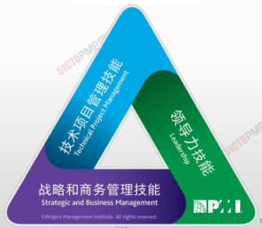
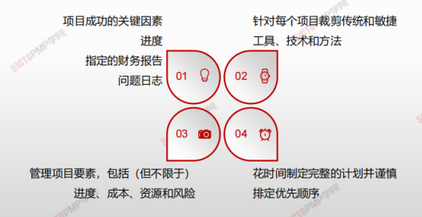
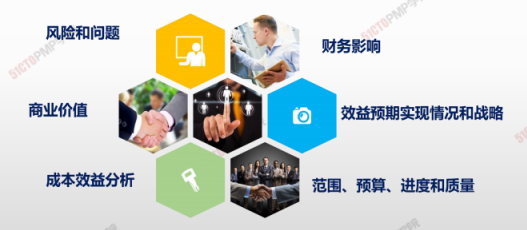
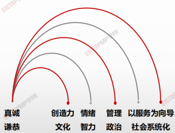

# 项目经理的能力

人才三角重点关注三个关键技能组合：

- 技术项目管理
- 领导力
- 战略和商务管理

## 技术项目管理

与项目、项目集和项目组合管理特定领域相关的知识、技能和行为，即角色履行的技术方面

1. 项目成功的关键因素、进度、指定的财务报告、问题日志
2. 针对每个项目裁剪传统和敏捷工具、技术和方法
3. 管理项目要素，包括（但不限于）进度、成本、资源和风险
4. 花时间制定完整的计划并谨慎排定优先顺序

## 领导力

指导、激励和带领团队所需的知识、技能和行为，可帮助组织达成业务目标。

| 管理                         | 领导力                         |
| ---------------------------- | ------------------------------ |
| 直接利用职责权利             | 利用关系的力量指导、影响与合作 |
| 维护                         | 发展                           |
| 管理                         | 创新                           |
| 关注系统的架构               | 关注人际关系                   |
| 依赖控制                     | 激发信任                       |
| 关注近期目标                 | 关注长期发展                   |
| 了解方式和时间               | 了解情况和原因                 |
| 关注盈利                     | 关注前景                       |
| 接受现状                     | 挑战现状                       |
| **正确的做事**               | **做正确的事**                 |
| 关注可操作的问题和以及其解决 | 关注愿景、一致性、动力和激励   |

## 战略和商务管理

关于行业和组织的知识和专业技能，有助于提高绩效并取得更好的业务成果。

# 领导技能

## 环境

如社会形势、经济状况、政治因素

## 组织

如目标、结构、工作类型

> 项目经理领导团队的方式可以分为很多种。项目经理可能会出于个人偏好或在总和考虑了项目有关的多个因素之后选择**领导力风格**。根据作用因素的不同，项目经理可能会改变风格。

## 个性

个性是指人与人之间在思维、情感和行为的特征模式方面的差异

# 执行整合力

> 项目经理扮演重要角色，**与项目发起人携手合作了解战略目标并确保项目目标和成果与项目组合、项目集以及业务领域保持一致。**

> 在项目层面上,项目经理**负责指导团队关注真正重要的实物并协同工作**