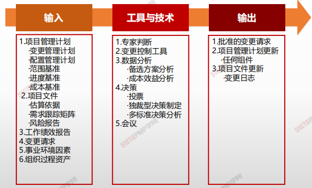
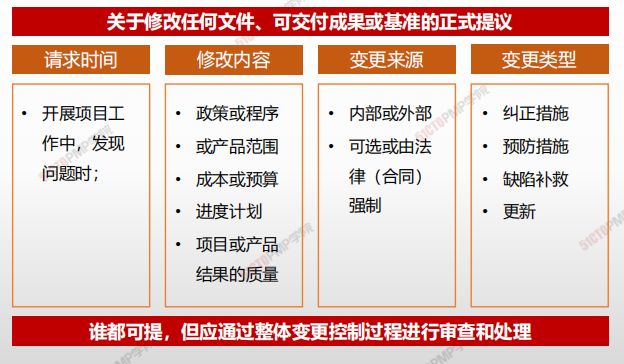
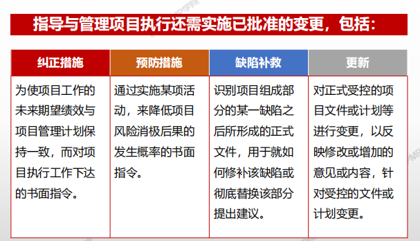
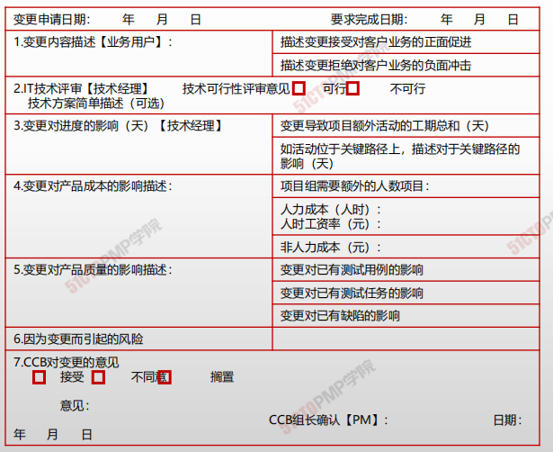
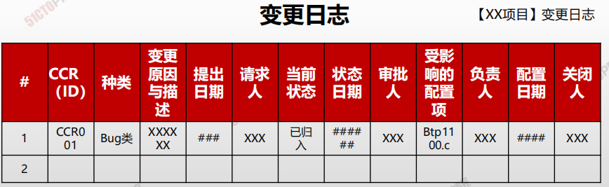

# 制定项目管理计划

- 实施整体变更控制过程贯穿项目始终，项目经理对此承担最终责任。
- 在整个项目生命周期的任何时间，参与项目的任何相关方都可以提出变更请求
- 尽管也可以口头提出，但所有变更请求都必须以书面形式记录，并纳入变更管理和配置管理系统中。
- 每项记录在案的变更请求都必须由一位责任人批准、推迟或否决，这个责任人通常是项目发起人或项目经理。必要时，应该由变更控制委员会（CCB）来开展实施整体变更控制过程。
- 变更请求得到批准后，可能要求调整项目管理计划和其他项目文件。
- 某些特定的变更请求，在CCB批准之后，可能还需要得到客户或发起人的批准。

## 4W1H

| 4W1H                | 制定项目章程                                                 |
| ------------------- | ------------------------------------------------------------ |
| what 做什么     | 审查所有变更请求、批准变更，管理对可交付成果、项目文件和项目管理计划的变更，并对变更处理结果进行沟通的过程。 <u>**作用：**</u>确保对项目中已记录在案的变更做综合评审。 |
| why 为什么做    | 如果不考虑变更对整体项目目标或计划的影响就开展变更，往往会加 |
| who 谁来做      | 项目管理团队进行，不涉及基准的、有储备的变更项目团队批准； 涉及基准的无储备的变更由CCB批准。 |
| when 什么时候做 | 本过程需要在整个项目期间开展。                               |
| how 如何做      | 遵循整体变更控制流程、步骤，审查对项目文件、可交付成果或项目管理计划的所有变更请求，并决定对变更请求的处置方案。 专家判断、变更控制工具、数据分析、决策、会议 |

## 输入/工具技术/输出

1. 输入
   1. 项目管理计划

      - 变更管理计划
      - 配置管理计划
      - 范围基准
      - 进度基准
      - 成本基准
   2. 项目文件
      - 估算依据
      - 需求跟踪矩阵
      - 风险报告
   3. 工作绩效报告
   4. 变更请求
   5. 事业环境因素
   6. 组织过程资产
2. 工具与技术
   1. 专家判断
   2. 变更控制工具
   3. 数据分析
      - 备选方案分析
      - 成本效益分析
   4. 决策
      - 投票
      - 独裁型决策制定
      - 多标准决策分析
   5. 会议
3. 输出
   1. 批准的变更请求
   2. 项目管理计划更新
   3. 项目文件更新

### 输入

#### 请求变更

### 工具与技术

#### 变更控制工具

为了便于开展配置和变更管理，可以使用一些手动或自动化的工具。工具应支持以下配置管理活动

### 输出

#### 批准的变更请求

#### 变更日志

