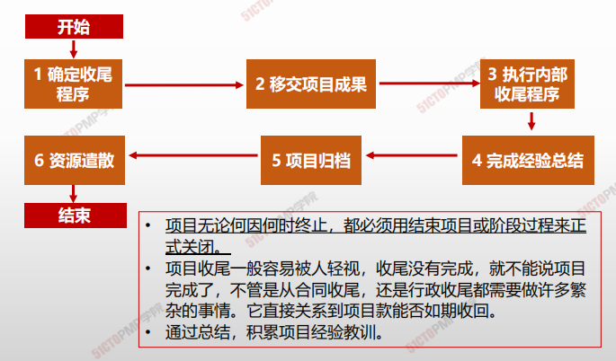
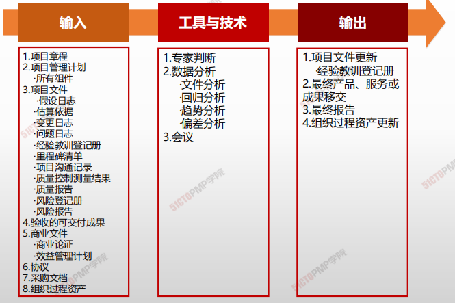
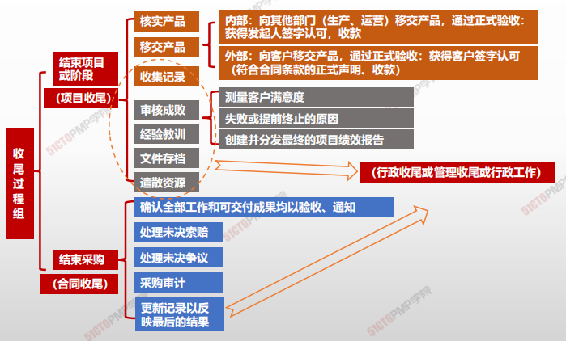
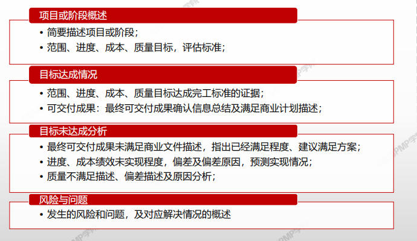

# 结束项目或阶段

> - 项目无论何因何时终止，都必须用结束项目或阶段过程来正式关闭。
>
> - 项目收尾一般容易被人轻视，收尾没有完成，就不能说项目完成了，不管是从合同收尾，还是行政收尾都需要做许多繁杂的事情。它直接关系到项目款是否能够如期收回
>
> - 通过总结，积累项目经验教训。

## 4W1H

| 4W1H                | 制定项目章程                                                 |
| ------------------- | ------------------------------------------------------------ |
| what 做什么     | 终结项目、阶段或合同的所有活动的过程。 作用：存档项目或阶段信息，完成计划的工作，释放组织团队资源以 展开新的工作。 |
| why 为什么做    | 移交产品、积累经验，留下知识财富，完成现有工作、开展新的工作 |
| who 谁来做      | 项目管理团队/项目团队（如果项目规模比较小的话）。 合同收尾是项目经理和合同管理人员的共同责任。 |
| when 什么时候做 | 项目或阶段末进行，合同收尾在管理收尾之前                     |
| how 如何做      | 在结束项目时，项目经理需要回顾项目管理计划，确保所有项目工作都已完成以及项目目标均已实现。如果项目在完工前就提前终止，结束项目或阶段过程还需要制定程序，来调查和记录提前终止的原因。 **<u>专家判断、数据分析、会议</u>** |

## 输入/工具技术/输出

1. 输入

   1. 项目章程
   2. 项目管理计划
      - 所有组件
   3. 项目文件
      - 假设文件
      - 估算依据
      - 变更日志
      - 问题日志
      - 经验教训登记册
      - 里程碑清单
      - 项目沟通记录
      - 质量控制测量结果
      - 质量报告
      - 风险登记册
      - 风险报告
   4. 验收的可交付成果
   5. 商业文件
      - 商业论证
      - 效益管理计划
   6. 协议
   7. 采购文档
   8. 组织过程资产

2. 工具与技术

   1. 专家判断
   2. 数据分析
      - 文件分析
      - 回归分析
      - 趋势分析
      - 偏差分析
   3. 会议

3. 输出

   1. 项目文件更新
      * 经验教训登记册
   2. 最终产品、服务或成果移交
   3. 最终报告
   4. 组织过程资产更新

   

### 输出

#### 最终报告

