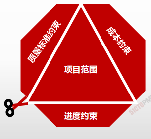
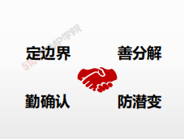

# 范围管理概述

|                | **启动过程组** | **规划过程组**                                            | **执行过程组** | **监控过程组**             | **收尾过程组** |
| -------------- | -------------- | -------------- | --------------------------------------------------------- | -------------- | -------------------------- | -------------- |
| **5.范围管理** |                | 5.1规划范围管理5.2收集需求 5.3定义范围 5.4创建WBS |                | 5.5确认范围 5.6控制范围 |                |

> 确认项目范围管理对项目管理的意义：
>
> 1. **项目范围定义不清往往是导致项目失败的首要原因。**
> 2. 项目范围管理是项目**各项计划、控制的基础**。
> 3. 项目范围管理确定了项目的**具体工作任务**，有助于清楚**责任划分**和**任务派分**。
> 4. **清楚了项目的工作具体范围和具体内容，为提高成本、进度和资源的准确性打下基础。**

## 确定范围：减法思维

- 在追求理想的过程中忍痛割爱，**最终的结果是形成必须交付的工作或服务**。
- 根据约束限制逐步缩减
- 兼顾**约束边界**的互动关系

| / | 过程 | 定义 |
| ---- | ---- |---- |
|5.1 |规划范围管理|为记录如何定义、确认和控制项目范围及产品范围，而创建范围管理计划的过程。|
|5.2| 收集需求|为实现项目目标而确定、记录并管理相关方的需要和需求的过程。|
|5.3| 定义范围| 制定项目和产品详细描述的过程。|
|5.4| 创建 WBS|将项目可交付成果和项目工作分解为较小的、更易于管理的组件的过程。|
|5.5 |确认范围| 正式验收已完成的项目可交付成果的过程。|
|5.6 |控制范围 |监督项目和产品的范围状态，管理范围基准变更的过程。|

1. **一谋：规划范围—找行动方案**  
2. **收集需求是求全**  
3. **定义范围是求细** 
4. **工作分解是求分**  
5. **确认范围是求果** 
6. **控制范围是求控**

