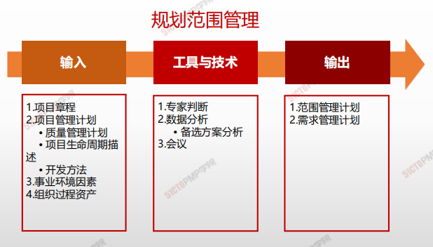
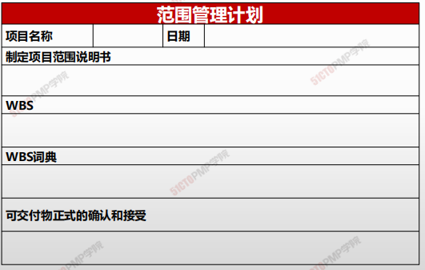
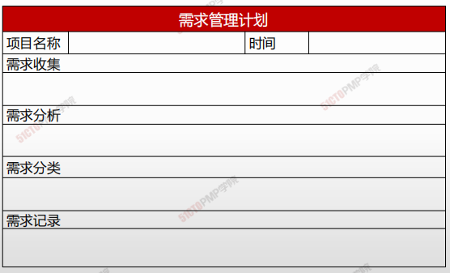

# 规划范围管理

## 4W1H

| 4W1H                | 规划范围管理                                                 |
| ------------------- | ------------------------------------------------------------ |
| what 做什么     | 记录如何定义、确认和控制项目范围及产品范围，而创建范围管理计划的过程。 **<u>作用：</u>**在整个项目期间对如何管理范围提供指南和方向。 |
| why 为什么做    | 指导范围管理知识领域其他过程如何开展。                       |
| who 谁来做      | 项目管理团队/项目团队。                                      |
| when 什么时候做 | 制定项目章程后，**范围管理其他过程之前**                     |
| how 如何做      | 制定范围管理计划和细化项目范围始于对下列信息的分析：项目章程中的信息、项目管理计划中已批准的子计划、组织过程资产中的历史信息和相关事业环境因素。 **专家判断、数据分析、会议** |

## 输入/工具技术/输出

1. 输入
   1. 项目章程
   2. 项目管理计划
      - 质量管理计划
      - 项目生命周期描述
      - 开发方法
   3. 事业环境因素
   4. 组织过程资产
2. 工具与技术
   1. 专家判断
   2. 数据收集
      - 备选方案分析
   3. 会议

3. 输出
   1. 范围管理计划
   2. 需求管理计划

### 输出

#### 范围管理计划

项目范围计划编制：对项目管理团队 **如何管理项目范围** 提供了指导

- 项目管理团队要把与范围相关的决策在项目管理计划中进行记录
- 根据具体项目工作的需要，项目范围管理计划可以是正式的或非正式的、很详细的或粗略的

>  **范围管理计划包括在项目管理计划中，或者是对其的补充范围管理计划**：**描述将如何定义、制定、监督、控制和确认项目范围。**

#### 范围管理计划(模板)

#### 需求管理计划(模板)

### 范围管理计划 vs. 需求管理计划

| 范围管理                                                     | 需求管理                                                     |
| ------------------------------------------------------------ | ------------------------------------------------------------ |
| 范围管理包含一系列子过程，用以确保项目包含且只包含达到项目成功所必须完成的工作，范围管理主要关注项目内容的定义和控制，即<u>包括什么，不包括什么。</u> | 需求管理是通过调查与分析，获取用户需求并定义产品需求，<u>确保各方对需求的一致理解，管理和控制需求的变更，以及需求的跟踪。</u> |

| 范围管理计划 | 需求管理计划 |
| ------------ | ------------ |
|      描述如何定义、制订、监督、控制和确认项目范围。 1. 制定详细范围说明书 2. 如何从详细的项目范围说明书创建WBS 3. 维护和批准WBS 4. 如何对已经完成项目的可交付物进行正式的确认和接受        |     需求管理计划是对项目的需求进行定义、确定、记载、核实管理过程和控制的行动指南。包括： 1. 如何规划、跟踪和汇报各种需求活动 2. 需求管理需要使用的资源 3. 培训计划：需求定义、需求分析、需求验证、 需求管理及相关工具、配置管理等 4. 项目相关方参与需求管理的策略 5. 判断项目范围与需求不一致的准则和纠正规程 6. 需求跟踪结构：双向跟踪 7. 配置管理活动         |

> 联系 ：
>
> * 首先通过需求收集来获取项目的需求，在此基础上确定项目的范围、进行项目范围管理
> * 其次需求的变更会引起项目范围的变更

# 小结

1. **规划范围管理在整个项目中对如何管理范围提供指南和方向**
2. **该过程生成：范围管理计划和需求管理计划**
3. **范围管理计划描述如何进行范围管理**
4. **需求管理计划描述如何分析、记录和管理需求**