# 收集需求

- 根据特定协议或其他强制性规范，产品、服务或成果必须具备的条件或能力
- 需求是发起人、客户和其他相关方的已量化且书面记录的需要和期望
- 需求必须是具体的、书面的、不是全部需要

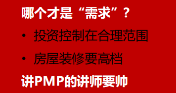

## 项目需求收集/定义的困难有哪些

**需求中遇到的艰难险阻：**

- 我们提供的(功能)就是你要的！
- 我认为我知道你的需求
- 猜测客户需求
- 无休止的客户需求
- 我不知道我要什么，只有我看到了我才知道
- 快速开发模型给我看看
- 需求没有被记录下来，没有得到重视和落实

**如何解决？**

- 遵行良好的需求收集/定义/管理流程和步骤
- 提供培训给负责需求管理的个人
- 邀请用户的经常性参与
- 书面记录需求并确认
- 验证需求
- 举行正式的需求评审
- 严格管理需求变更

## 收集需求

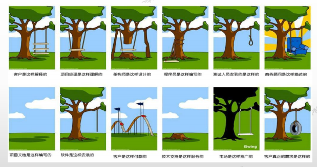

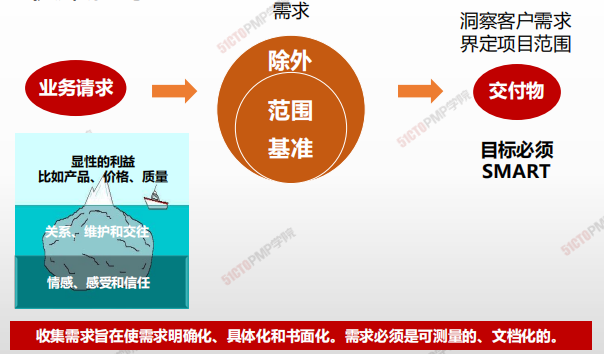

> 收集需求在使需求明确化、具体化和书面化。需求必须是可测量的、文档化的。

> 如何挖掘真实需求
>
> - 把握本质的需求，洞悉客户真正的需要

## 4W1H

| 4W1H                | **收集需求**                                                 |
| ------------------- | ------------------------------------------------------------ |
| what 做什么     | 实现目标而确定、记录并管理相关方的需要和需求的过程。 <u>**作用：**</u>为定义产品范围和项目范围奠定基础。 |
| why 为什么做    | 让相关方积极参与需求的探索和分解工作，并仔细确定、记录和管理对产品、服务或成果的需求，能直接促进项目成功。需求将成为工作分解结构（WBS）的基础，也将成为成本、进度、质量和采购规划的基础。 |
| who 谁来做      | 项目管理团队                                                 |
| when 什么时候做 | 项目章程制定后，相关方初步识别后，规划范围管理后             |
| how 如何做      | 应该足够详细地探明、分析和记录这些需求，将其包含在范围基准中，并在项目执行开始后对其进行测量。 专家判断、数据收集、数据分析、决策、数据表现、人际关系与团队 <u>**技能、系统交互图、原型法**</u> |

## 输入/工具技术/输出

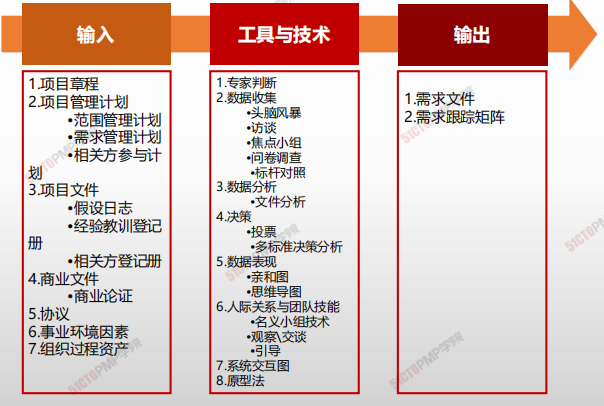

1. 输入
   1. 项目章程
   2. 项目管理计划
      - 范围管理计划
      - 需求管理计划
      - 相关方参与计划
   3. 项目文件
      - 假设日志
      - 经验教训登记册
      - 相关方登记册
   4. 商业文件
      - 商业论证
   5. 事业环境因素
   6. 组织过程资产
2. 工具与技术
   1. 专家判断
   2. 数据收集
      - 头脑风暴
      - 访谈
      - 焦点小组
      - 问卷调查
      - 标杆对照
   3. 数据分析
      - 文件分析
   4. 数据表现
      - 亲和图
      - 思维导图
   5. 人际关系与团队技能
      - 名义小组技术
      - 观察、交谈
      - 引导
   6. 系统交互图
   7. 原型法

3. 输出
   1. 需求文件
   2. 需求跟踪矩阵

### 工具与技术

#### 数据收集 - 问卷调查

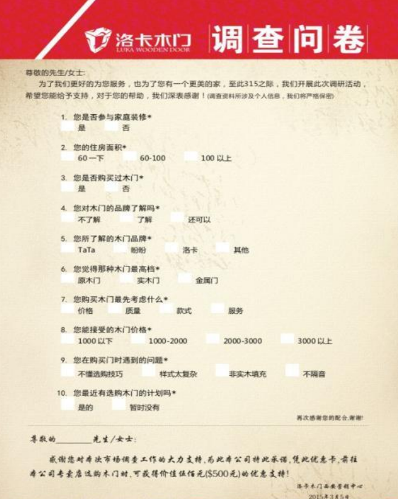

> 设计一系列书面问题，向众多受访者快速收集信息。
>
> * 受众多样化
> * 快速完成调查
> * 适合展开系统分析
> * 受访者地理位置分散

#### 数据收集 - 文件分析

> 分析现有文档，识别与需求相关地信息，来挖掘需求
>
> - 协议
> - 商业计划
> - 业务流程或接口文档
> - 业务规则库
> - 现行流程
> - 市场文献
> - 问题日志
> - 政策和程序
> - **法规文件，**如法律、法令
> - 建议邀请书
> - 用例

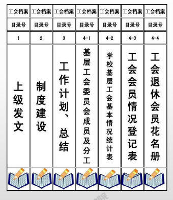

#### 数据收集 - 决策

> 借助决策矩阵，用系统分析方法建立诸如风险水平、不确定性和价值收益等多种标准，以对众多创意进行评估和排序

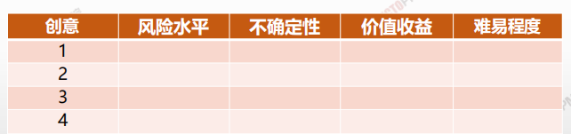

#### 数据收集 - 亲和图

> **用来对大量创意 <u>进行分组技术</u>，以便进一步审查和分析**

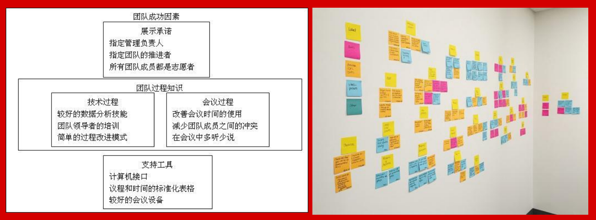

#### 数据收集 - 思维导图

> 把从头脑风暴获得的创意合成一张图，用以反应创意之间的共性与差异，<u>激发新创意</u>

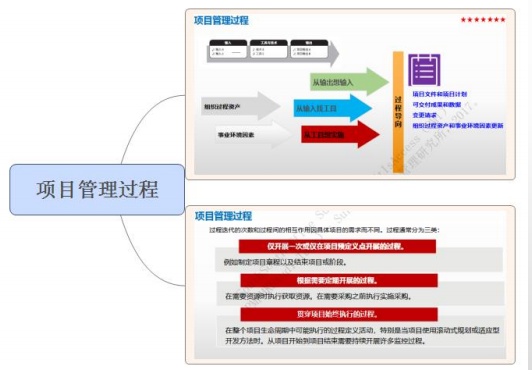

#### 人际关系与团队技能 - 名义小组技术

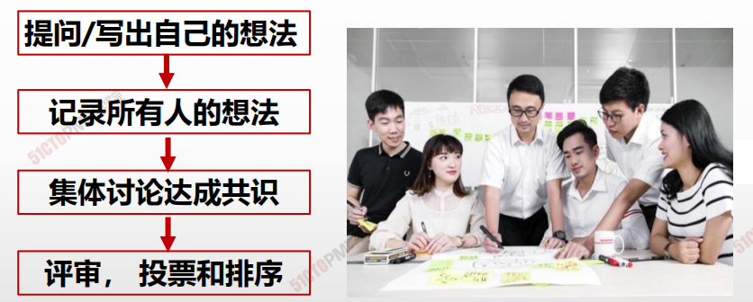

> 更加结构化的头脑风暴
>
> 通过投票排序得到最有用的创意

#### 人际关系与团队技能 - 引导 （联合应用开发）

> 把业务主题专家（SME）和开发团队集中在一起，以收集需求和改进软件开发过程（软件行业常用）

> **快速定义跨职能需求并协调相关方的需求差异**

#### 人际关系与团队技能 - 引导（质量功能展开QFD）

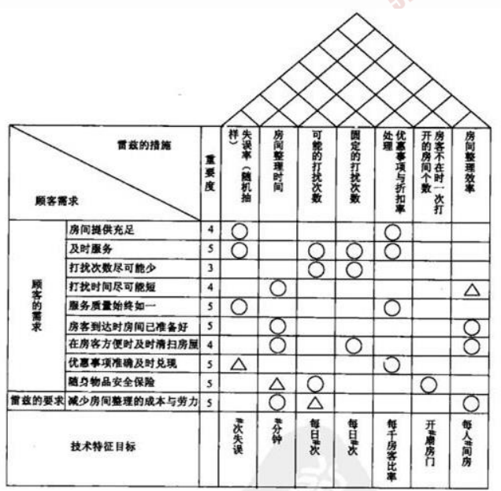

> - 制造业则采用QFD来帮助确定新产品的关键特征
> - QFD从收集客户需求（又称“客户声音：）开始，然后客观地对这些需求进行分类和排序

#### 人际关系与团队技能 -  引导（用户故事）

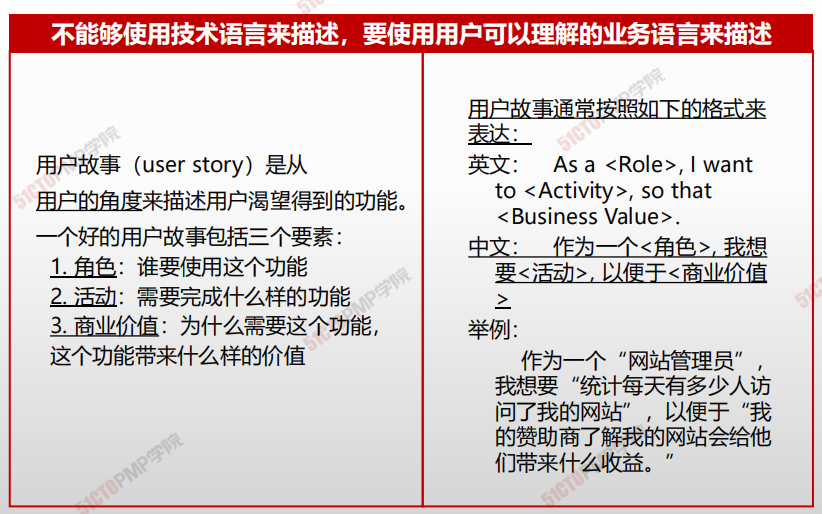

#### 人际关系与团队技能 - 观察和交谈

**旁站式观察**，也称工作**跟踪体验式**（参与式）&<u>不愿或说不清需求</u>&<u>挖掘深层潜在需求</u>

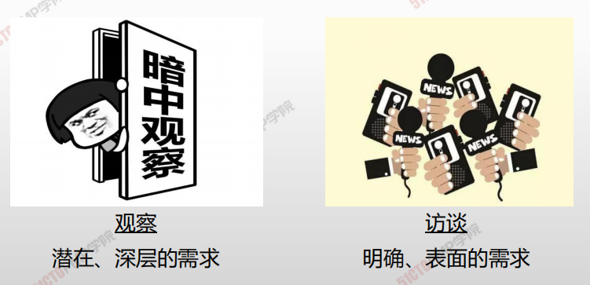

#### 需求收集 - 系统交互图

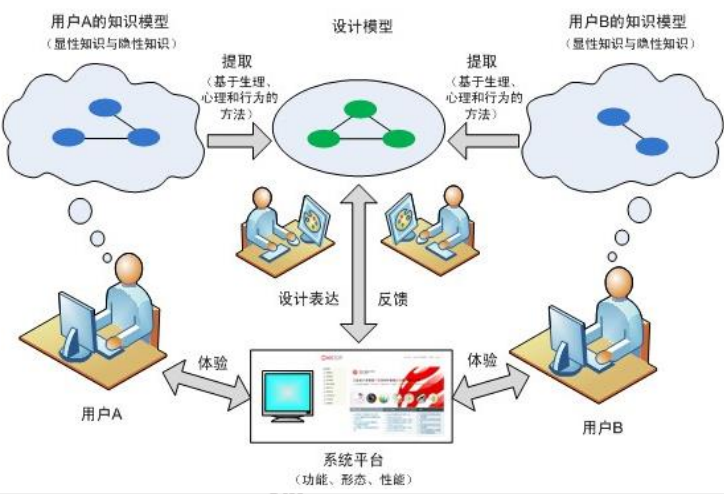

> - 对产品范围的可视化描述显示业务系统及其任何其他系统（行动者）之间的交互方式
> - 显示了业务系统的输入、输入提供者、业务系统的输出和输出接受者。

### 输出

#### 需求文件

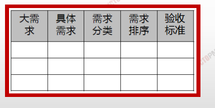

- 描述各种单一需求将如何满足与项目相关的业务需求
- 随着有关需求信息的增加而**逐步细化**
- 主要内容包括：
  - ✓ 业务需求
  - ✓ 相关方需求
  - ✓ 解决方案需求
  - ✓ 项目需求
  - ✓ 过渡和就绪
  - ✓ 质量需求

#### 需求与项目目标的逻辑关系

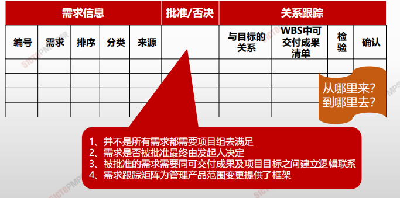

> ## 需求文件
>
> - 需求文件描述各种单一需求将如何满足与项目相关的业务需求
> - **用于生成范围说明书**

> ## 需求跟踪文件
>
> - 需求跟踪矩阵是吧产品需求从其来源连接到满足的可交付成果的一种表格
> - **用于验收可交付成果**

# 小结

1. 需求是根据特定协议或其他强制性规范，产品、服务或成果必
   须具备的条件或能力
2. 所有相关方都可以提出需求，需求要量化并书面记录
3. 收集需求是为实现目标而确定、记录并管理相关方的需要和需
求的过程
4. 需求文件描述各种单一需求将如何满足与项目相关的业务需求
5. 需求跟踪矩阵确保经批准的每一项需求在项目结束时都能得到
实现