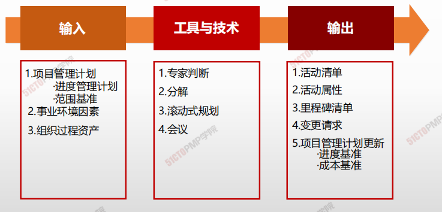
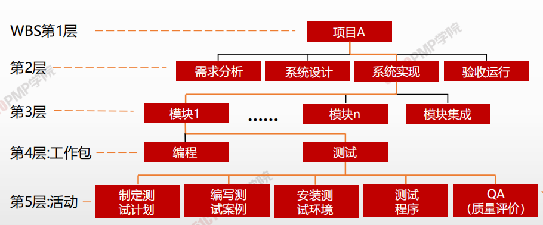
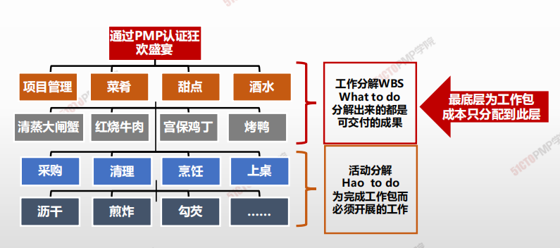
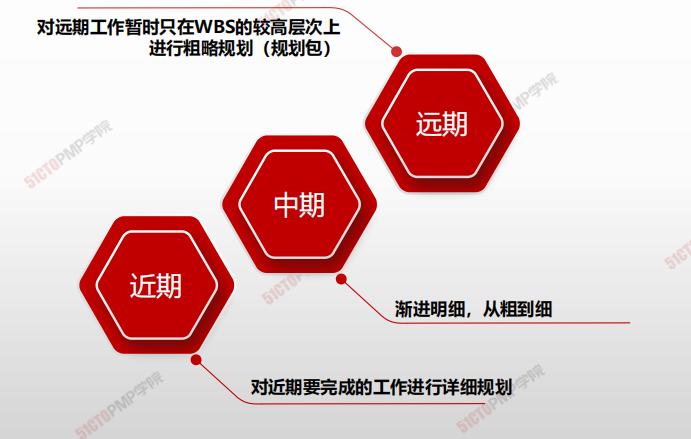
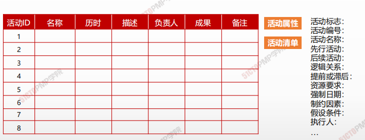
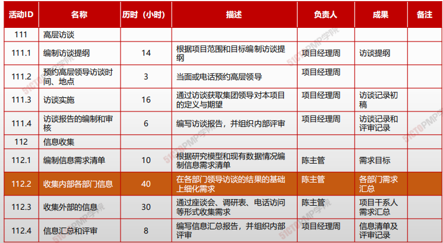
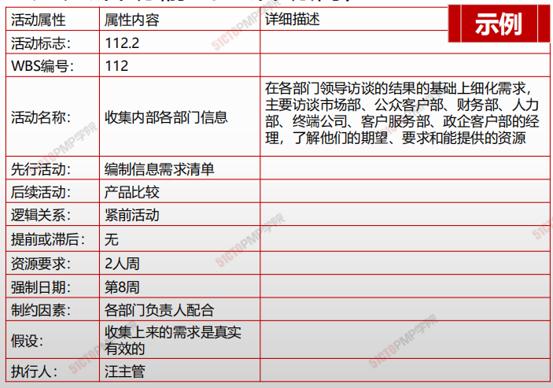

# 规划进度管理

## 4W1H

| 4W1H                | 规划进度管理                                                 |
| ------------------- | ------------------------------------------------------------ |
| what 做什么     | 识别和记录为完成项目可交付成果和须采取的具体行动的过程。 <u>作用：</u>将工作包分解为进度活动，作为对项目工作进行进度估算、规划、执行、监督和控制的基础 |
| why 为什么做    | 对活动才能更详细更准确的分配资源和时间、成本，作为后续的基础。 |
| who 谁来做      | 项目管理团队。                                               |
| when 什么时候做 | 范围基准确定后                                               |
| how 如何做      | 工作包分解为进度活动。 <u>专家判断、分解、滚动式规划、会议</u> |

## 输入/工具技术/输出

1. 输入
   1. 项目管理计划
      - 进度管理计划
      - 范围基准
   2. 事业环境因素
   3. 组织过程资产
2. 工具与技术
   1. 专家判断
   2. 分解
   3. 滚动式规则
   4. 会议
3. 输出
   1. 活动清单
   2. 活动属性
   3. 里程碑清单
   4. 变更请求
   5. 项目管理计划更新
      - 进度基准
      - 成本基准

#### 定义活动

|                                                           | 通过工作分解结构（WBS），将项目分解为一系列更小、更易管理的活动 |                                                            |
| --------------------------------------------------------- | ------------------------------------------------------------ | ---------------------------------------------------------- |
| 自 顶 向 下 ， 逐 步 细 化 |  | 渐 进 明 细 ， 更 加 可 控 |

#### 分解活动

>  工作分解WBS，分解出来的都是可交付的成果

> 活动分解，为完成工作包而必须开展的工作

#### 滚动式规划

#### 活动清单示例

- **活动清单**是**一份包含项目所需的全部进度活动的清单**。活动清单中应该包每个活动的标志和足够详细的工作描述，使项目团队成员知道应当完成哪些工作。
- **活动属性**是指每项活动所具有的多重属性，用来**扩充对活动的描述**。活动属性的数量因应用领域而异

#### 活动属性

#### 活动里程碑

里程碑是项目中重大事件，通常是指一个或多个主要交付物的完成。

里程碑的突出特征是：到达此里程碑的没有歧义。

里程碑的作用：

- <u>计划：</u>与项目整体目标保持一致，并分解为阶段性目标；
- <u>控制：</u>里程碑通常为强制约束，控制项目各个阶段的目标实现；
- <u>沟通：</u>与管理干系人良好沟通；
- <u>责任：</u>明确规定了项目各方的责任义务；
- <u>报告：</u>简明、生动、通俗、实用。

