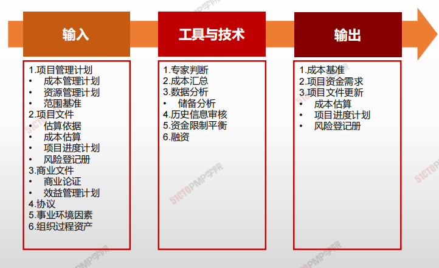
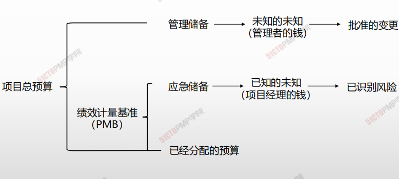

# 制定预算

## 4W1H

| 4W1H                | 制定预算                                                     |
| ------------------- | ------------------------------------------------------------ |
| what 做什么     | 制定预算是汇总所有单个活动或工作包的估算成本，建立一个经批准的成本基准的过程。 <u>作用：确定可据以监督和控制项目绩效的成本基准。</u> |
| why 为什么做    | 确定可据以监督和控制项目绩效的成本基准。                     |
| who 谁来做      | 项目经理与预算小组。                                         |
| when 什么时候做 | 本过程仅开展一次或仅在项目的预定义点开展。                   |
| how 如何做      | 进行制定成本管理计划、资源管理计划、范围基准。制定项目文件、商业文件。数据经过专家相关人员分析，得出预算计划。 <u>专家判断、成本汇总、数据分析、历史信息审核、资金限制平衡、融资</u> |

## 输入/工具技术/输出

1. 输入
   1. 项目管理计划
      - 成本管理计划
      - 资源管理计划
      - 范围基准
   2. 项目文件
      - 估算依据
      - 成本估算
      - 项目进度计划
      - 风险登记册
   3. 商业文件
      - 商业论证
      - 效益管理计划
   4. 协议
   5. 事业环境因素
   6. 组织过程资产
2. 工具与技术
   1. 专家判断
   2. 成本汇总
   3. 数据分析
      - 储备分析
   4. 历史信息审核
   5. 资金限制平衡
   6. 融资
3. 输出
   1. 成本基准
   2. 项目资金需求
   3. 项目文件更新
      - 成本估算
      - 项目进度计划
      - 风险等级手册

### 应急储备 vs 管理储备

|                      | 应急储备                               | 管理储备                                                 |
| -------------------- | -------------------------------------- | -------------------------------------------------------- |
| **属于的过程**       | 估算成本过程                           | 指定预算过程                                             |
| **用来应对哪些事件** | 预期但不确定的事件，即：一直的未知事件 | 未计划但可能存在的项目范围和成本变化，即：未知的未知事件 |
| **是否属于成本基准** | 属于成本基准                           | 不属于成本基准，但属于项目总预算                         |
| **项目经理处置权利** | 项目经理可以自由使用                   | 必须经过批准才可以动用                                   |
| **是否纳入政治计算** | 纳入                                   | 不纳入                                                   |

### 成本汇总

1. 项目总预算
   1. 管理储备
      1. 未知的未知（管理者的前）
         1. 批准的更改
   2. 绩效计量基准（PMB）
      1. 应急储备
         1. 已知的未知（项目经理的钱）
            1. 已识别风险
      2. 已经分配的预算

