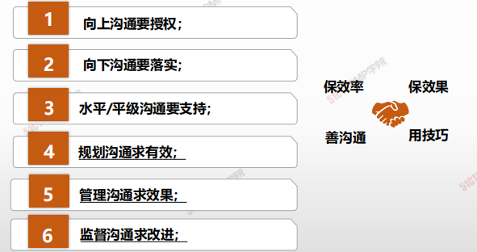
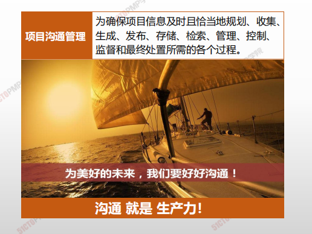
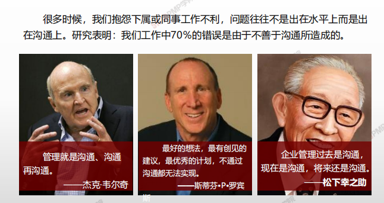
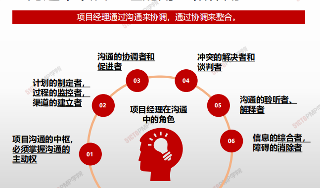

# 项目沟通管理概述

| 10.1 | 规划沟通管理 | 基于每个相关方或相关方群体的信息需求、可用的组织资产，以及具体项目的需求，为项目沟通活动制定恰当的方法和计划的过程。 |
| ---- | ------------ | ------------------------------------------------------------ |
| 10.2 | 管理沟通     | 确保项目信息及时且恰当地收集、生成、发布、存储、检索、管理、监督和最终处置的过程 |
| 10.3 | 监督沟通     | **确保**满足项目及其相关方的**信息需求**的过程               |

 

- **《大英百科全书》：**沟通是“互相交换信息的行为”

- **英国学者丹尼斯·奎尔：**沟通是“人或团体主要通过符号向其他个人或团体传递信息、观念、态度或情感的过程”

- **美国学者布农：**沟通是“将观念或思想由一个人传递给另一个人的过程，或者是一人自身内的传递，其目的是使接受沟通的人获得思想上的了解”

>  综上：沟通是人与人之间传递信息、传播思想、传达情感的过程。是一个人获得他人思想、情感、见解、价值观的一种途径。是人与人之间交往的一座桥梁，通过这个桥梁。人们可以分享彼此的情感和知识，消除误会，增进了解，达成共同认识或共同协议。

## 管理就是沟通

## 沟通中项目经理的角色和作用

